[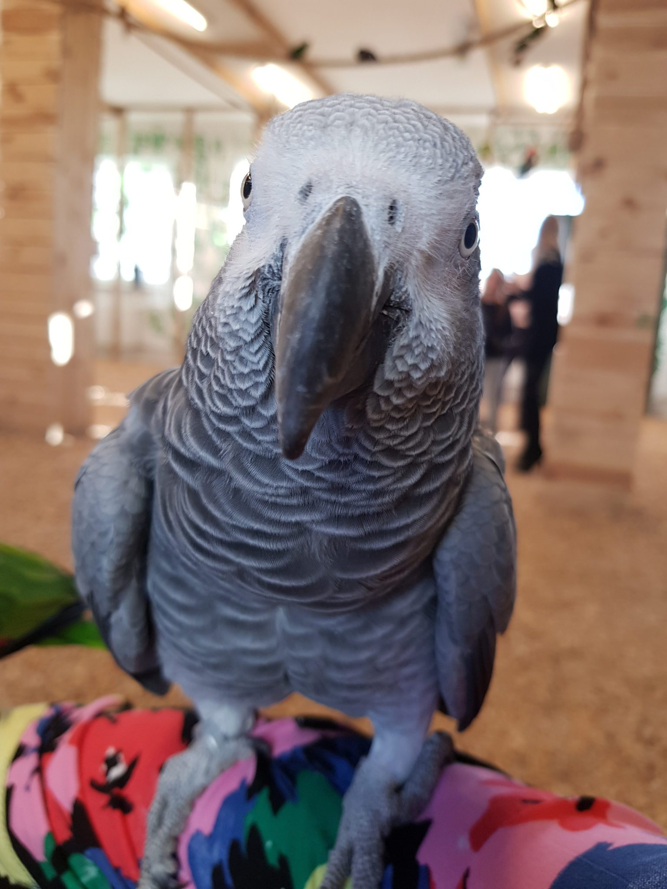](https://antybariera.pl/wp-content/uploads/2020/08/be9ed-20190216_151248-e1550493164997.jpg)

Przepiękne, nieznane mi gatunki papug chwilami odnosiłam wrażenie rozmowy, wywiadu z nimi. Mimo niewoli mam wrażenie, że im jest dobrze.

Czysty przypadek sprawił, że ostatnią sobotę spędziłam w niesamowitym miejscu. Pogoda była idealna na spacer, powędrowałyśmy z Gosią na ul. Połczyńską 73 do Papugarni - obiekt, w którym zamieszkuje a przy okazji pięknie się prezentuje wiele pięknie ubarwionych, różnych wielkości i ras ptaków. Przyznaję się że mało co wiedziałam na temat zwyczajów papug, mimo to spędziłam sympatycznie czas świetnie się bawiąc. Zacznę od początku, na samym wejściu należy pozdejmować z siebie wszelką biżuterię i wszystko co mogłoby ją przypominać - aby nie "kusiło" papug. Trochę mnie to zaskoczyło, myślę sobie jakaś ściema czyżby w rolę papug wcielono nasze sroki?! Żartuję!

- 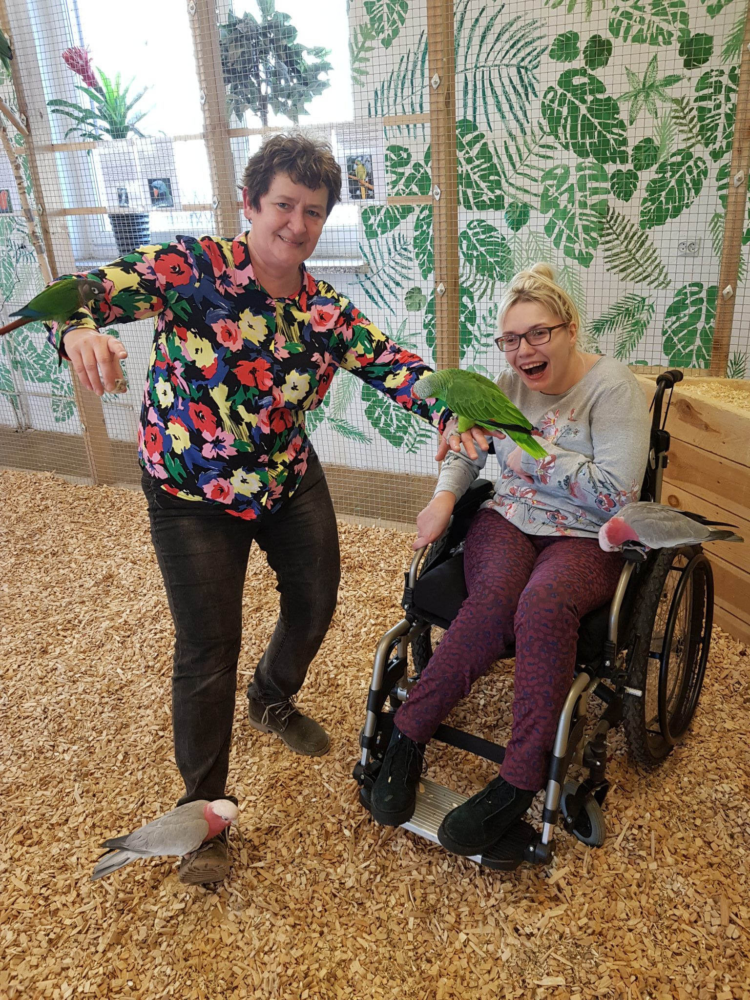
    
- 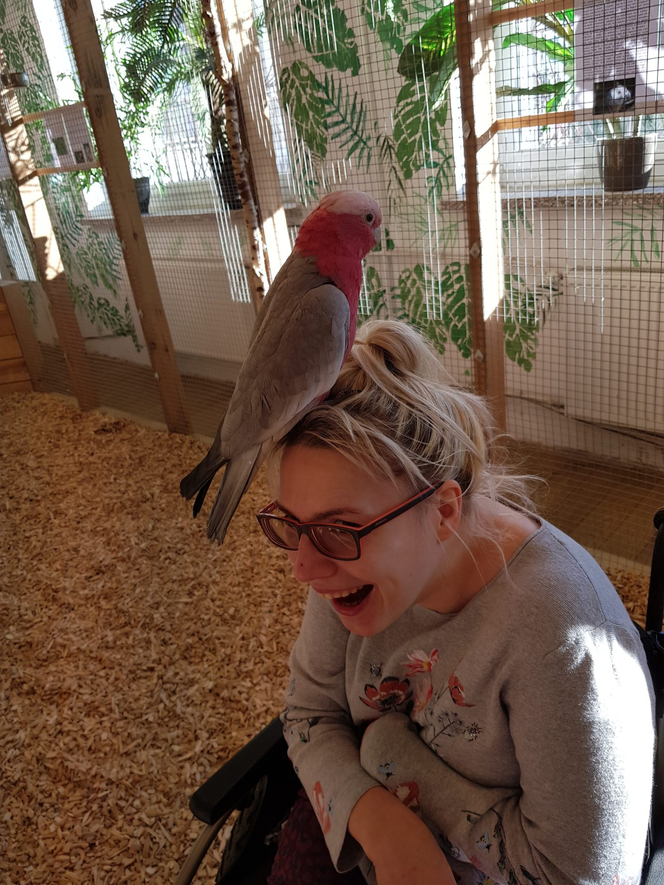
    

Posłusznie pochowałyśmy wszystko, niestety z jednej „ozdoby” zrezygnować nie mogłam, wózka (aluminiowy, błyszczący, wraz ze mną na pace) staliśmy się natychmiast obiektem wielkiego zainteresowania lokatorek tego lokalu. Dodatkową zachętą do bliższego zapoznania się stanowiły różne ziarna, które były smakołykami dla bardzo towarzyskich ptaszków.

[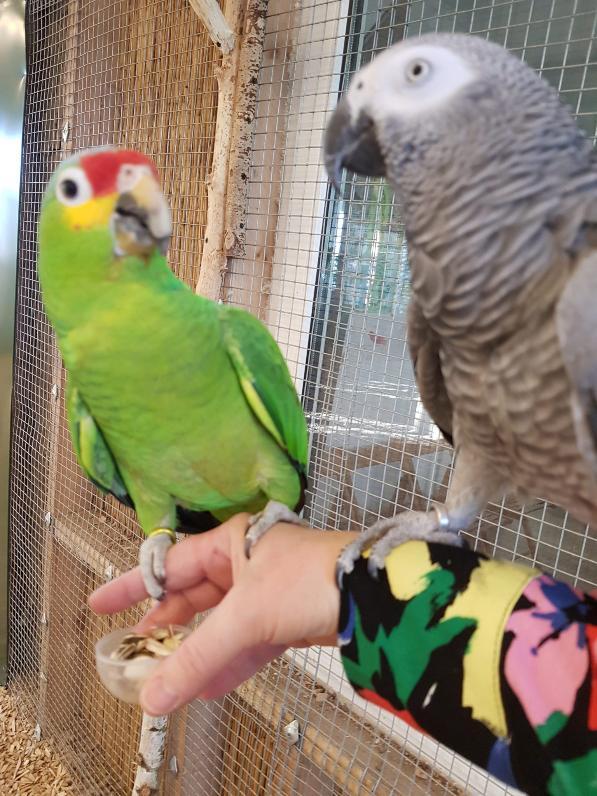](https://antybariera.pl/wp-content/uploads/2020/08/4bd73-20190216_151511-e1550493578188.jpg)

Toczyły między sobą głośne dyskusje,kłótnie, odniosłam wrażenie nawet tzw. pyskówek - w tym miejscu przyznaję słuszność stwierdzeniu, jak ma do powiedzenia tyle co papuga to na pewno jest prawnikiem albo dziennikarzem. Z racji wyuczonego zawodu powinnam wśród kolorowych piór czuć się doskonale, i tak też było, choć przy wejściu wystraszyłam się wielu decybeli, okazało się że papugi bardzo głośno wyrażają swoją radość z powodu nadchodzących gości.

Dziękuję za pomoc profesjonalnie przygotowanym pracownikom zarówno teoretyczne (żadne z moich pytań nie zostało bez odpowiedzi) jak i techniczne (duża pomoc w wielu chwilach okazywania nadmiernej sympatii ze strony skrzydlatych "przyjaciół").

[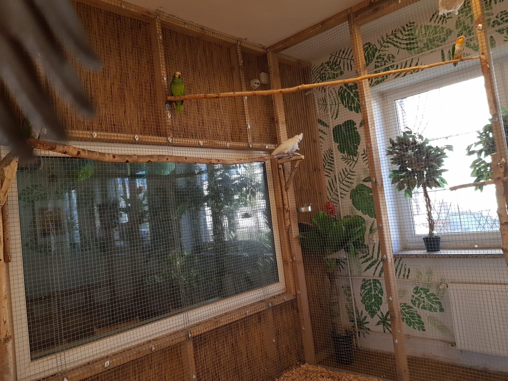](https://antybariera.pl/wp-content/uploads/2020/08/d468b-20190216_143639.jpg)

Może to dziwne, ale jest tam mnóstwo pięknych gatunków papug, jednak ptaków, które znane są raczej jako małe czyściochy, a jest tam naprawdę zaskakująco czysto. Wyjątkowo polubił nas gang różowych , mówię o Kakadu Różowym, które jest bardzo ruchliwym, zabawnym i zajmującym ptakiem. W ich towarzystwie trzeba dbać o swój dobytek, oskubią Cię ze wszystkiego. Skubaczki usilnie próbowały zdemontować gumki w rączkach wózka ,albo też całkowicie wypruć podeszwę w bucie Gosi (dobrze, bo nie interesowały się moimi).

- 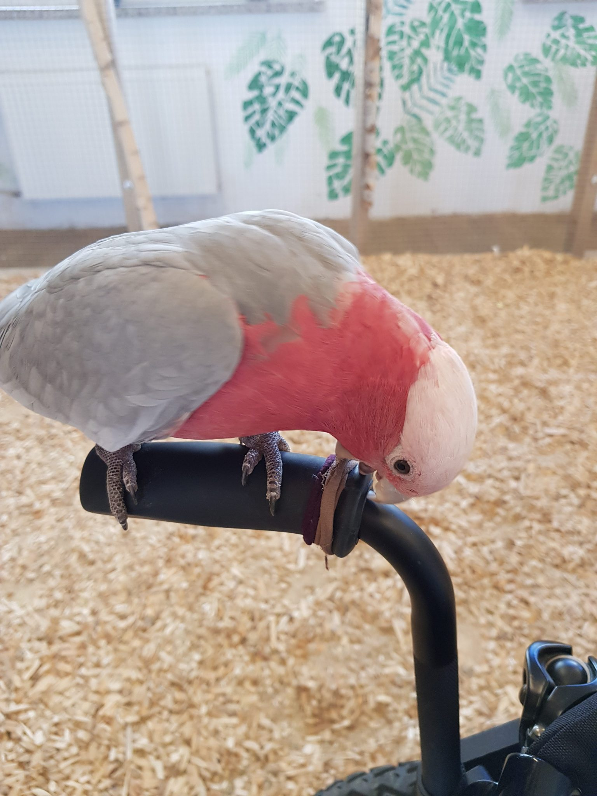
    
- 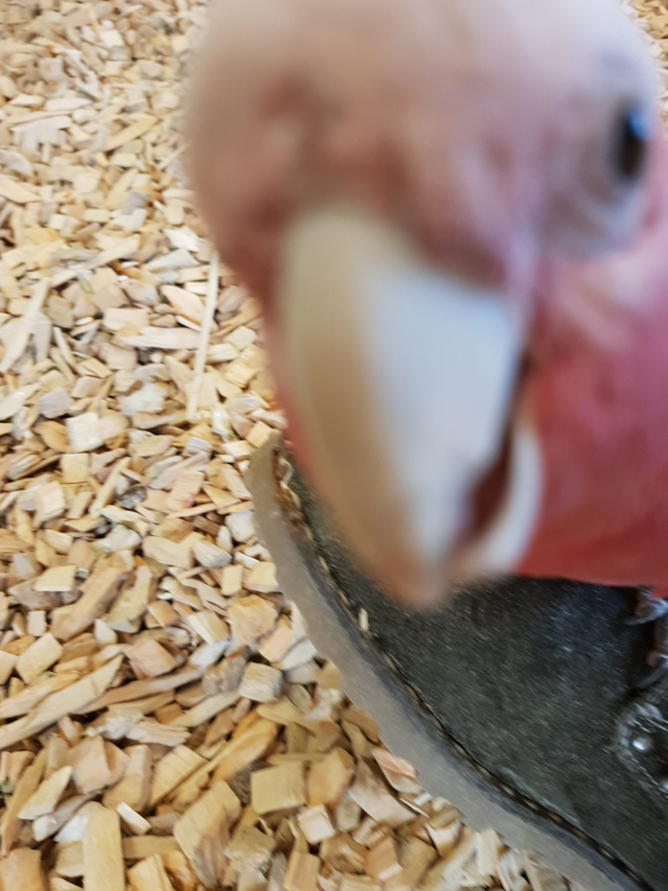
    

Najbardziej spodobała mi się dostojna Papuga Popielata z gatunku Żako Kongijskie, działająca z rozmysłem , przysłuchująca się naszej rozmowie. Okazuje się, że, ten gatunek z łatwością przyswaja i naśladuje naszą mowę, wygwizduje melodie, potrafi budować krótkie zdania, przywiązuje się do właściciela. Słynny Alex rozróżniał kolory, kształty, rozwiązywał proste zadania.

[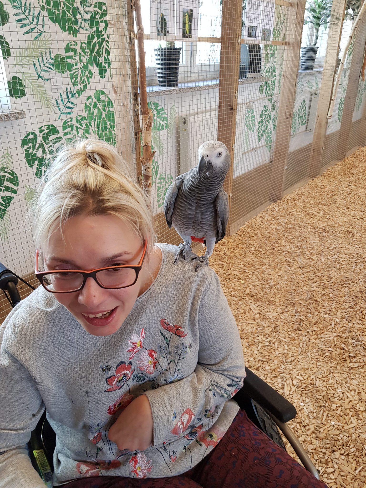](https://antybariera.pl/wp-content/uploads/2020/08/2f123-20190216_151356-e1550493038387.jpg)

Miss foto w tym dniu okazała się przedstawicielka Amazonek (chyba! Bo nie sposób zapamiętać wszystkich naraz ), na zdjęciach wyglądamy na znajome od lat, takie są przyjacielskie do ludzi.

- 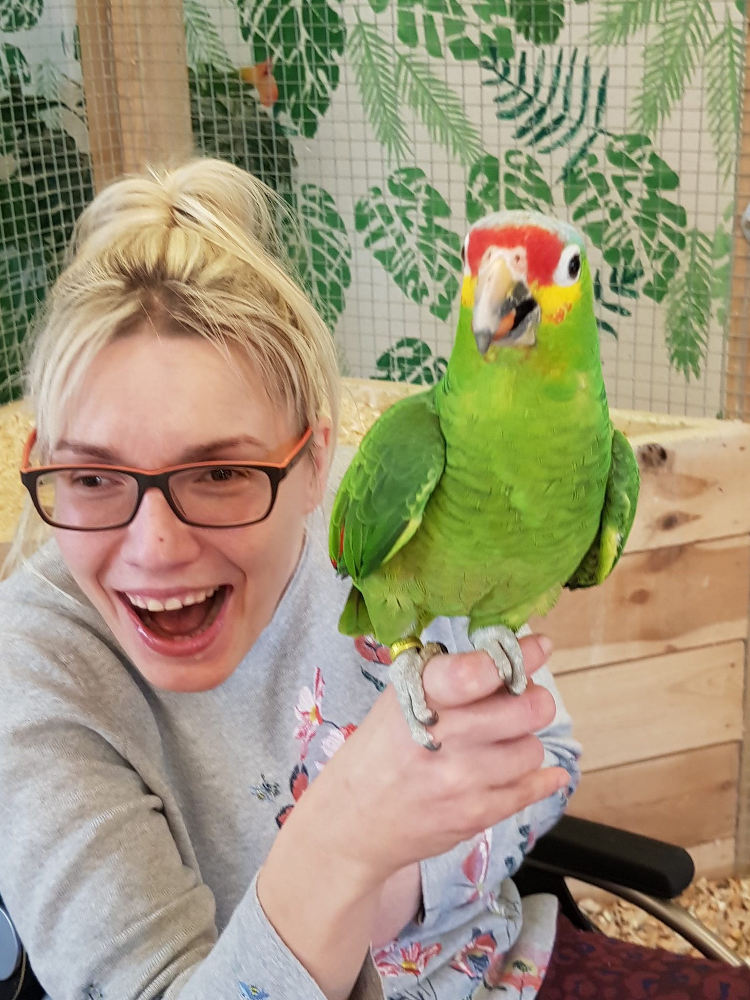
    
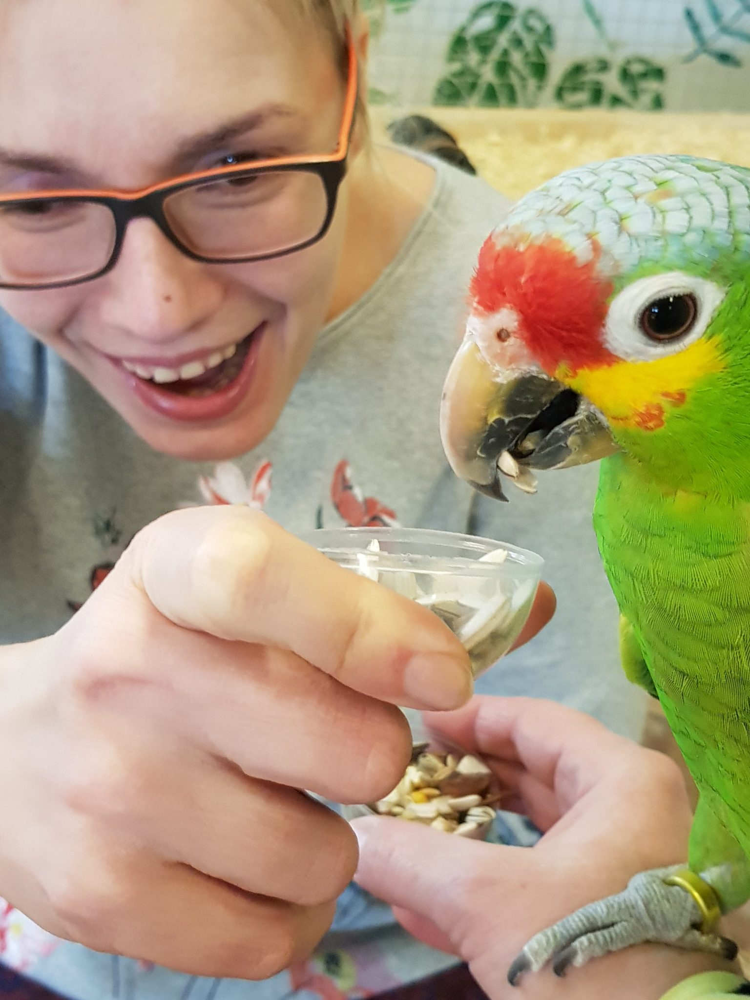
    

**Na koniec niespodzianka, są papugi, które jeszcze nie mają imienia , usłyszałam, że jedna z nich zostanie ochrzczona moim imieniem. Nie wiem jeszcze która, ale już teraz bardzo się cieszę. Dla osób, które się wahają, jeszcze nie były w domu kolorowych ptaków serdecznie polecam to miejsce.**

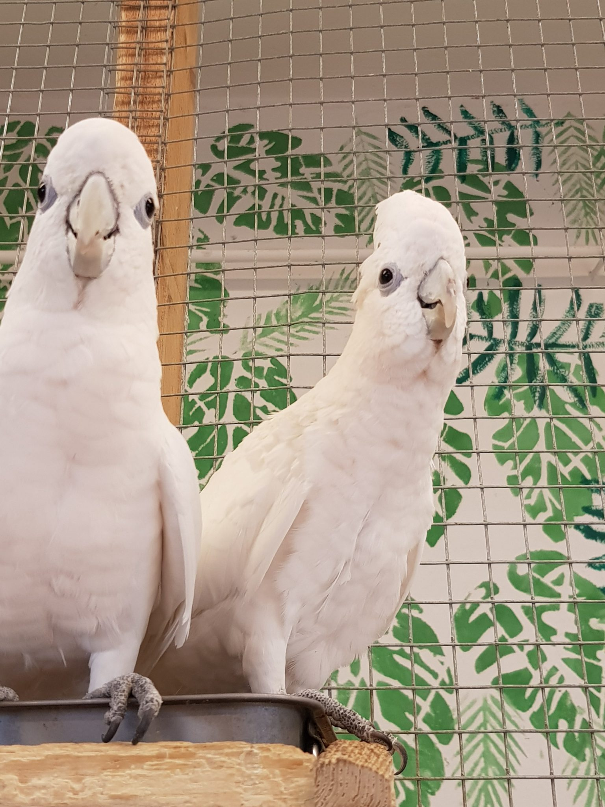
    
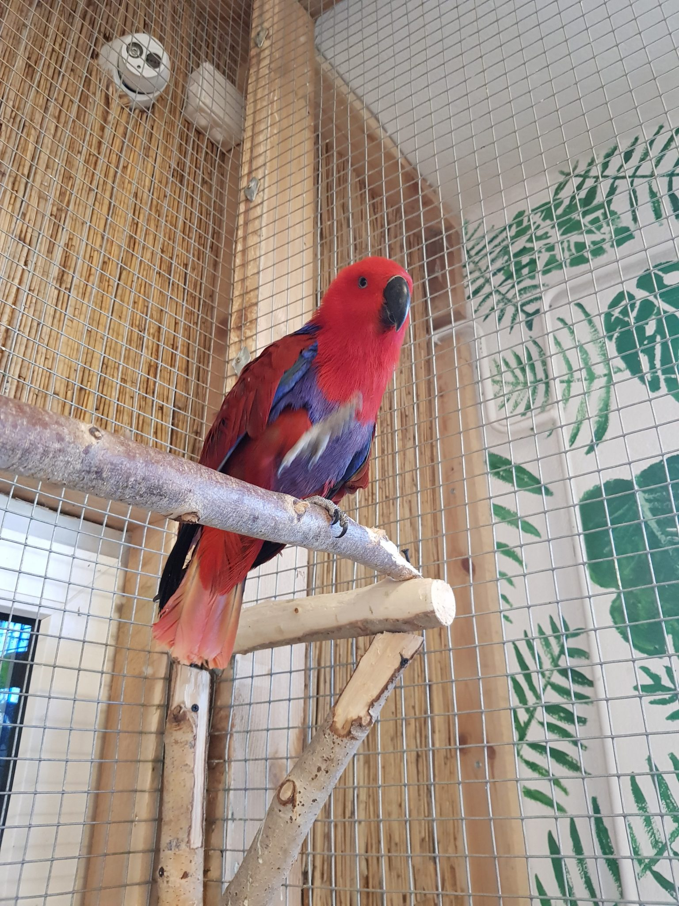
    
- 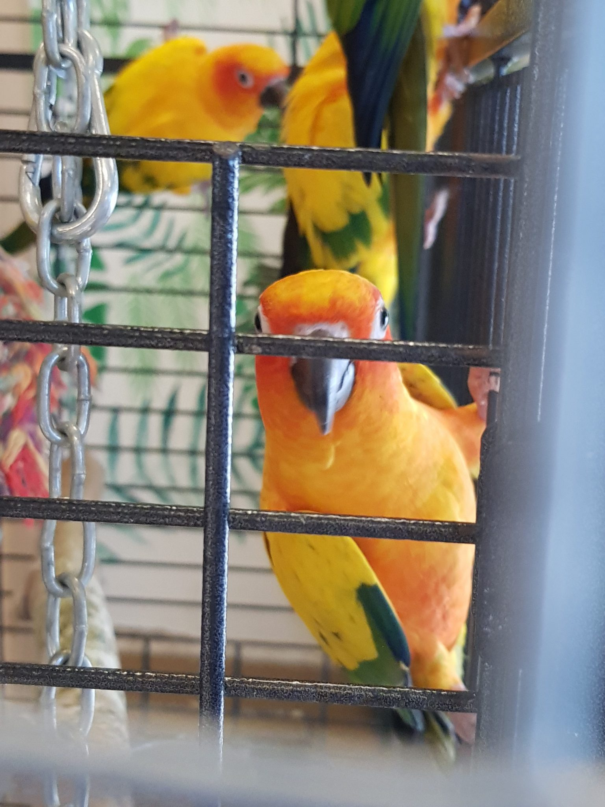
    
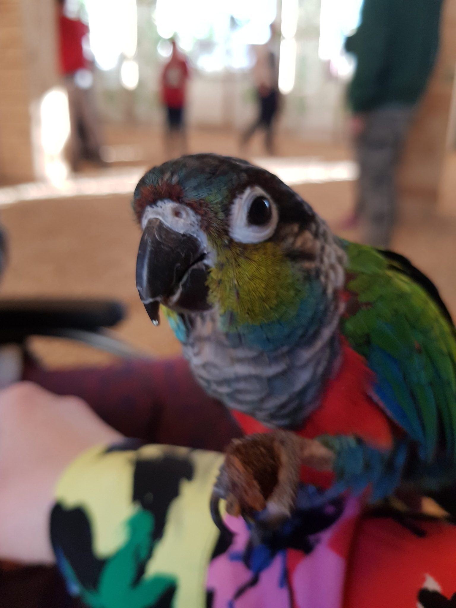
