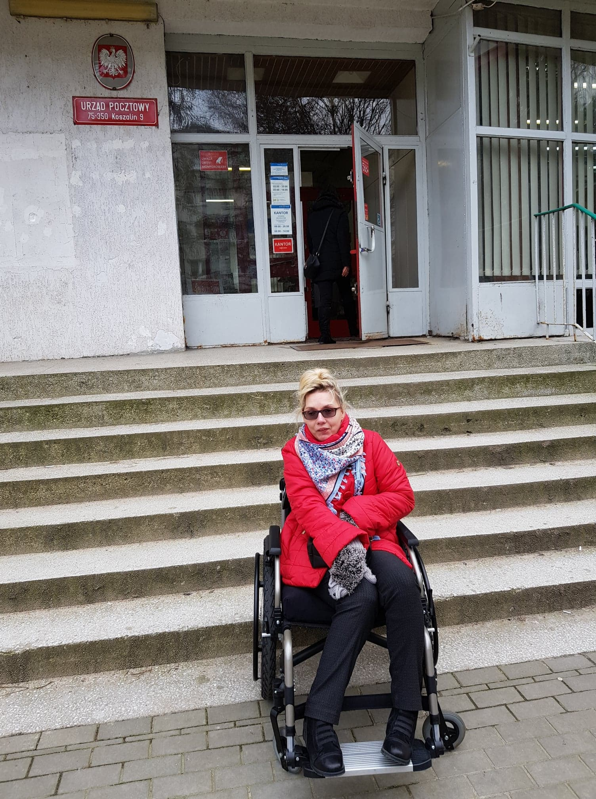
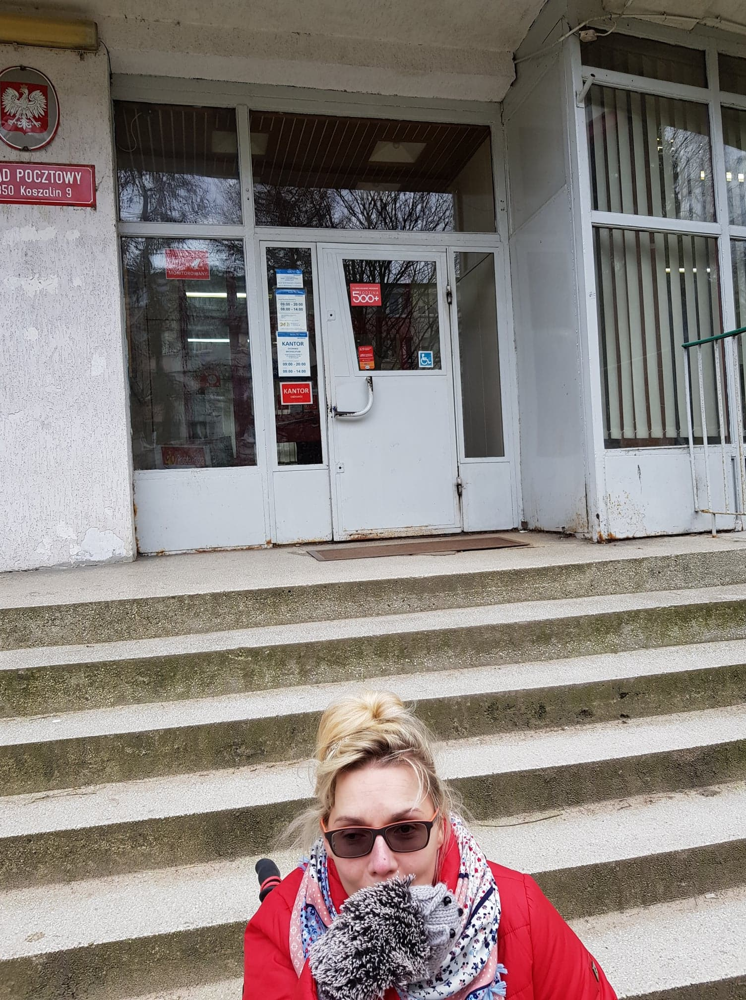
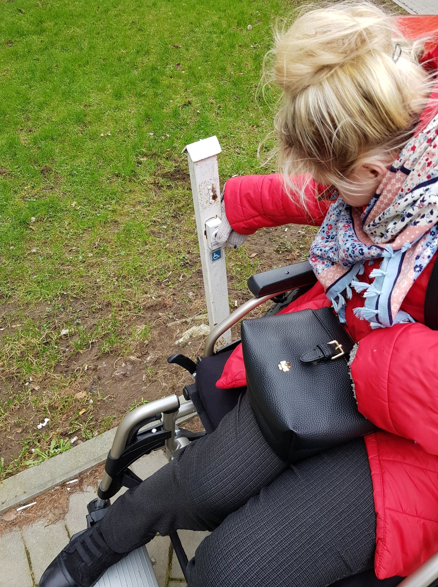
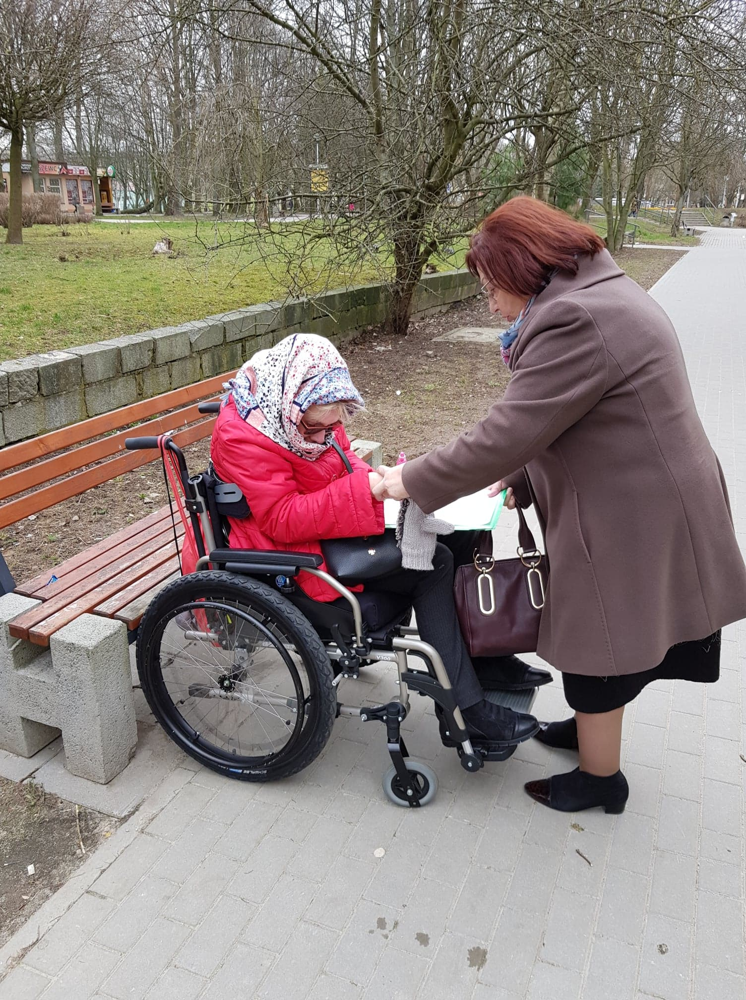
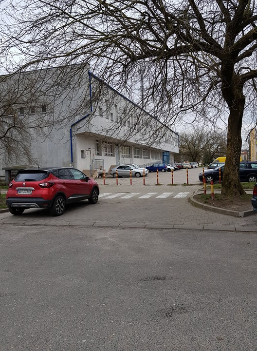

Mam dosyć ignorancji.

Pierwszy raz opiszę dość szczegółowo bardzo smutne i przykre zdarzenie jakie mnie spotkało. Nieludzkie i nieeleganckie zachowanie urzędniczki państwowej. Borykam się z myślami czy nadszedł czas konsekwentnego wymagania pewnych obowiązujących przepisów.

Temat równej dostępności dla wszystkich w miejscach publicznych poruszałam już kilkakrotnie. Prezydent Polski podpisał w 2009 roku procedury unijne dotyczące dostępności miejsc publicznych .Została podpisana dostępność częściowa, ale dla mnie jest ona iluzoryczna, gdyż w praktyce wiele miejsc dla takich osób jak ja, jest niedostępna. Warunkowe unijne procedury działają w Polsce tylko do 31 grudnia 2019 r. Tyle czasu dostaliśmy od Europy. Od 1 stycznia 2020 r. wszystkie miejsca publiczne w naszym kraju, podkreślam wszystkie muszą i powinny być dostępne! Pozostało kilka miesięcy, wydawałoby się, że jesteśmy przygotowani na pełną realizację procedur unijnych w kwestii dostępności. Niestety życie przedstawia całkowicie inne realia.

A teraz czas na konkrety, przykładem jest nasza kochana Poczta Polska.

Zacznę od początku. p>Z naszej skrzynki pocztowej mama wyjęła awizo do mnie (do tej pory nie miałam kłopotu z korespondencją, pisma doręczał mi do ręki listonosz (mieszkam na parterze skrzynka zamocowana jest na ścianie na wprost moich drzwi). Może był to inny doręczyciel, ale na pewno byłam w domu.

Próba odebrania przez mamę pisma w urzędzie nie powiodła się - PROCEDURY! - muszę odebrać osobiście. W pośpiechu (ha, ha ...w moim przypadku około godziny) stanęłam przed wejściem placówki Poczty Polskiej.

Mama weszła do budynku a ja stoję przed schodami. Naklejka na drzwiach informuje o dostępności dla osób na wózkach, dopiero po chwili dostrzegam malutki sprzęcik do komunikacji osób na wózkach na zewnątrz budynku z pracownikami urzędu. Na dworze zimno, moje próby kontaktu nie powiodły się. Naciskałam trzykrotnie dzwonek, bez odzewu, żadnej reakcji ze urzędników administracji państwowej, a przecież o zgrozo dla pań, mógł to być kolejny klient na wózku.

Okazuje się, że jednak można ominąć przepisy, bo mama częściowo w moim imieniu „załatwia” sprawę przy okienku, pozostałe formalności, czyli moje podpisywanie odbioru pism odbędzie się, nie uwierzycie, na dworze.

Odbyło to się w obecności "biednej" pani urzędniczki, która niestety nie chciała upamiętnić się na wspólnym zdjęciu. Przemilczę zachowanie tej Pani, życzę serdecznie jej i jej najbliższym pełnej sprawności zawsze. Usłyszałam na koniec, że w tej placówce urzędu państwowego w taki sposób wdrożone zostały przepisy unijne dotyczące dostępności dla każdego. Na koniec, od tzw. zaplecza, budynku pocztowego widoczny jest podjazd, ale zapewne procedury zarządcy gmachu zabraniają korzystania osobom postronnym.

Nie miałam już chęci tego sprawdzać. Spodziewam się jeszcze kilku pism za pokwitowaniem osobistym, zastanawiam się gdzie zaplanować następne potwierdzenie odbioru, przy podobnej aurze: w pobliskiej kawiarence czy w moim samochodzie na parkingu. Próbuję żartować, ale pomału mam już dość wiecznych przepychanek, tłumaczeń, dochodzeń, pogawędek dydaktycznych itp. Konstytucja Rzeczpospolitej Polskiej gwarantuje mi prawo do równego traktowania.
