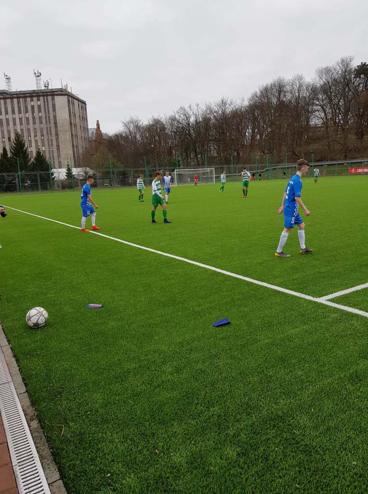
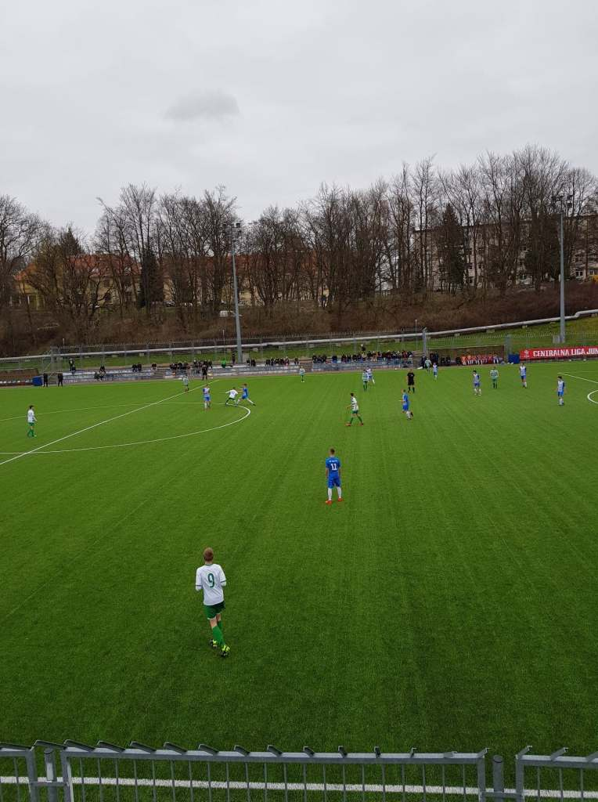
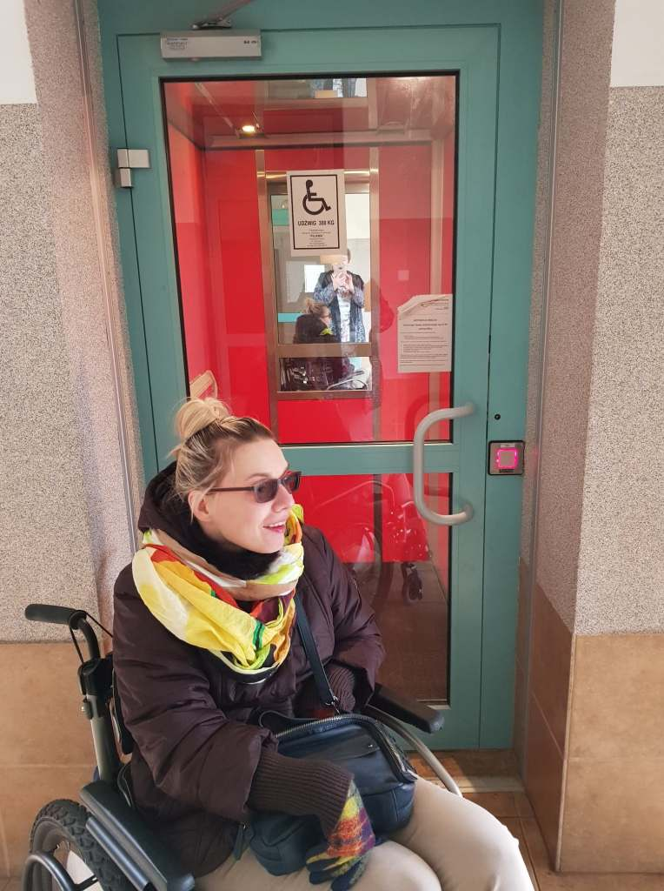
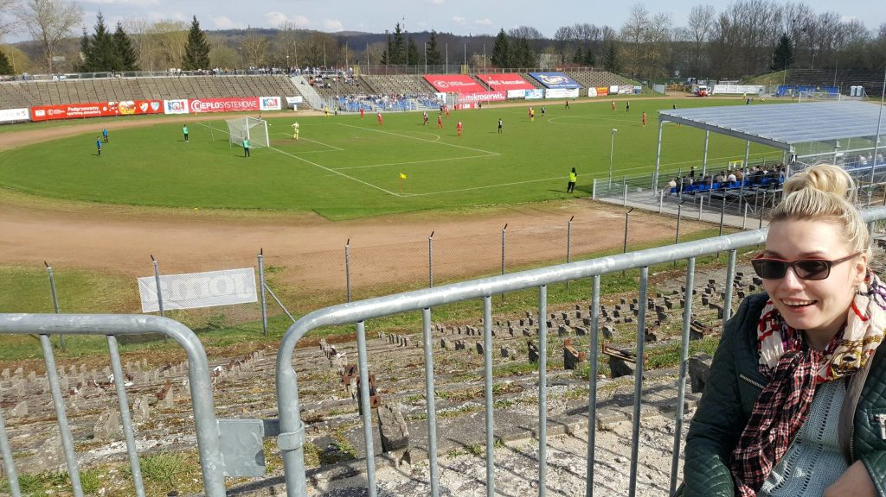
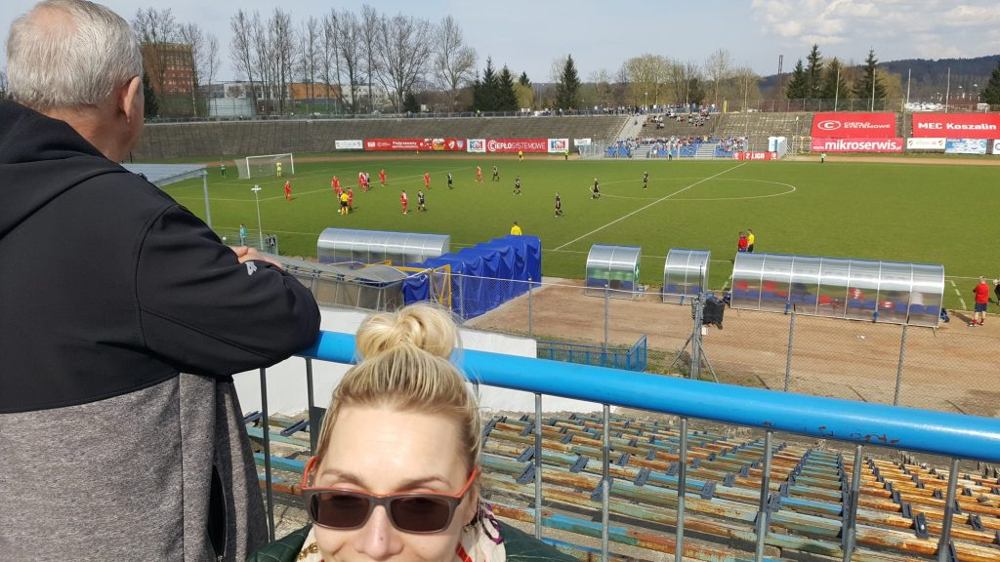
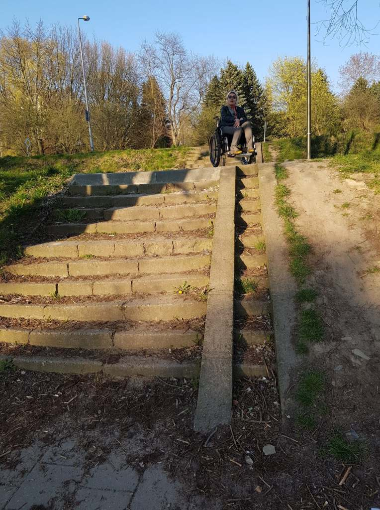
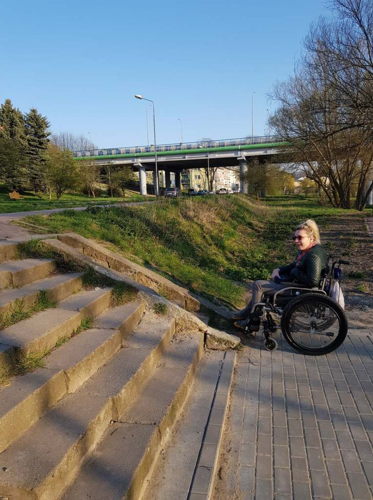
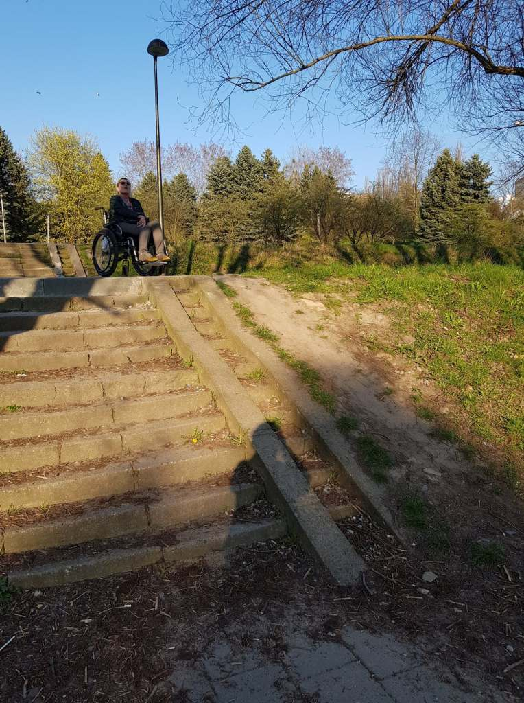
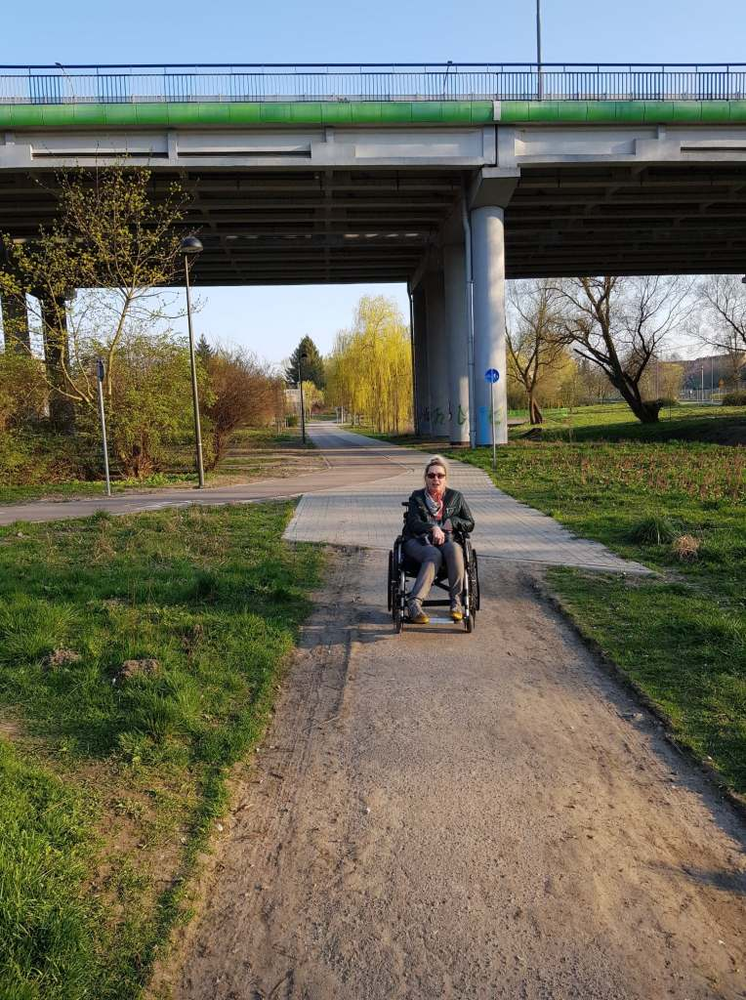

Na ostatnim spacerze moje kroki (kółka) skierowałam do naszego miejskiego parku. Czy to miejsce użyteczności publicznej jest dostępne dla wszystkich, po zakończonych pracach nowo powstałych ścieżek rowerowych?

W trakcie przechadzki zaciekawiły mnie  hałasy dochodzące ze stadionu Koszalińskiego Klubu Bałtyk, który  znajduje się w centrum zielonego serca naszego miasta. Trwał mecz piłki nożnej, w rozgrywkach CLJ (Centralnej Ligi Juniorów), w której jak się dowiedziałam od kibiców nasza lokalna Akademia Piłkarska bardzo dobrze sobie radzi. Nasi juniorzy do lat 15-tu wygrali 1:0 z drużyną Lechii Gdańsk.

    

    

Piłka nożna jest jedną z dyscyplin sportowych, której zasady zostaną dla mnie nieodgadnione. Duch kibica odzywa się jedynie w rozgrywkach światowych, przy udziale polskiej kadry.

Wracając do moich wytyczonych wcześniej zadań, stadion Bałtyku też poddałam testowi dostępności. Okazał się przyjazny dla osób z inną sprawnością fizyczną, Mimo, że impreza odbywała się na bocznym boisku, mogłam ją obserwować z widokowego tarasu, na który bez problemu dostałam się windą. Brawo dla zarządców Bałtyku Koszalin.

W tamtym roku w kwietniu odwiedziłam inny koszaliński stadion, poruszyłam to na mojej stronie, smutne ale obraz tej placówki do dzisiaj niewiele się zmienił.

    

    

Koszaliński park pozostawia jeszcze wiele do życzenia, ciągle wisi nędzny wizerunek wieloletnich zaniedbań. Tworzone ścieżki rowerowe z jednej strony rozświetlają miejski zieleniec, jednak z drugiej strony ujawniają ciemne schody.

    

    

    

Zastanawia  mnie zasadność pozostawiania komunistycznych budowlanych bubli, które nikomu nie służą. Czy koszt demontażu tak bardzo przekroczyłby budżet miasta? Czy może pozostawiono w myśl zasady „lepsze to niż nic”? Alejki spacerowe dla innych użytkowników, które ciągną się wzdłuż tras rowerowych nagle się urywają.

Widocznie, mój spacer ma ustanowione granice dystansu, mam nadzieję, że to tylko chwilowe zawieszenie prac i w niedalekiej przyszłości koszaliński park będzie wzorem idealnego obiektu użyteczności publicznej tj . dostępnego dla każdego.
