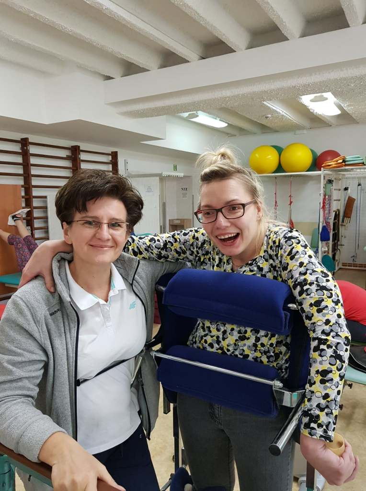
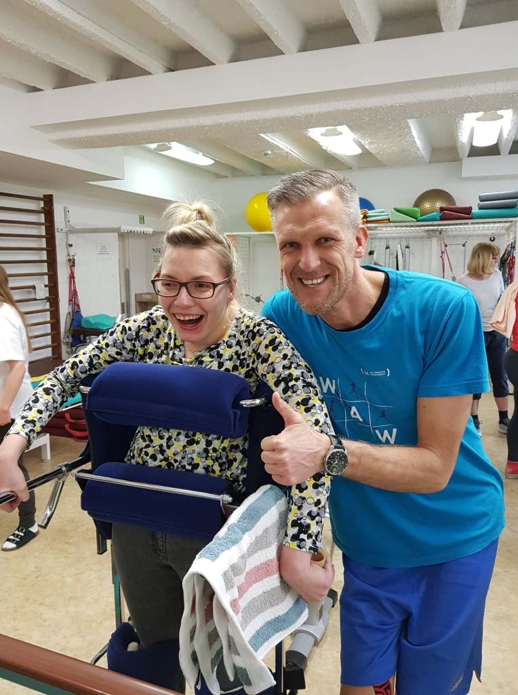
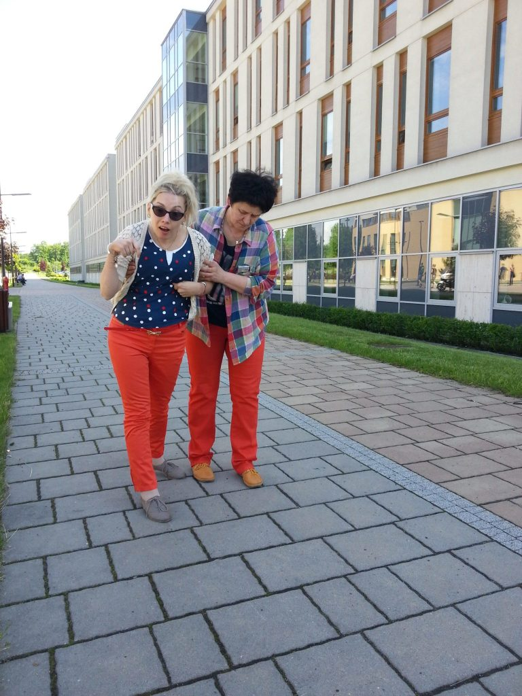
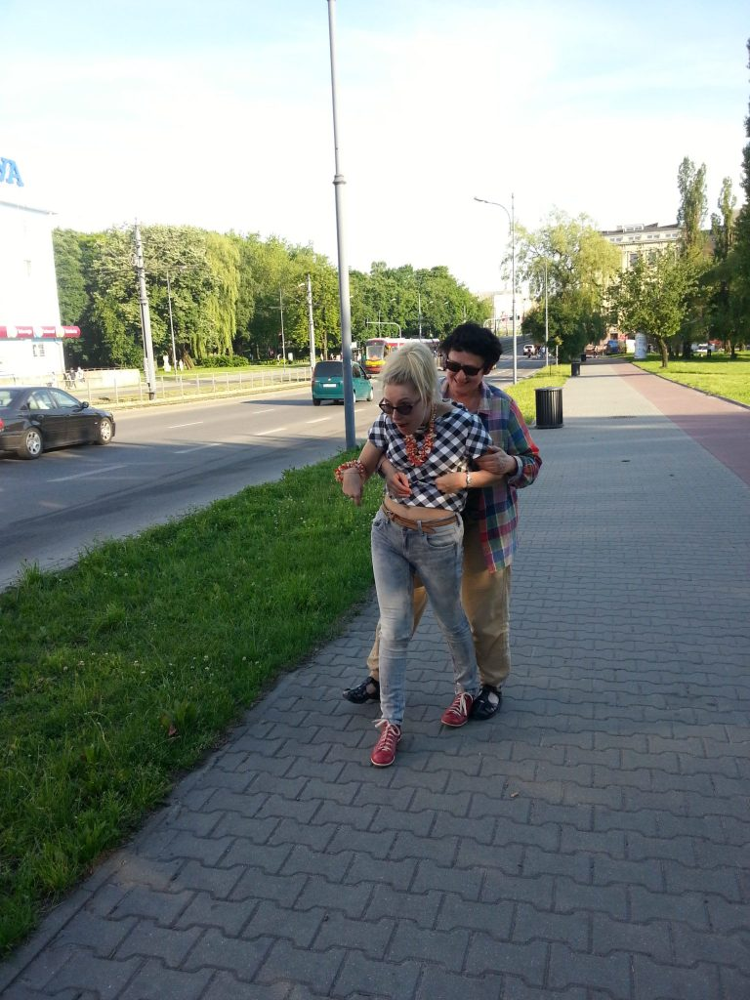
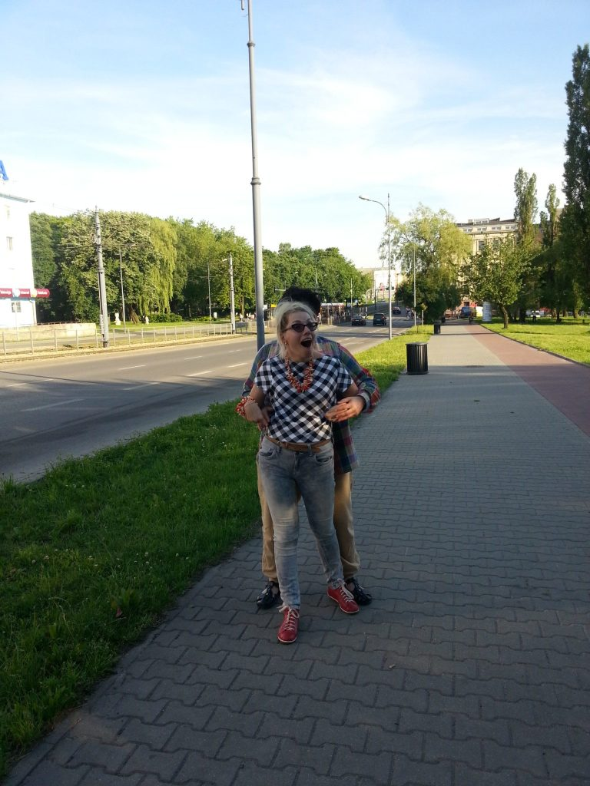
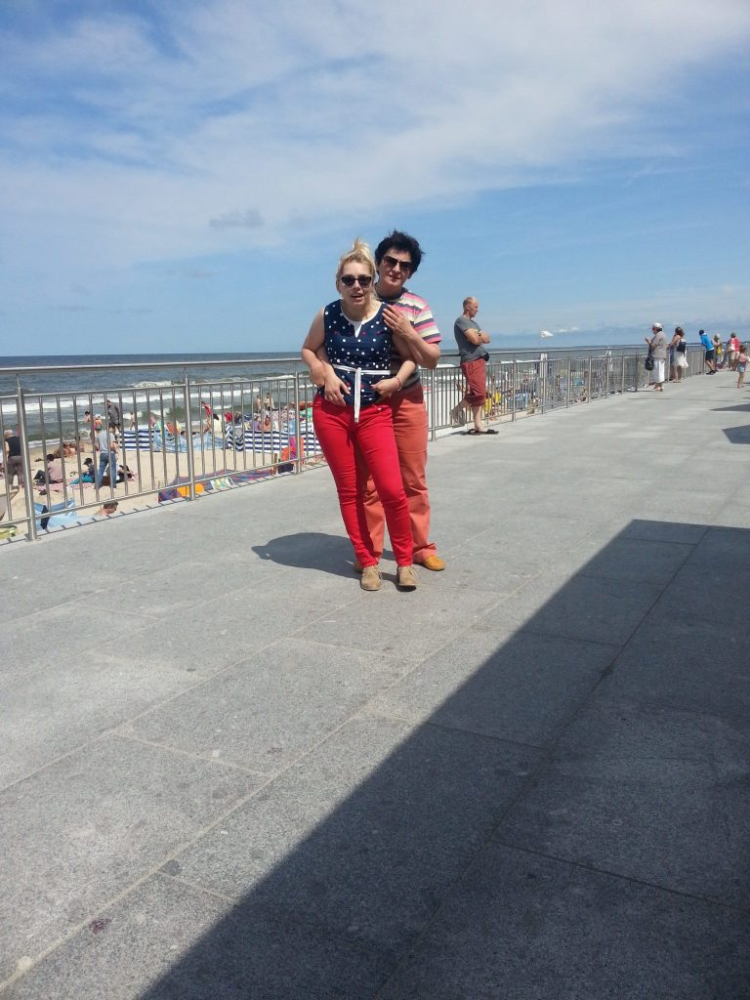

Dzisiaj zacznę od końca, jadę albo idę w światowym biegu ”WINGS FOR LIFE WORLD”. Próbowałam zarejestrować się jako uczestniczka biegu w Poznaniu, ale niestety brak miejsc na liście startowej. Spóźniłam się, przez co przegapiłam szansę wypróbowania darmowego samodzielnego spaceru w egzoszkielecie. Trudno, wierzę że kiedyś ta chwila nastąpi.

Mój długoletni fitness w ostatnim czasie rozwinął się o zajęcia w koszalińskim szpitalu w oddziale rehabilitacji , z czego się bardzo cieszę. Ćwiczę to czego nie mogę wykonać w domu, w dodatku w doborowym towarzystwie. Nigdy nie wiemy co się nam przydarzy, w trakcie zajęć zaintrygował mnie pewien facet, nie wiedzieć dlaczego chciałam wiedzieć kim on jest. Odpowiedzi na to pytanie udzieliła mi Beata, szefowa rehabilitacji.

    

    

Usłyszałam - filar koszalińskiej koszykówki w latach 90-tych. Tak, mnie nigdy nie przyciągał sport. Pan Piotr Kondraciuk bo o nim mowa, w bardzo krótkiej rozmowie uświadomił mi, że swoje siły w tragedii trzeba szukać tylko w swojej, a nie w obcej głowie. Rehabilitacja (choć czasami może najzwyczajniej boleć) jest konieczna, żeby nie usiąść albo się położyć, czyli się nie poddawać swojej chorobie, albo swojej inności. ‘’Dostałam’’ dodatkowej, wielkiej siły, za co Tobie Piotrku bardzo dziękuję.

Swój „bieg” realizuję w Koszalinie w Dolinie Wodnej, start w dniu 5 maja o godz. 13:00. Serdecznie zapraszam do biegu wspólnego, (jest czas na rejestrację) lub kibicowania i trzymania kciuków. Zakładam około 35 minut swojego uczestnictwa, to będzie mój rekord. Zobaczymy. Pozdrawiam i do zobaczenia na starcie biegu.

    

    

    

Czy będę pierwsza na mecie zobaczymy?

