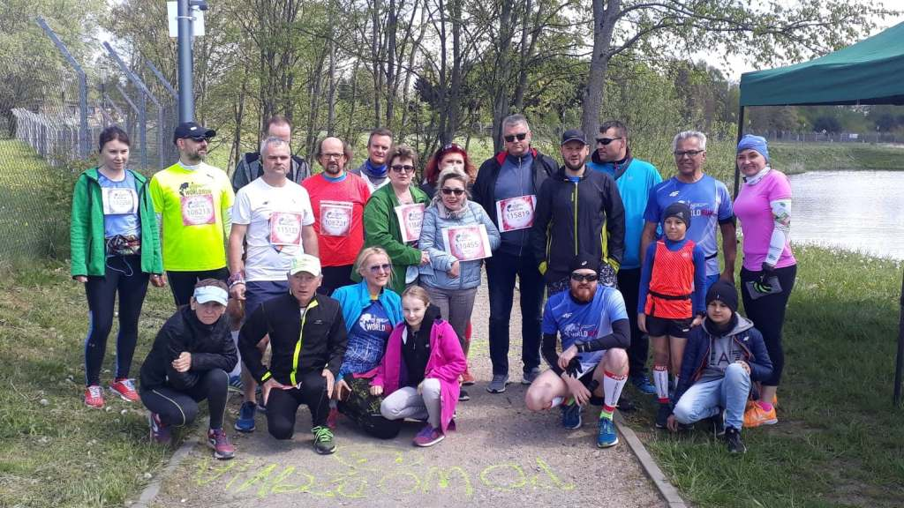
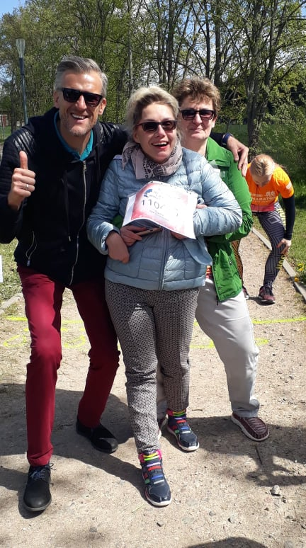
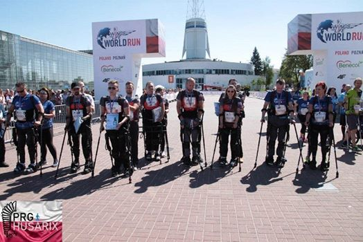
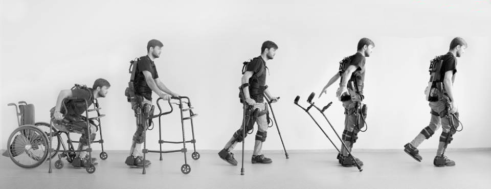
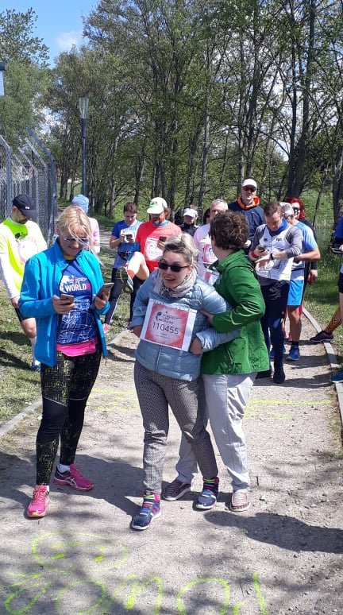
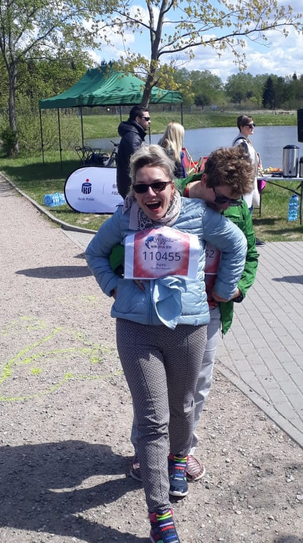
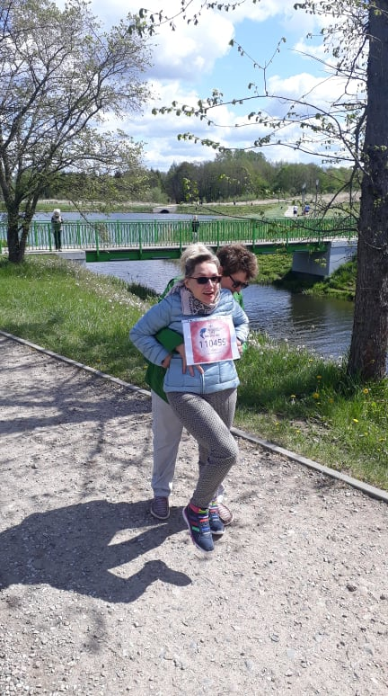

Czas na podsumowanie mojego udziału w **WINGS FOR LIFE WORLD RUN**.

Inspiracją do mojego startu w biegu stała się rozmowa z fajnym człowiekiem, którego poznałam na rehabilitacji w koszalińskim szpitalu. Mówię o byłym koszalińskim koszykarzu Piotrze Kondraciuku (sam boryka się z wieloma bolesnymi urazami) wciąż  jest aktywny sportowo. Zacytuję kilka zdań Piotra, które mi oświeciły, bardzo zmotywowały:

 „Swojej siły w tragedii trzeba szukać tylko w swojej, a nie w obcej głowie.” 

„Nie daj się! Człowiek jest taki, jakie myśli w jego sercu”.

„Bez względu na to jak źle jest w danym momencie pamiętaj, że to tylko moment.”

"Pozytywnie będę myśleć tylko jeśli wszystko się zmieni.." - czytaj od końca.

Nabrałam  apetytu na próbę sprawdzenia swoich możliwości. W Poznaniu, który jest polską stolicą **Wings For Life World Run** lista uczestników była już zamknięta. Nie sądziłam, że w Polsce jest tylu fanów biegania. Okazało się, że w Koszalinie  bieg ten również się odbędzie. Pomyślałam lepszy rydz niż nic, trudno, w tym roku pójdę - „pobiegnę” u siebie, a w 2020 zgłoszę się do Poznania (tam mam szansę wypróbowania / przetestowania egzoszkieletu).

Po załatwieniu formalności, stanęłam na starcie w asyście swojego osobistego bioszkieletu tj. starszej siostry Margaret. Drużyna fantastycznych ludzi ze stowarzyszenia „Biegamy bo lubimy”, których poznałam na chwilę przed startem zadbała o wszystko. Atmosfera wśród zawodników i organizatorów zauroczyła mnie, odniosłam wrażenie, że znamy się od wielu lat. Wzajemny serdeczny doping, wsparcie i przyjacielska rywalizacja była mottem przewodnim biegu, który rozgrywaliśmy w pięknym plenerze Doliny Wodnej. To wszystko zdecydowało o zmianie moich planów w przyszłorocznym biegu Wings For life World Run. Po co mam się tułać po obcych drogach, jak tu na miejscu mam wszystko, może prawie wszystko? Brakuje tylko egzoszkieletu, urządzenia  wspomagającego ludzi, którzy bardzo chcą, a nie mogą z różnych powodów samodzielnie chodzić. Teraz się nie udało, ale może w przyszłym roku. Zobaczymy. Fajnie by było, gdybym w kolejnym roku 2020 „pobiegła” - poszła w egzoszkielecie w Koszalinie w Dolinie Wodnej, w tym samym doborowym towarzystwie.
    

    
