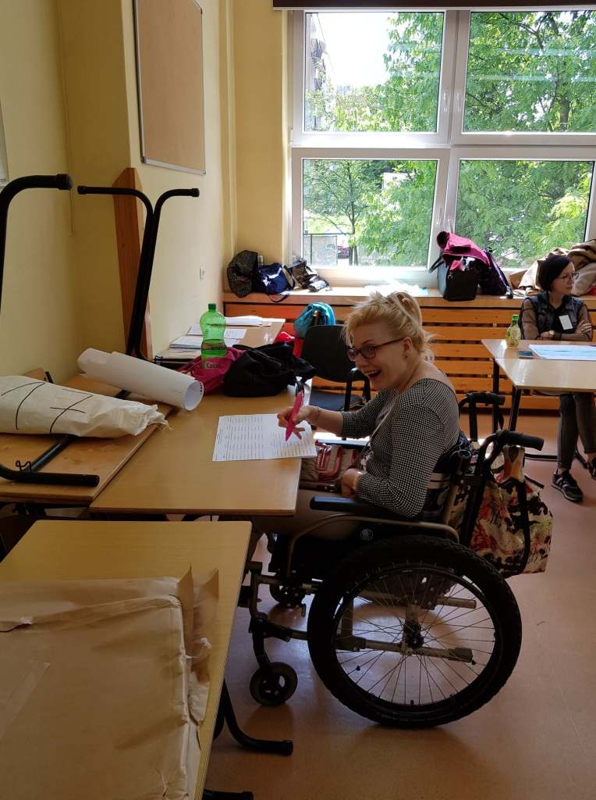
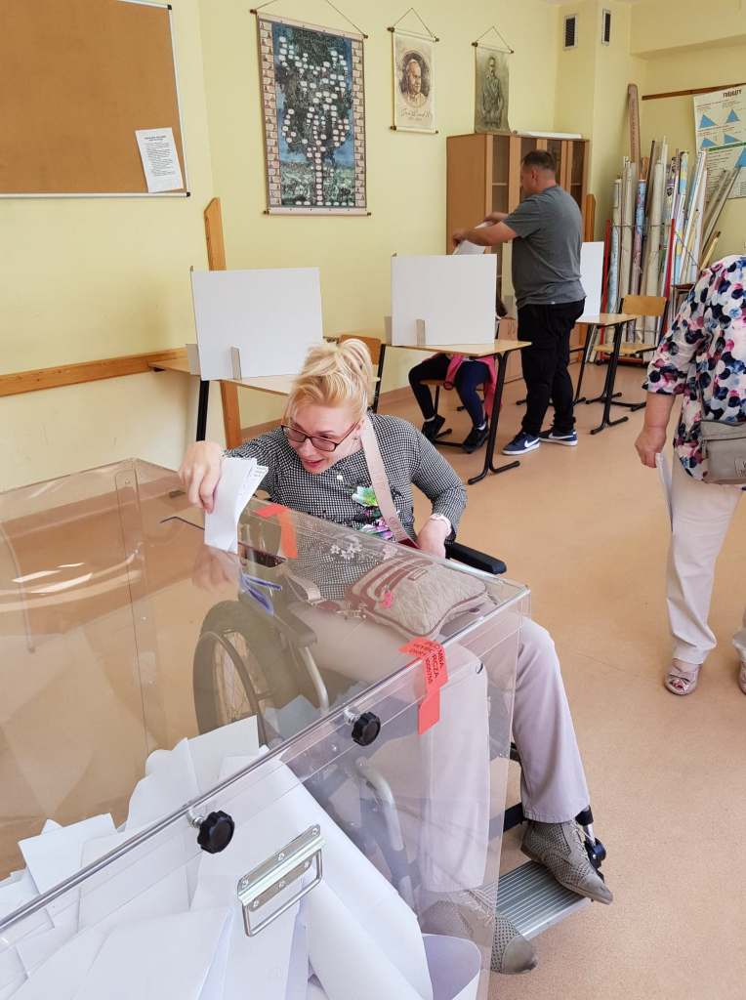
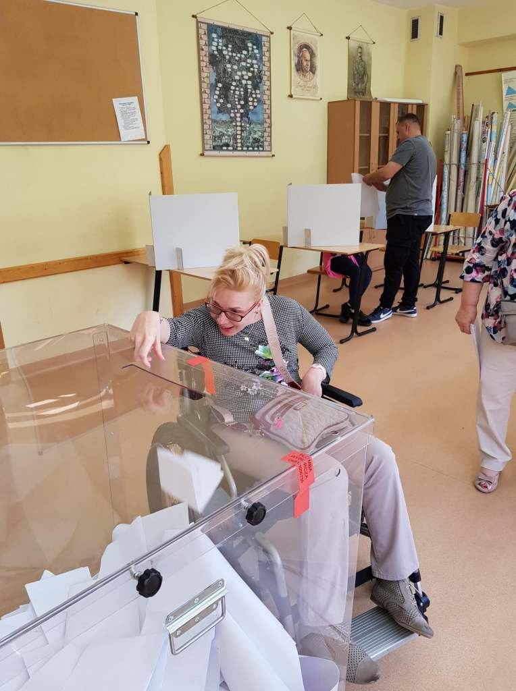

Mój udział we wczorajszych wyborach do Parlamentu Europejskiego (po raz pierwszy) potwierdza regułę, że jak bardzo się chce, to można.

Pobyt w Krakowie, zaplanowany już miałam od dawna, okazało się, że właśnie w tym czasie odbędą się wybory. W koszalińskim ratuszu wydano mi imienne zaświadczenie, które pozwoliło zagłosować poza miejscem zamieszkania. W samym  Krakowie miałam dowolność wyboru Okręgowej Komisji Wyborczej, ze względu na dostępność obiektu. Po raz kolejny stwierdzam, co mnie bardzo cieszy, miasto Kraków jest miastem przyjaznym dla ludzi z niepełnosprawnościami.

    

    

Samo głosowanie przebiegło sprawnie.

Wśród sporej grupy wyborców niestety nie spotkałam nikogo na wózku.
