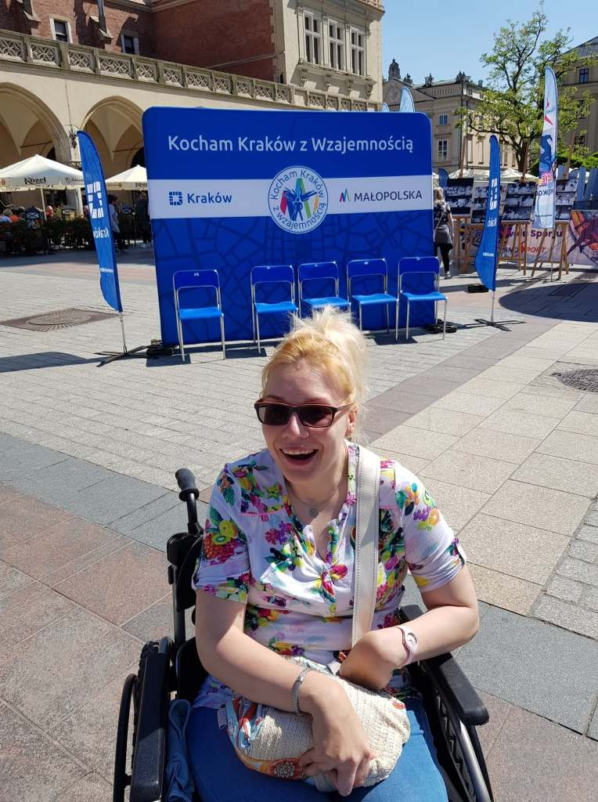
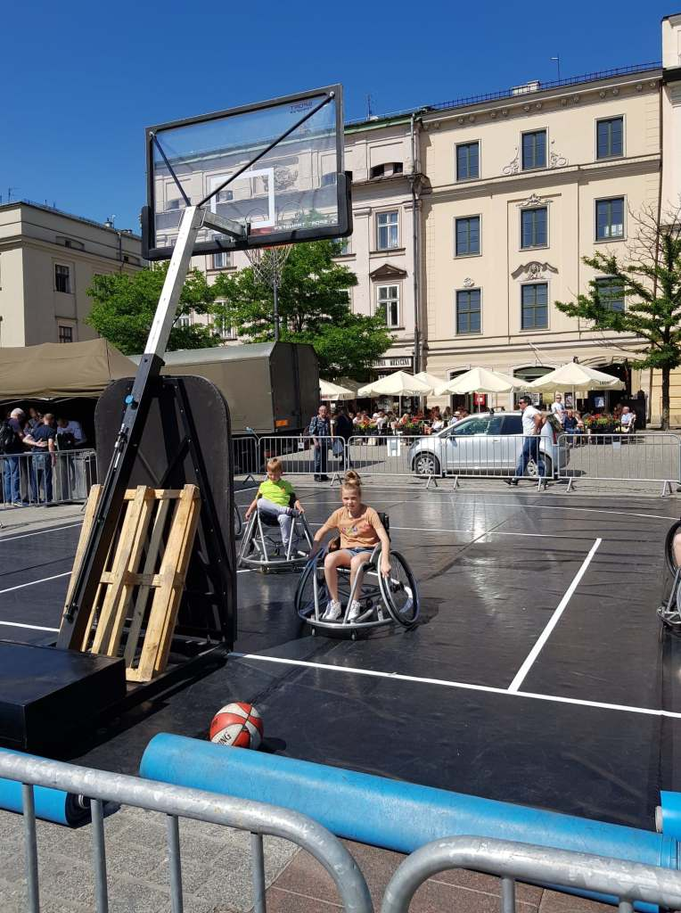
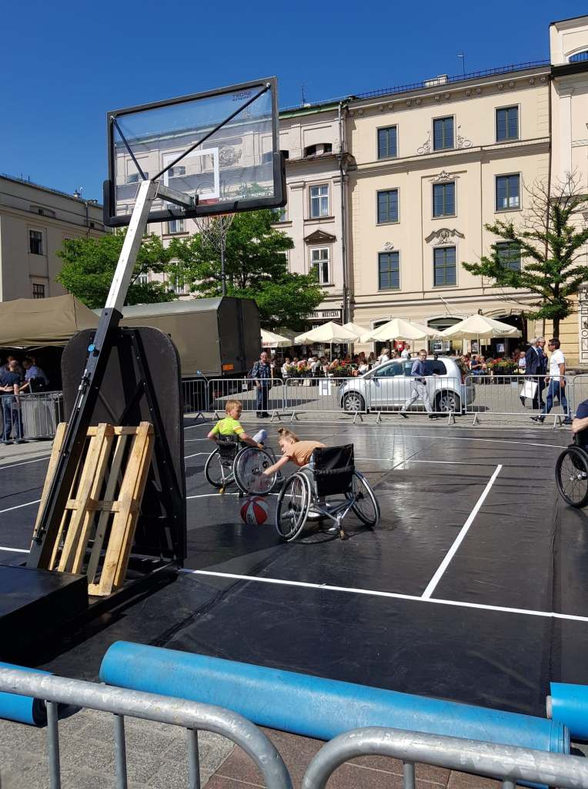
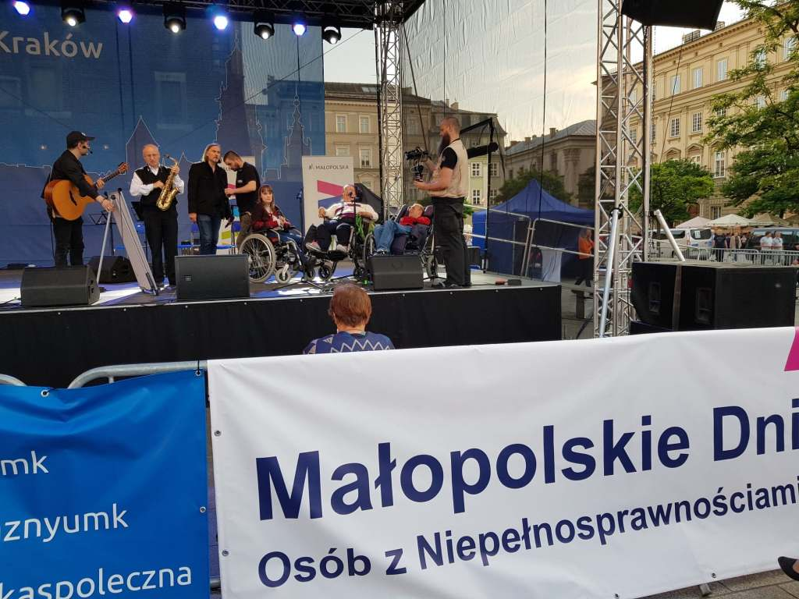
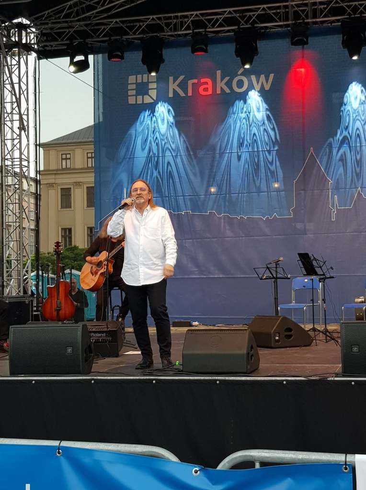
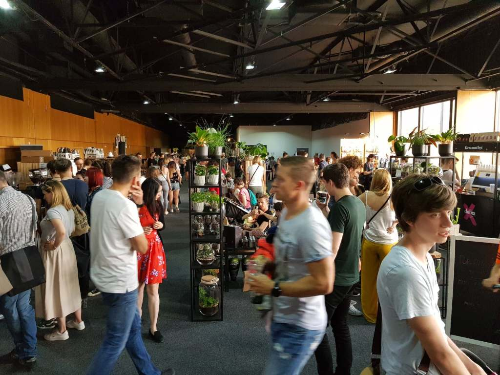
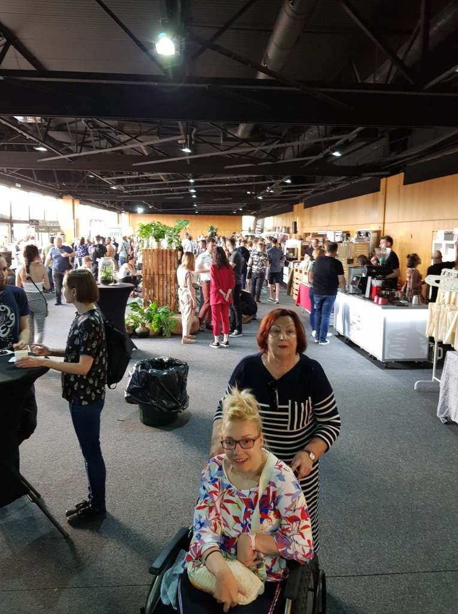
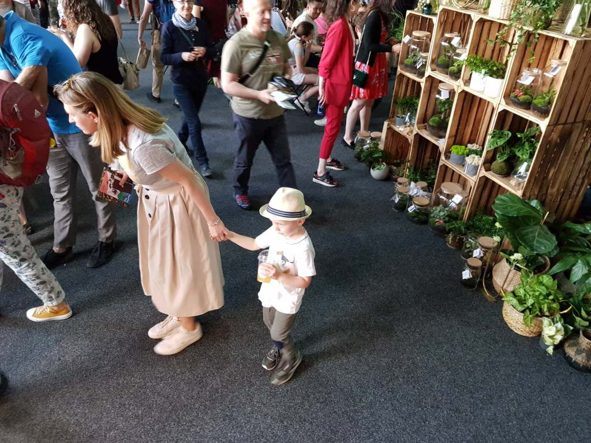
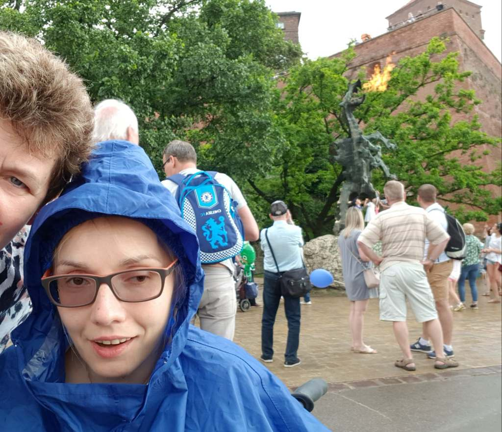

Ostatni weekend w Krakowie obfitował w plenerowe imprezy.

Piątkowe popołudnie spędziłam na Rynku Głównym w gronie sympatycznych ludzi. Trwał **XX Małopolski Tydzień osób z niepełnosprawnościami**. Rozstawiono dużo namiotów, w których zorganizowane grupy ludzi niepełnosprawnych ”chwaliły się” swoimi osiągnięciami, twórczością i umiejętnościami. Własne przeżycia, przekonały mnie nie raz, ile trzeba włożyć siły, koncentracji myśli a często wiele łez, aby wykonać prozaiczną czynność, którą w pełnej sprawności wykonujemy właściwie prawie automatycznie. Dużym zainteresowaniem cieszyła się liczna drużyna szachistów, która zapraszała do wspólnej gry. Sama nie umiem grać, ale miłym zaskoczeniem był widok ustawionej kolejki chętnych. Niezwykłe wrażenie wywarł na mnie mecz koszykówki, warunkiem udziału w grze było poruszanie się na wózku.

    

    

Widziałam podejmowanie prób grania w pozycji siedzącej przez osoby sprawne. Oj, nie łatwe to zadanie, jestem pełna podziwu dla zawodników.

O 20-tej na scenie Rynku Głównego wystąpił zespół aktorów z niepełnosprawnością o nazwie EXIT.

Repertuar zawierał słowa różnych psalmów ubarwione rytmicznym bluesem. W trakcie występu jeden z widzów otworzył przypadkową stronę Księgi Psalmów. Wspólnie z widownią stworzono następny utwór, który razem zaśpiewaliśmy. Gwiazdą wieczoru był Marek Piekarczyk, którego znałam jedynie z roli jurora muzycznego programu telewizyjnego.

Piękny człowiek i koncert, widać było, że publiczność zebrana wokół estrady nie była przypadkowa. Były wokalista rockowej grupy TSA, prekursorów heavy metalu w Polsce, tytułowy Jezus w rock - operze pt. Jezus Christ Superstar. Poderwał całą publikę do wspaniałej zabawy. Śpiewom a nawet tańcom nie było końca, trudno było się rozstać.

Przesadnie moim zdaniem nazwana hucznie „Festiwalem kawy” impreza  zorganizowana  na Tarasach Wiślanych, była mierna. Owszem wybór kaw smaków, różnorodność mieszanek i sposobów parzenia była pokaźna, słodkości również, ale organizacyjnie całość imprezy mocno kulała. Zabrakło mi klimatu w jakim powinno się delektować małą czarną.

    

    

    

Spory tłum kawoszy zmuszony był do przepychania się między ciasno ustawionymi stoiskami. Miejsca siedzące graniczyły z cudem, ja miałam swoje ze sobą (towarzyszy mi już od piętnastu lat, ale ten czas pędzi). Dawno zapomniane miejsce, brudno, toalety dla mnie niedostępne przez schody. Szkoda miałam nadzieję miło spędzić czas. Niestety.

Muszę się przyznać, że nie mam szczęścia do krakowskiej pogody, chciałam obejrzeć Paradę Smoków - smocze widowisko pod Wawelem. Zarówno rok temu, jak w tym roku potężna ulewa skutecznie mnie przegoniła, zdążyłam jedynie odwiedzić smoka wawelskiego.

    

    

Może w przyszłym roku…?
