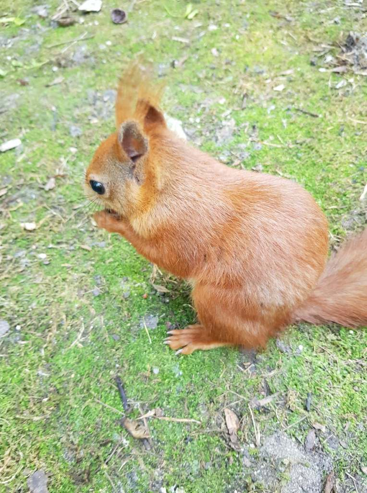
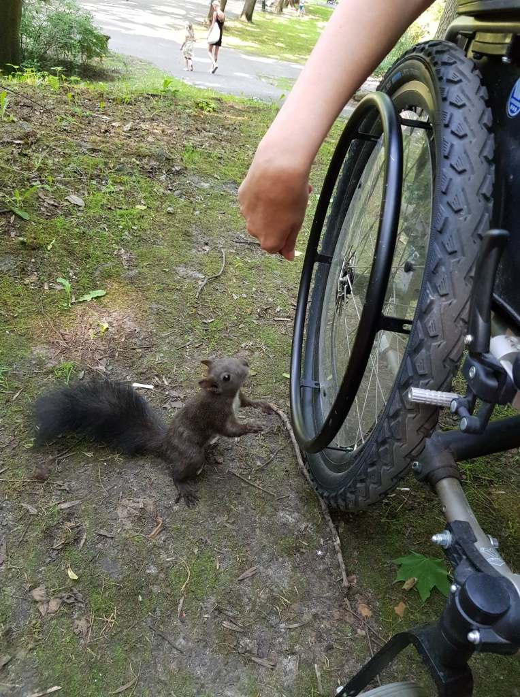
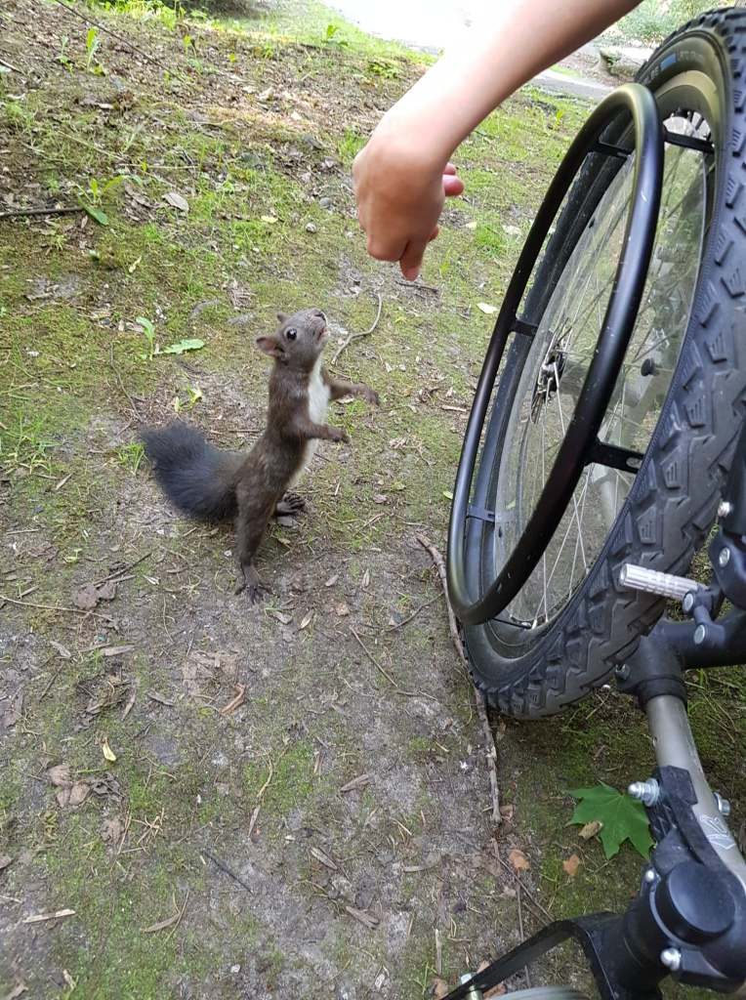
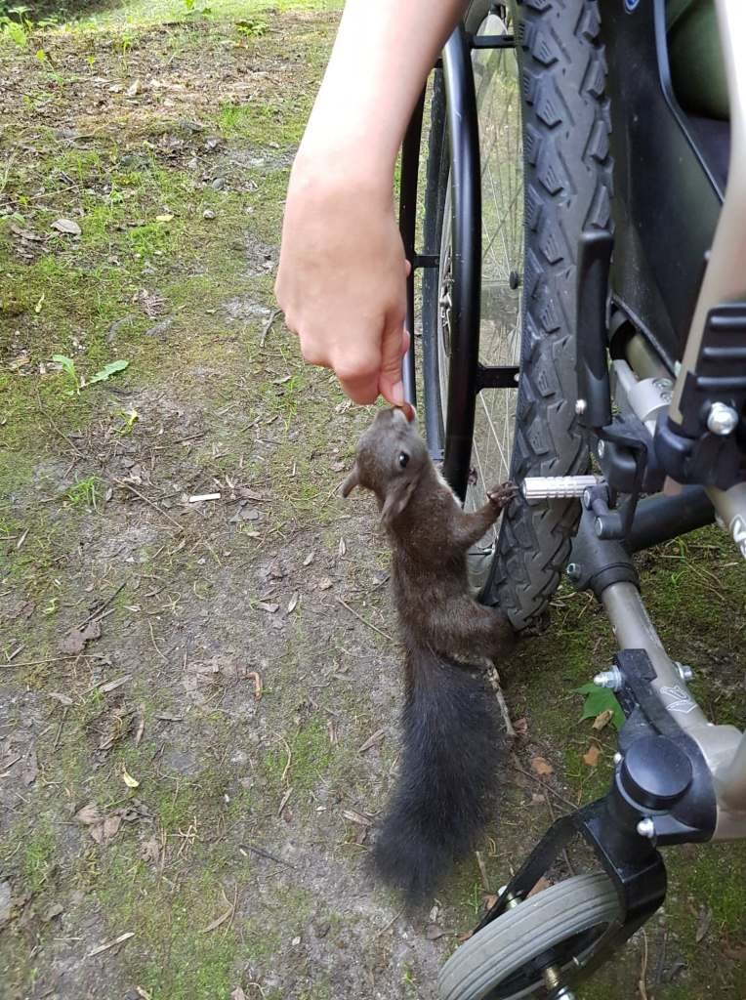
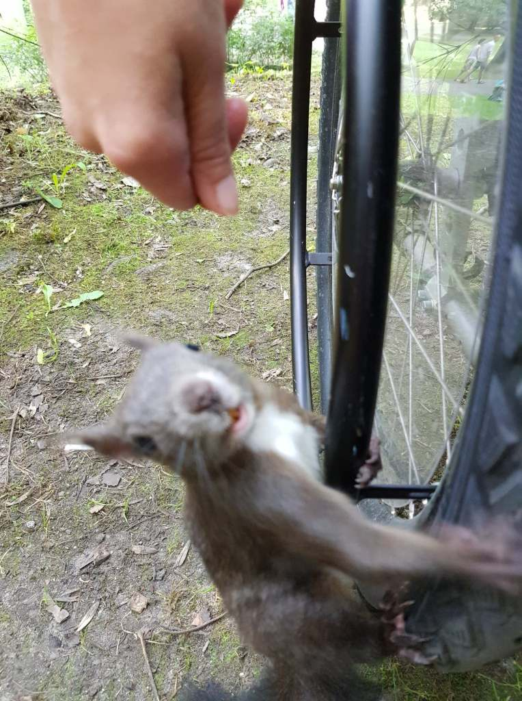

Stało się już zwyczajem, że w trakcie mojego pobytu w Krakowie odwiedzam też moje serdeczne przyjaciółki, zwyczajowo zwane Baśkami. Wiewiórki, bo o nich wspominam mieszkają w parku im. Wojciecha Bednarskiego na Podgórzu. Jest to bardzo urokliwe miejsce.

    

    

    

    

Tak stało się i tym razem, czekały i zachowywały się jakbyśmy rozstały się wczoraj. Minął równo rok od naszego ostatniego spotkania i nic się nie zmieniło. Pełne energii i zaufania zabrały się rozkosznie za bufet zapełniony smakołykami tj. orzeszkami włoskimi.

Do zobaczenia za rok.
