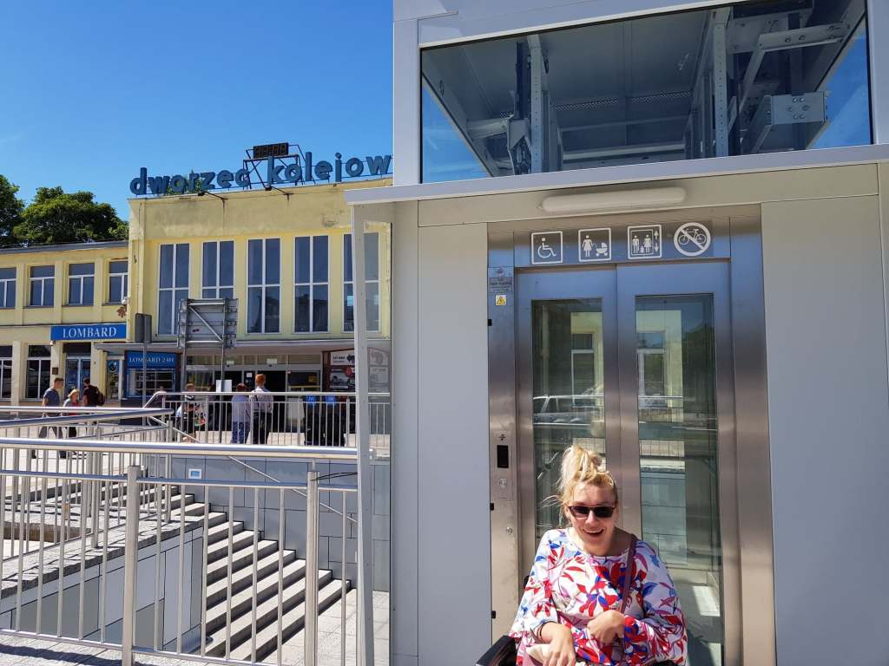
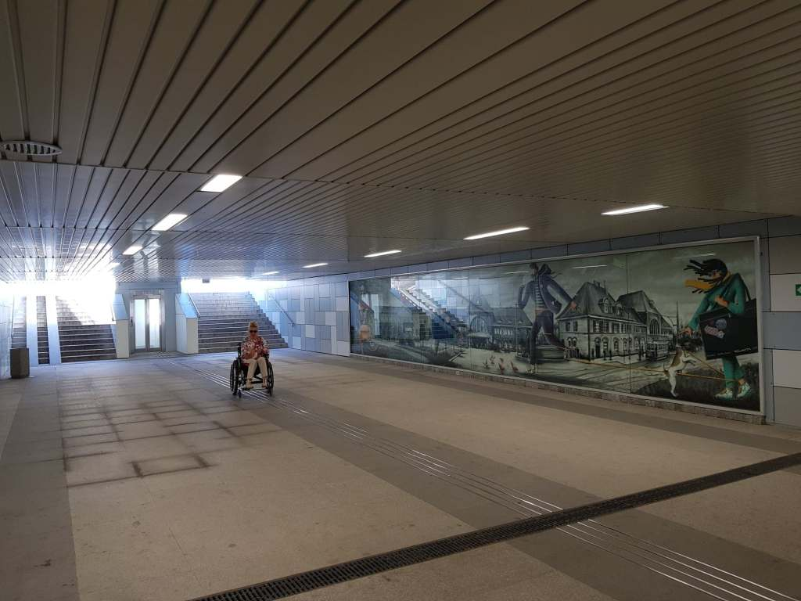
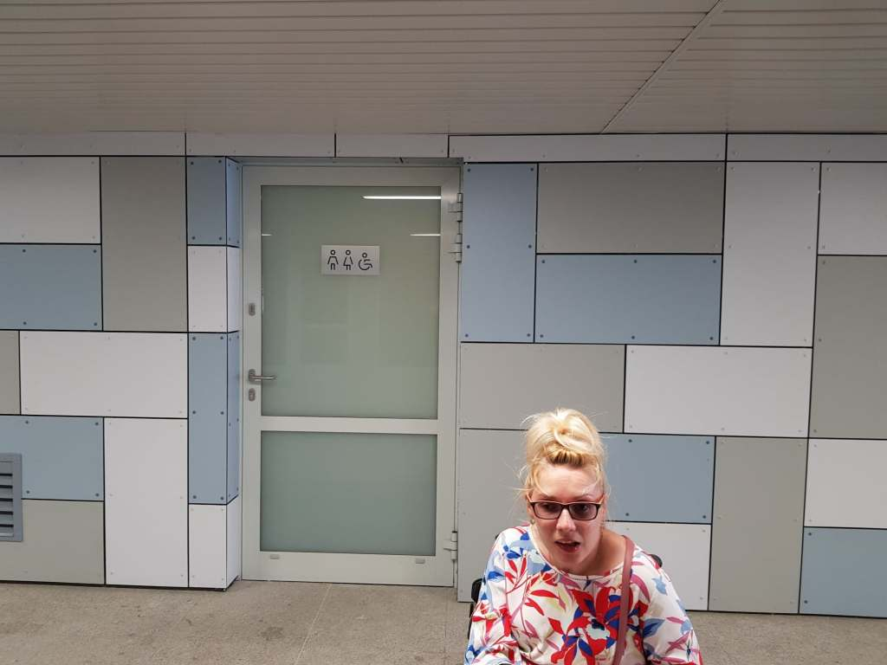
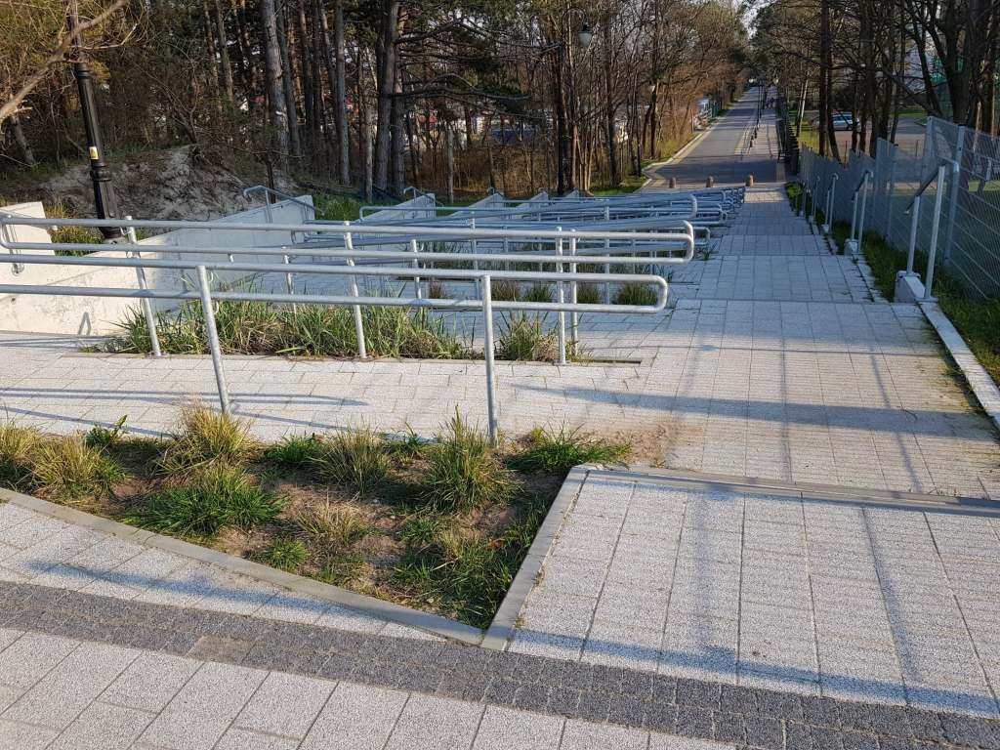
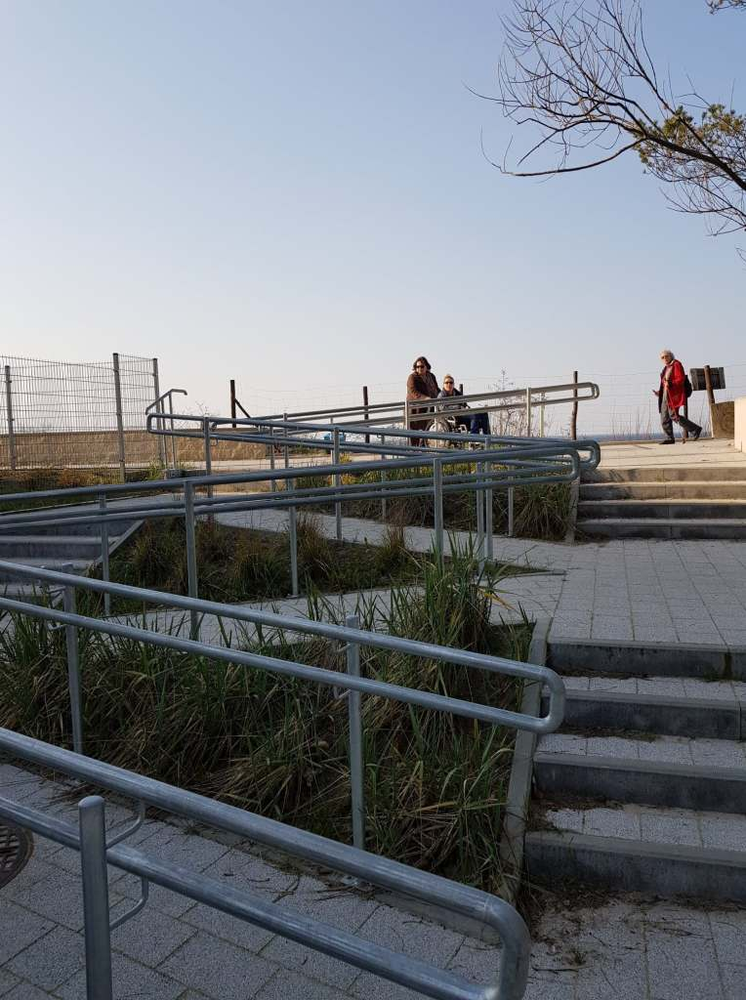

Bardzo się cieszę, że już teraz podróż do i z Koszalina dla osób z niepełnosprawnością staje się łatwiejsza. Winda przy dworcu jest i działa, sama sprawdziłam. Koniec koszmarnych niekończących się objazdów po wątpliwie równych chodnikach. Do windy, którą wymieniłam wcześniej prowadzi piękny, aktualnie po remoncie tunel podziemny.

    

    

Podróż pociągiem stała się dla mnie realna. Mam taką nadzieję i zamierzam już wkrótce przetestować trasę do Mielna. Pochwalić się nią a nawet być przewodnikiem dla znajomych i przyjaciół, uczestników zbliżającego się festiwalu filmowego INTEGRACJA TY I JA. Poprzednie lata były ubogie w komunikację podmiejską.

W ubiegłym roku rozkład jazdy pociągu do Mielna obowiązywał do 31 sierpnia. Impreza filmowa rozpoczyna się w pierwszych dniach września, a gdyby tak... chociaż o te kilka dni. Byłoby extra, sama też bym chętnie skorzystała z tak dogodnej dla wózkowiczów podróży nad nasze morze.

    

    

