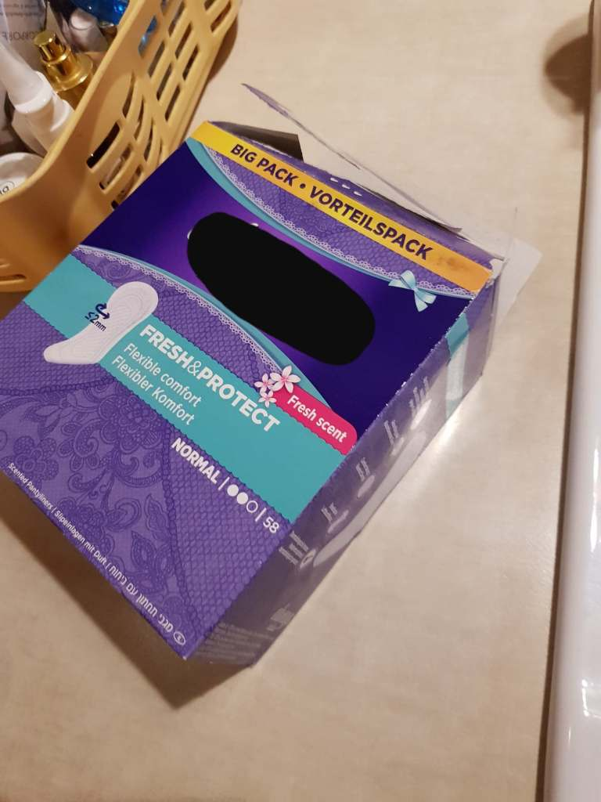
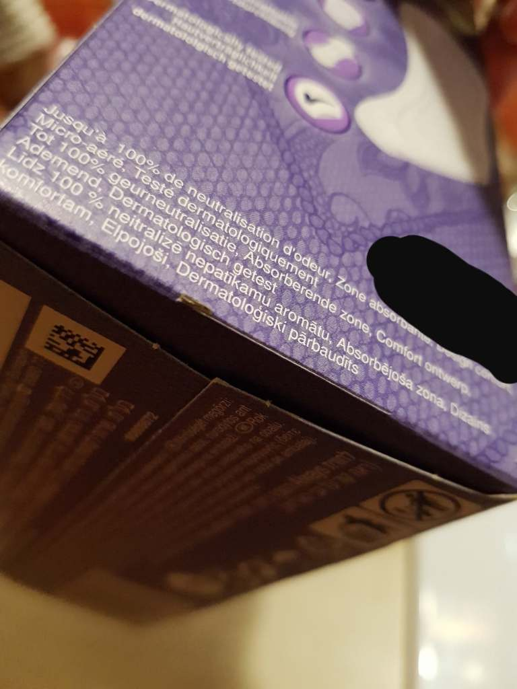

Opowiem Wam historię, która mi się ostatnio przydarzyła. 

Zacznę od początku.

Robiłam zakupy, w jednym z największych sklepów sieciowych, do koszyka wrzuciłam m.in. opakowanie wkładek (najbardziej popularnej firmy na rynku). Na obecną chwilę, wtedy za słabo na mnie podziałało (teraz już wiem) dało mi do myślenia za duża lekkość tej paczki. Przy kasie samoobsługowej po zeskanowaniu towaru, waga nie odnalazła tego artykułu. Doradca handlowy, czyli pracownik sklepu zwyczajnie „przepchnął” w programie kasy na następny produkt.

    

    

Kupione przeze mnie to pudełko wkładek było oryginalnie zamknięte co uśpiło moją czujność (po artykuły sięgam zawsze z głębi półki, opakowania z brzegu są przeważnie uszkodzone i niepełne. W domu okazało się, że w sklepie miałam słuszne wątpliwości, szkoda tylko, że nie potraktowałam od razu ich poważnie.

Pudełko było, tak mi wyglądało, na oryginalne zamknięte, po otwarciu opakowania okazało się, że jest całkowicie puste. Za dziesięć złotych kupiłam kartonik bez zawartości. Za głupotę, własną bezmyślność trzeba płacić.

NIE DAJCIE SIĘ OSZUKAĆ, SPRAWDZACIE KAŻDE OPAKOWANIE ARTYKUŁU, KTÓRY ZAMIERZACIE KUPIĆ.
