Zbliża się koniec wakacji, a wiec czas na posumowanie wypoczynku nad morzem Bałtyckim. Dysponując własnym środkiem transportu wydaje się, że sprawa jest prosta. Dojechać można wszędzie, podróż potrwa trochę dłużej, wąskie jezdnie co za tym idzie-jedzie przez kilometrowe korki, m.in. do Mielna, ale tak się dzieje przy większości popularnych miejsc wypoczynkowych.  Jeżeli w planach urlopu wyruszamy w dalszą podróż wybór własnego pojazdu jest słuszny, jednak są jeszcze inne rozwiązania szczególnie gdy mieszkamy  w pobliżu nadmorskich kurortów. Mieszkam w Koszalinie, kilkanaście kilometrów od Morza Bałtyckiego. Uśmiecham się w chwilach gdzie się przedstawiam w nowym środowisku i próbuję określić gdzie mieszkam, zawsze słyszę stwierdzenie: „….a tak, tak Koszalin to te miasto koło Mielna…”

Zacznę od drugiej, innej strony. Od dłuższego czasu, mocno irytowało, smuciło mnie stwierdzenie - ‘’Niemożliwie jak będąc, mieszkając od Bałtyku zaledwie 15 minut, być na plaży zaledwie kilka razy do roku’’. W sezonie letnim „podróż” samochodem lub autobusem mija się z celem, ponieważ trwa około 1 do 1½ godziny, w niekończącym się korku przy tropikalnych temperaturach można dosłownie wykorkować. Z transportu publicznego na tej trasie najbardziej popularne są tzw. busy, niestety nie dla mnie, mój pojazd się nie zmieści.

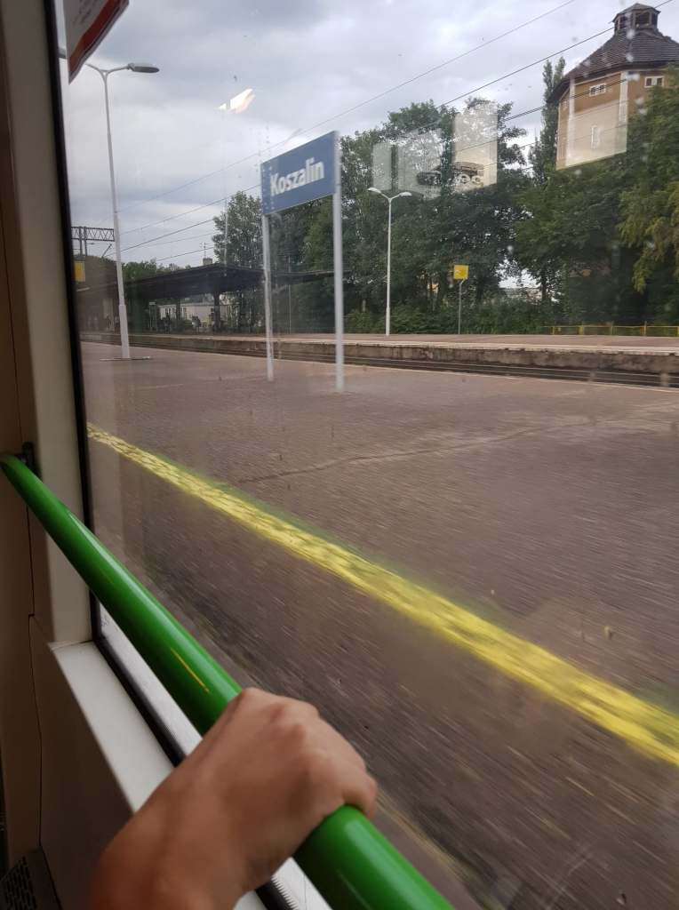
    
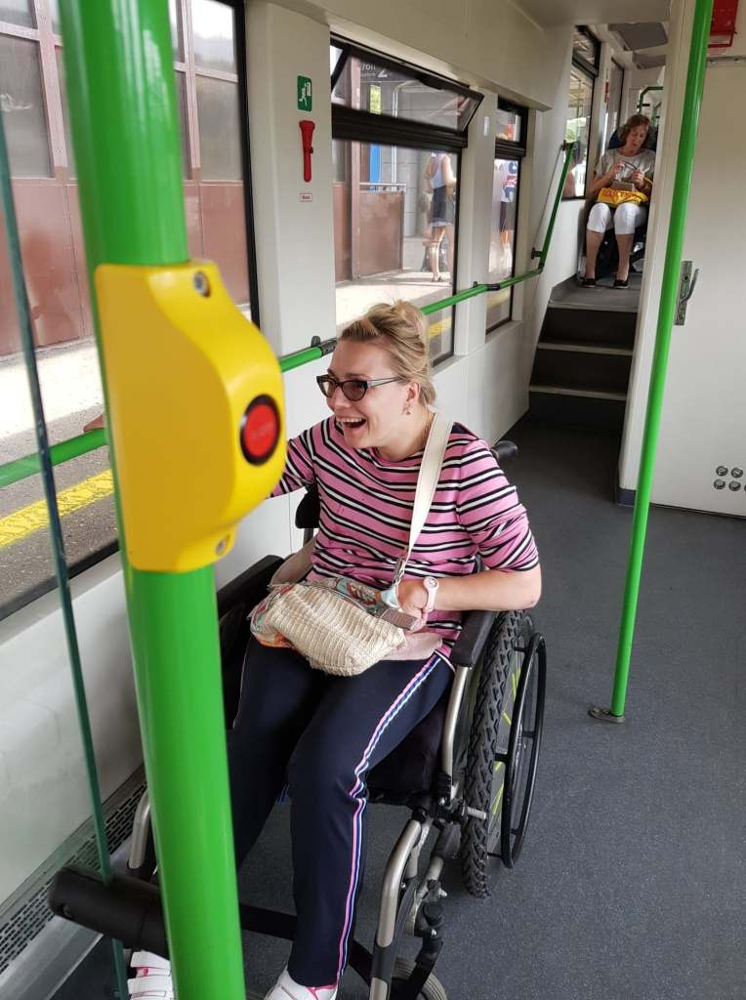
    
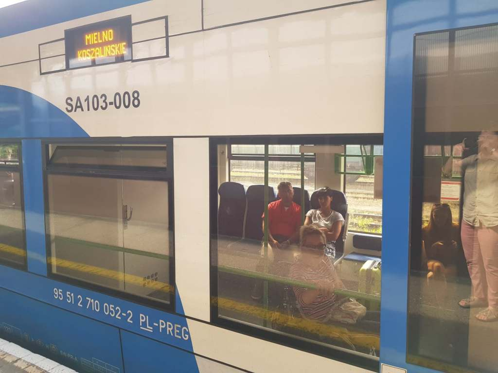
    
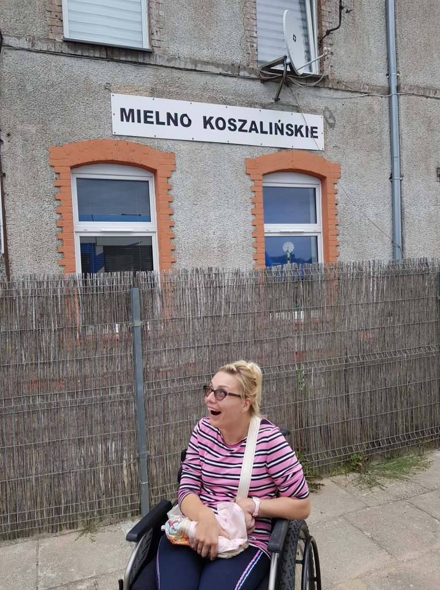
    

Od kilku lat w Koszalinie istnieje  podmiejski szynowy transport publiczny, również do Mielna. Od tego sezonu dostępny jest również dla nas wózkowiczów, co postanowiłam osobiście przetestować.

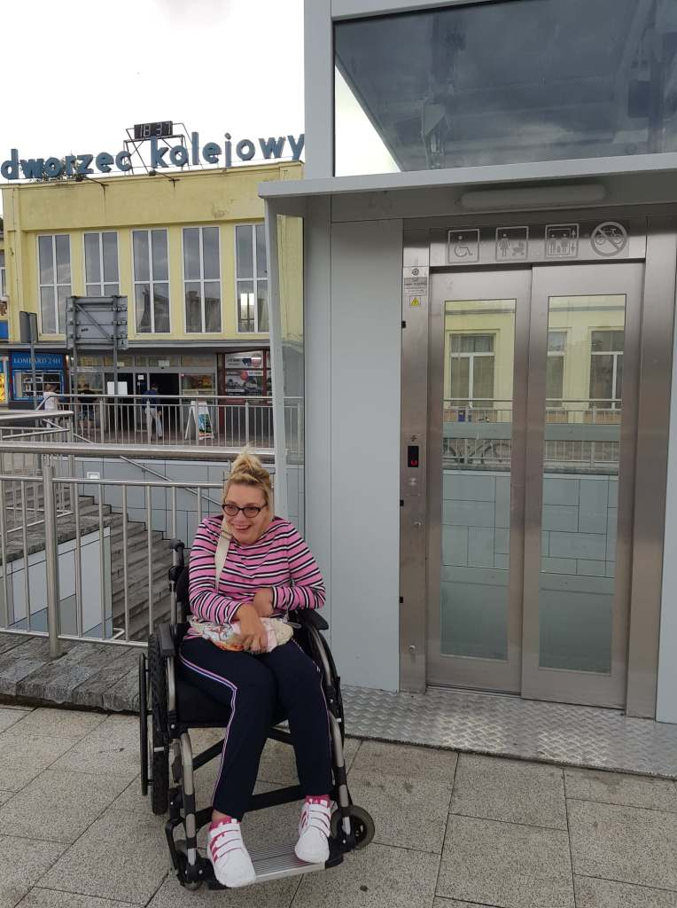
    
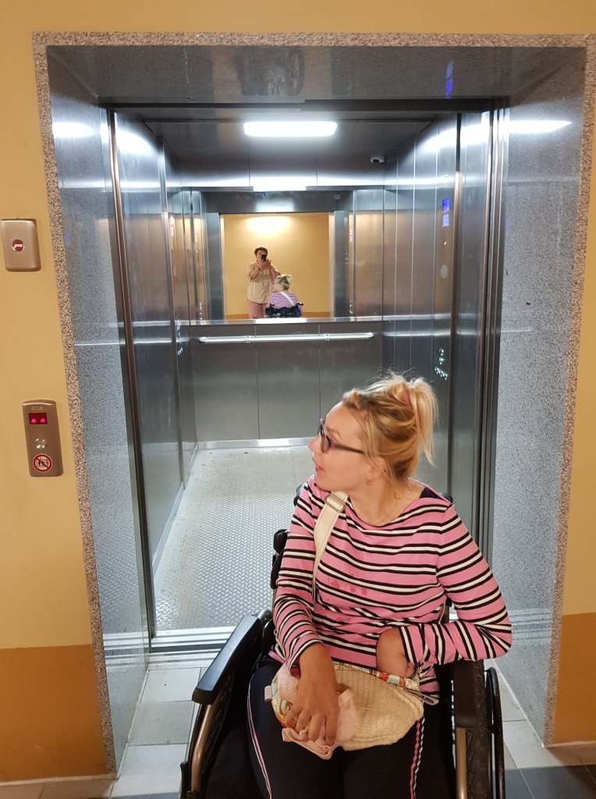
    

Windy przed budynkiem dworca PKP oraz na peronach kolejowych opisałam w moich poprzednich relacjach. Czas rozpocząć podróż. Z kupnem biletu (wbrew wcześniejszym informacjom) nie miałam żadnego problemu.

Procedury transportu publicznego PKP wymagają od podróżnego z niepełnosprawnością poruszającego się na wózku, zgłoszenia i wypełnienia osobiście szczegółowego formularza na 48 godzin przed podróżą. Dobrze, daleka podróż może potrzebne, ale we Francji nikt ode mnie niczego takiego nie wymagał, zwiedziłam Paryż poruszając się tylko transportem publicznym, również koleją.

Na tę podróż procedury zostały mi podarowane, wycieczka trwała 15 minut, nie mogła odbyć się bez bariery-schodka.

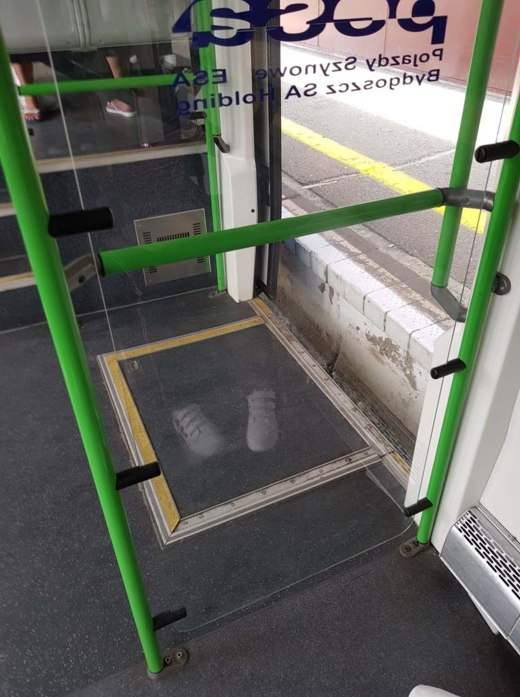

Różnica poziomów między peronem a podwoziem wagonu wynosiła około 50 cm, na szczęście sympatyczna i przystojna, a przede wszystkim dobrze przeszkolona załoga pociągu  pomogła. Owszem w asyście przejdę nawet spory kawałek, ale zeskakiwać, albo samodzielnie podskakiwać na kilka metrów w górę nie jestem w stanie, zwyczajne nie mogę.

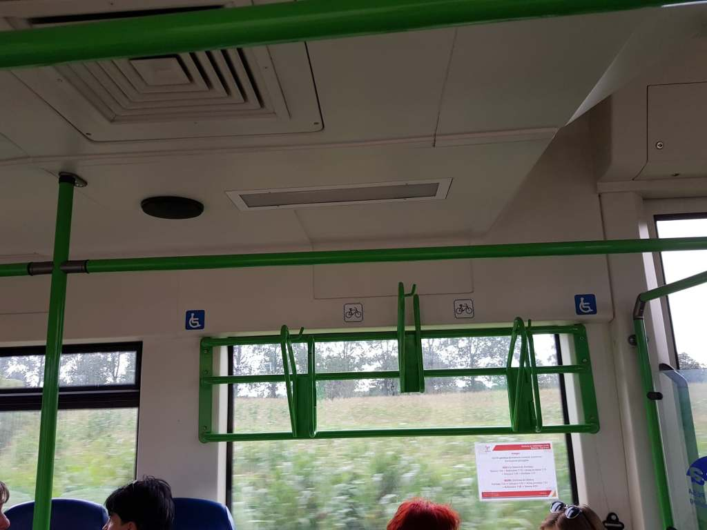
    

Warunki przejazdu dobre, dużo przestrzeni na pojazdy, i ku mojemu zaskoczeniu dostępna toaleta DLA WSZYSTKICH.

Przykry widok zastałam na  plaży, mnóstwo śmieci dosłownie wszędzie. W myślach przeklinałam użytkowników morskich kąpieli, jednak myliłam się oskarżając wczasowiczów. Wandalami okazują się ptasie ‘’gangi’’ mew i rybitw, które dziobami rozrywają worki, coraz częściej goszczą również w Koszalinie. Dlaczego? Brak ryb w morzu?!

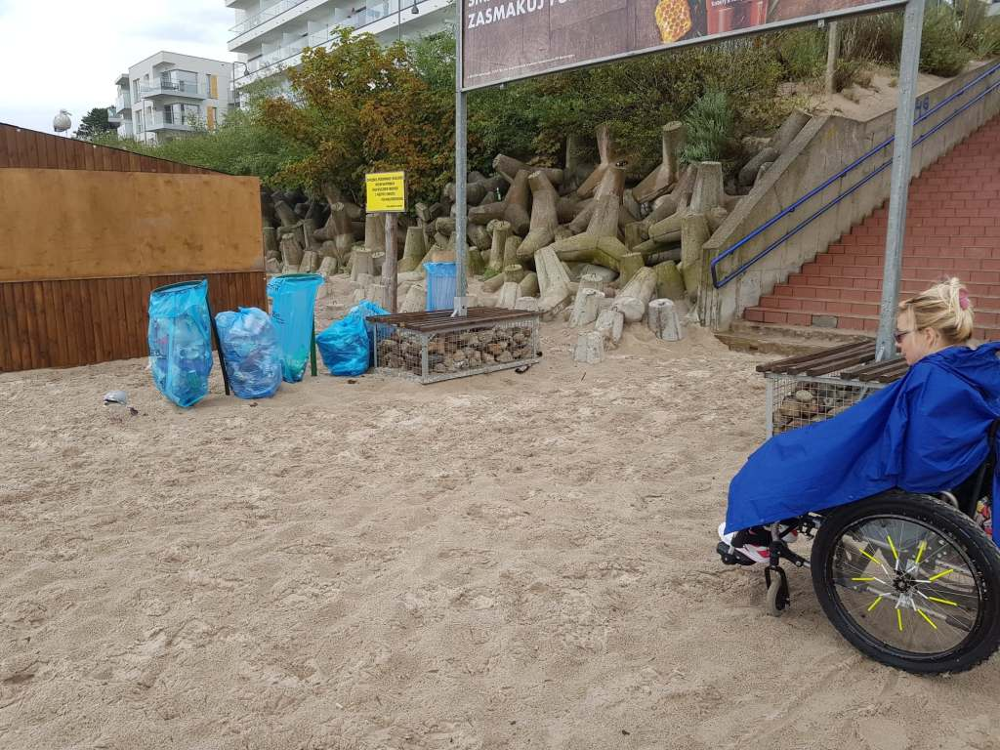
    
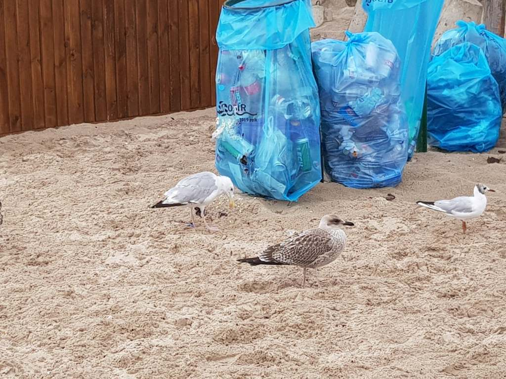
    

Tego dnia podjechałam wózkiem, blisko wody po gumowej macie (prosty pomysł ale jak doskonały) z myślą o małej kąpieli. Niestety, deszcz, gwałtowne ochłodzenie i lodowata woda zdecydowanie osłabiły moje chęci. Przyjdzie na to czas.  

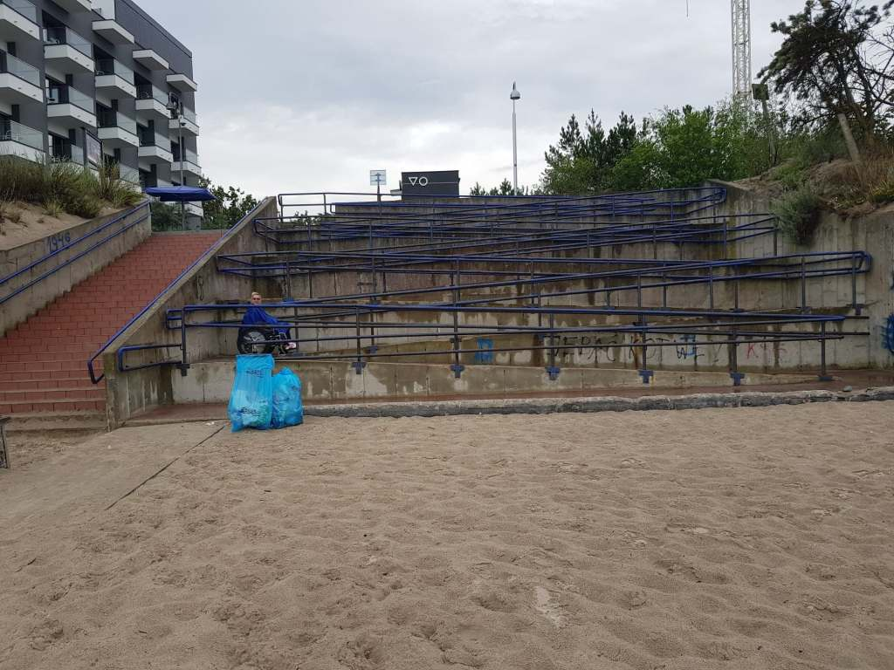
