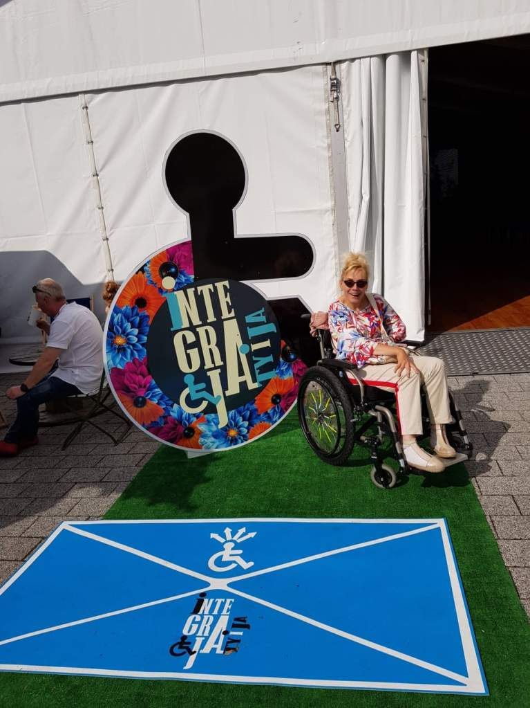
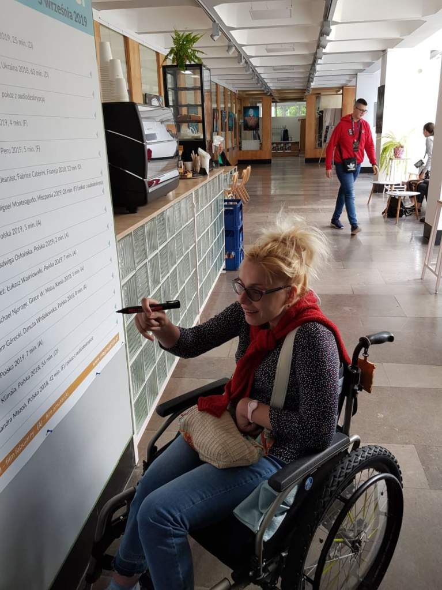
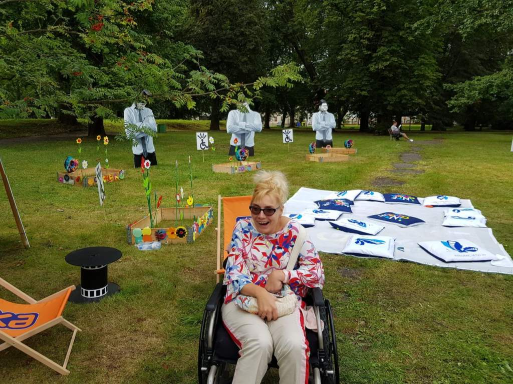
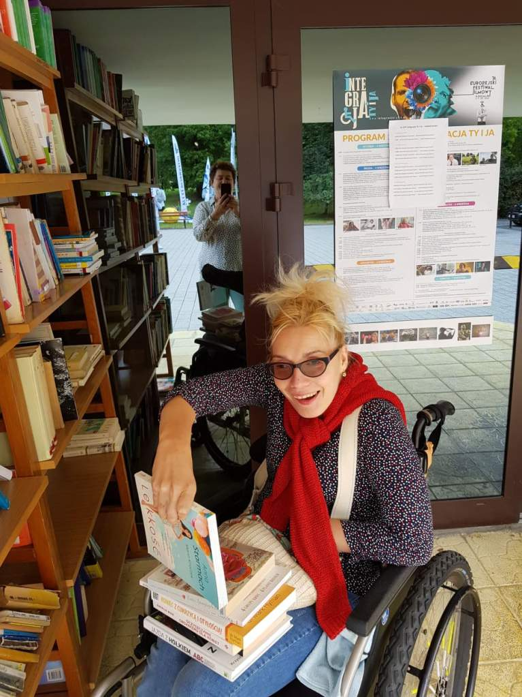
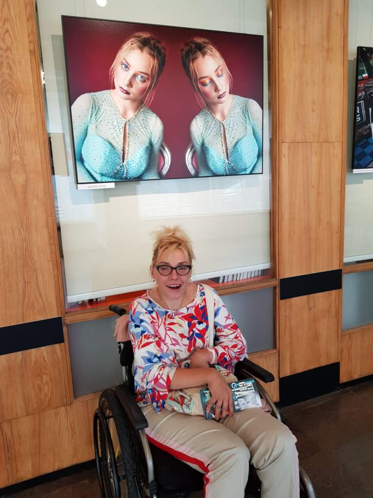

Biblioteka Wojewódzka w Koszalinie, mieszcząca się przy Placu Polonii w centrum miejskiej zieleni przynajmniej raz w roku pęka w szwach.

Od kilkunastu lat w pierwszych dniach września zamienia się w zaczarowane miejsce i czas. Poznajemy wielu fantastycznych ludzi twórców, artystów, sportowców - ich losy pokazane w kadrze filmowym (zwycięzców i pokonanych), które reżyseruje często samo życie.

    

    

    

**EFF Intergacja Ty i Ja**, bo o tej imprezie mówię udostępnia nam obrazy z udziałem osób z niepełnosprawnością w społeczeństwie. Przedstawiane są losy ludzi, którzy w życiu zawodowym często kogoś ratowali (np.: medyk, strażak), sekundy w jednej z akcji decydują że stają się ofiarami tragedii i sami potrzebują pomocy.

Siła, wiara, obecność i pomoc bliskich, pomaga im w powrocie do życia. Festiwal jest imprezą, w której Jury w skład którego wchodzą ludzie polskiego ekranu musi wyłonić zwycięzcę oraz przyznać wyróżnienia. Serdecznie współczuję członkom komisji, muszą wybrać faworyta i przez to kogoś skazać na przegraną. Według mnie wszyscy jesteśmy mistrzami, dlatego, że chcieć to znaczy móc - reszta stanowi dodatek.

Cieszę się, że mogłam być uczestnikiem imprezy wydawałoby się malutkiej lokalnie, która przedstawia wolę walki i siłę zwycięstwa człowieka w każdym miejscu na ziemi. W większości  bohaterem jest przedstawiciel tzw. płci brzydkiej.

Poza konkursem udało mi się wreszcie obejrzeć film pt: ”Kręcisz mnie”, komedia, gdzie główną rolę gra dziewczyna na wózku. W ubiegłym roku zawitał do kin, na -jeden dzień. Nie był kasowy i usunięto go z afisza.

Zastanawiam się dlaczego ”Nietykalni” (również komedia ale ukazująca perypetie mężczyzny na wózku) staje się hitem kinowym oglądanym przez uwaga - 50 milionów widzów!?

W ramach festiwalu zorganizowano spotkanie z Robertem Więckiewiczem, aktorem grającym jedną z głównych ról w filmie pt: ”Jak pies z kotem” - projekcja odbyła się poza konkursem. Tematem filmu jest relacja między braćmi (znani reżyserzy kina polskiego), jednego z nich sięga niepełnosprawność po udarze mózgu. Zakładamy, że przedstawiony obraz będzie wielkim dramatem, co jest błędem. Przed projekcją filmu smaczku dodał poprzez przezabawnie opowiedziane scenki pan Robert Więckiewicz. Nic więcej nie powiem, film naprawdę warto obejrzeć.

    

    

Udało mi się również przy tak zwanej okazji przekazać kilka książek z mojej domowej biblioteki, które znajdą kolejnego czytelnika. Dziękuję za pięknie spędzony czas i do zobaczenia za rok.
