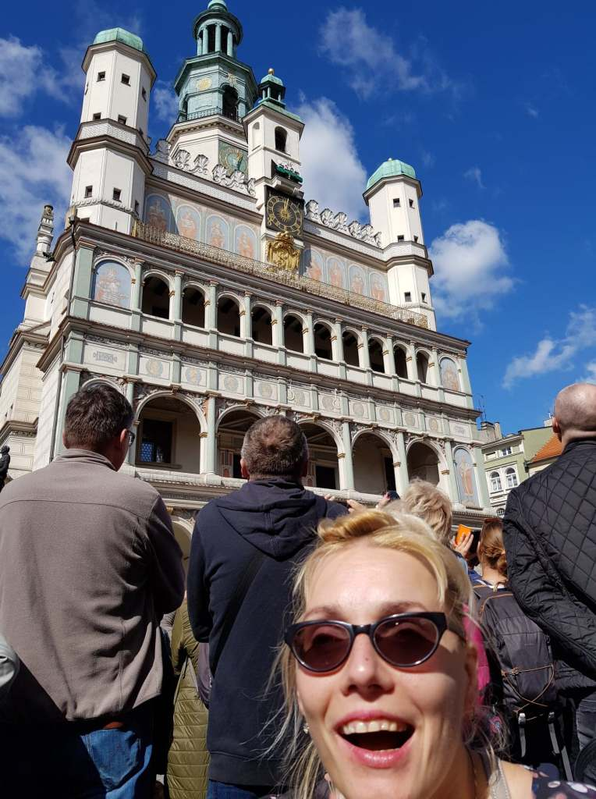
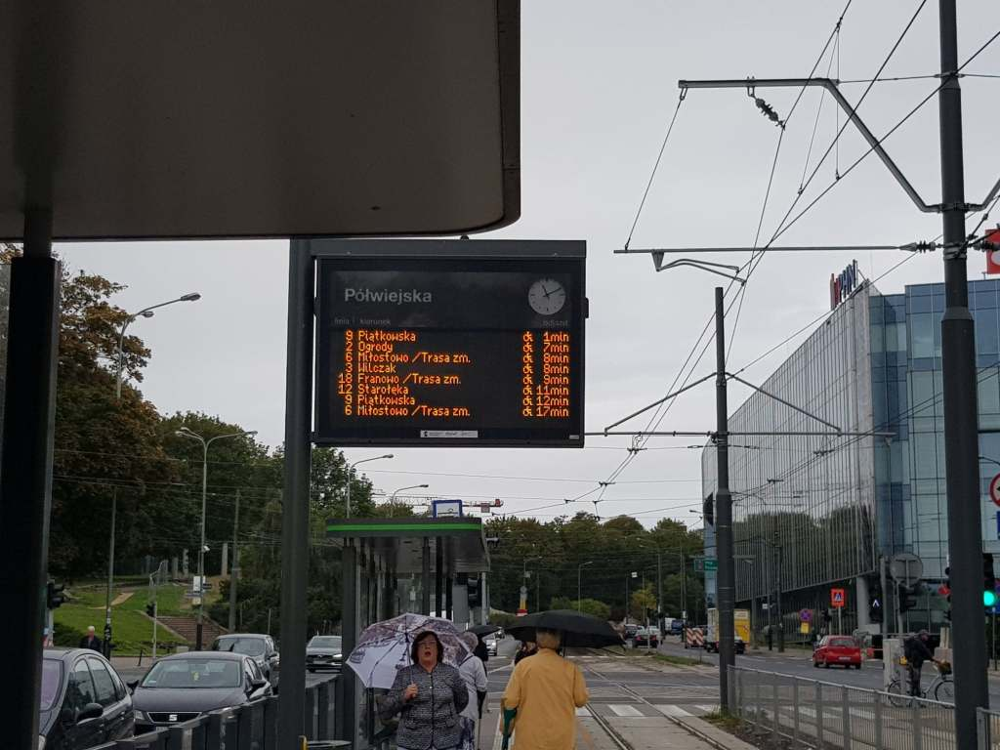
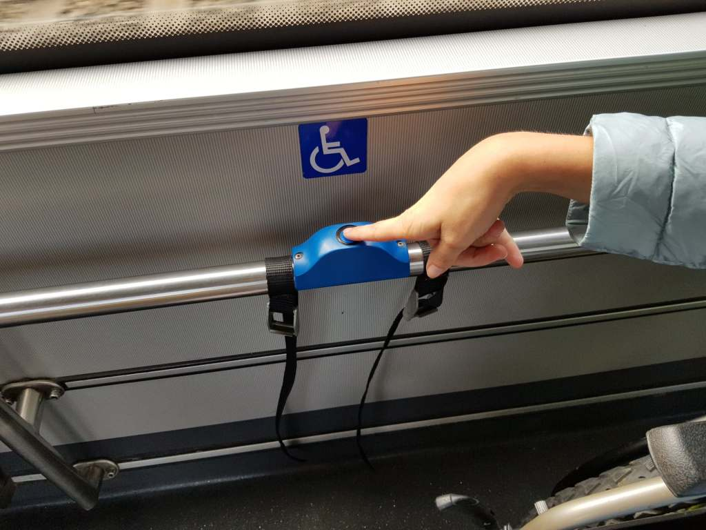
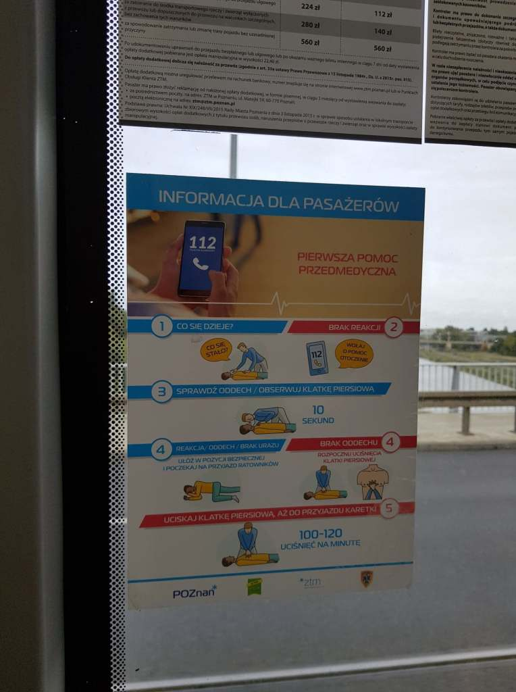

Ważne prywatne sprawy podrzuciły mnie na kilka dni do Poznania. Oczywiście obowiązkowo w samo południe odwiedziłam na Starym Rynku (cały w kocich łbach, kiepskie chwile dla mnie) w Ratuszu Poznańskie koziołki. Zaskoczyła mnie popularność tego miejskiego „urządzenia błazeńskiego”, ujrzałam międzynarodowe skupisko ludzi oczekujące na pojawienie się rogaczy. Podobnie odbywa się w wielu naszych miastach, chociażby w moim ukochanym Krakowie taka atrakcje turystyczną jest smok wawelski u podnóża Wawelu ziejący ogniem. Dość oryginalne, kolorowo ozdobione są elewacje kamienic poznańskiego rynku.  

> „Jest to najlepiej zachowany i najwierniej odwzorowany zespół kramów dawnego bazaru. Budy śledziowe istniały tutaj już w XIII wieku. W XV wieku ich właściciele, zrzeszeni w cechach budników, zaczęli wznosić murowane domy na wąskich parcelach z kramem w przyziemiu i izbami mieszkalnymi na wyższych piętrach. Wejścia do kramów ukryte były w podcieniach, które w pierwszej połowie XVI wieku otrzymały obecny wygląd.
> 
> [https://gloswielkopolski.pl/stary-rynek-wszystkie-tajemnice-poznanskich-kamieniczek-zdjecia/ar/10430930](https://gloswielkopolski.pl/stary-rynek-wszystkie-tajemnice-poznanskich-kamieniczek-zdjecia/ar/10430930)

    

Mieszkałam w hotelu bez barier, po mieście poruszałam się komunikacją państwową. Zdecydowana większość taboru jest dostępna dla wszystkich. Brawo dla włodarzy miasta. Niby drobiazg, ale jednak niebieski przycisk po pierwsze działa, po drugie nareszcie odpowiedni i w dostępnym miejscu. Fajnym uczuciem jest nawet najmniejsza namiastka samodzielności.

Podczas jazdy tramwajem można się również nauczyć. Pozytywnie zaskoczyła mnie naklejona na szybie tramwaju „ściąga „udzielania pierwszej pomocy" - ratowania ludzkiego życia. W prosty sposób, każdy jest w stanie zrozumieć co w takiej niecodziennej chwili trzeba zrobić.
