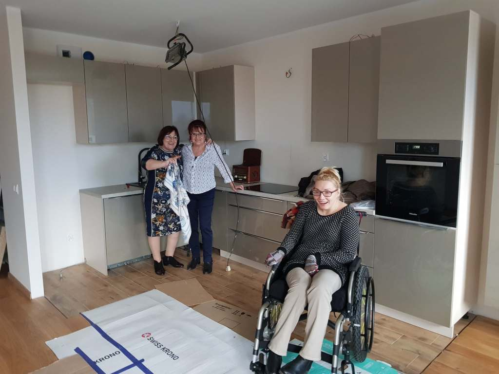

Dawno nie dawałam znaku życia, ale powodem nie było lenistwo. Jestem i wszystko jest dobrze, po prostu od dwóch miesięcy zajęta jestem urządzaniem mojego nowego domu (mieszkania). Tak, właśnie i jeżeli wszystko pójdzie według planu to…

Cieszę się, ponieważ mam windę od poziomu garażu, to jedno. Po drugie łazienka dostosowana do moich realiów, pokój fitnessowy konieczny - wiadomo, ale już jako osobne pomieszczenie. Całe mieszkanie swobodnie dostępne, na to wszystko naprawdę duży balkon. Wrócę do pisania już w nowym domu. Jednak muszę szybko coś napisać. Zupełnie przypadkowo wpadła mi w oko recenzja książki Łukasza Grassa ”Szlag mnie trafił”.

Bohaterką jest Monika, moja rówieśnica, która przeżyła udar (nazywa go szlag). Mnie kilkanaście lat temu (wypadek) trafiło zupełnie coś innego, ale bardzo bliskie stały mi się słowa dziewczyny, której podobnie jak mi świat zawalił się w kilku sekundach. …"Skrzydeł" dostała już na szpitalnym korytarzu, kiedy po wielu miesiącach niespodziewanie wpadła na pewnego lekarza. Marzyła o tej chwili. Chciała mu pokazać, że żyje, chodzi i mówi. Zastygli na moment, patrząc na siebie badawczo, ale Monika od razu rozpoznała twarz – to ten sam lekarz, który w pierwszych dniach po udarze powiedział jej matce, że jej córka umrze za kilka dni. Słowa, które wtedy usłyszała, mogły podciąć skrzydła nawet najbardziej walecznej osobie. Spojrzała mu prosto w oczy i powiedziała: „Niech pan nigdy nie mówi głośno ludziom po udarach, że umrą. Oni wszystko słyszą”…

We wtorek odbiorę w księgarni zamówiony drukowany egzemplarz, audiobooka nie znalazłam - szkoda. Słowo czytane zdeklarowała mi moja siostra Margaret, ponieważ druk mocno nadwyręża mój wzrok. Monika jest niesamowitą dziewczyną, dzięki której zaczęłam myśleć o… tańcu. Dlaczego?

Pomyślałam sobie,ze skoro ktoś po udarze mózgu szykuje się do TRIATLONU, to ja antysportowiec mogę podjąć trening tańca, który kiedyyyyyyś był moim żywiołem. W Koszalinie jest kilka szkół tańca, nawet dostępnych, nabrałam ochoty, czy to dobrze okaże się już wkrótce.
