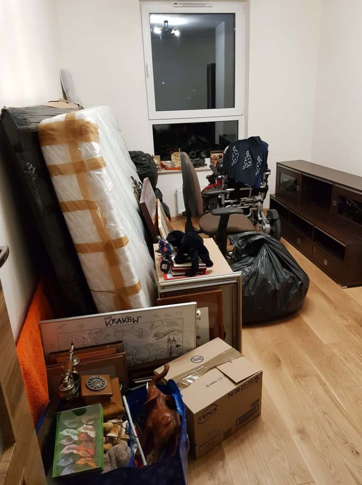
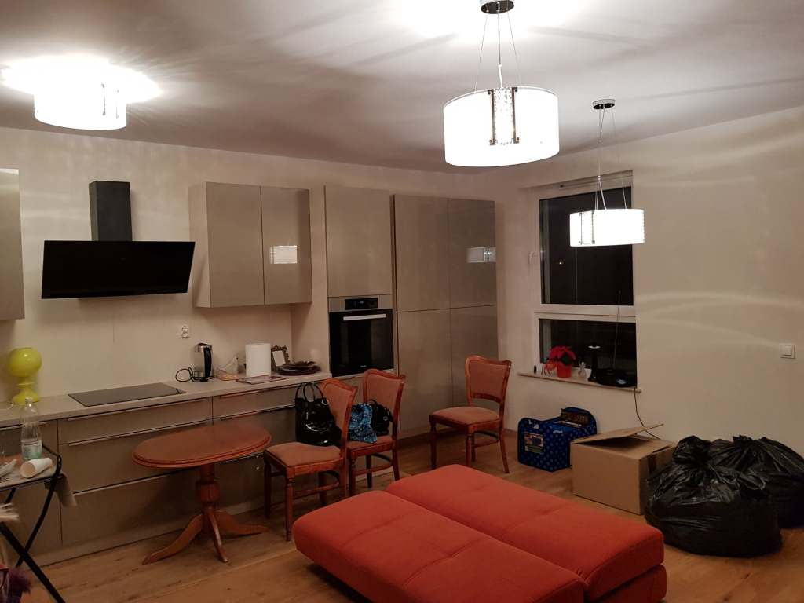
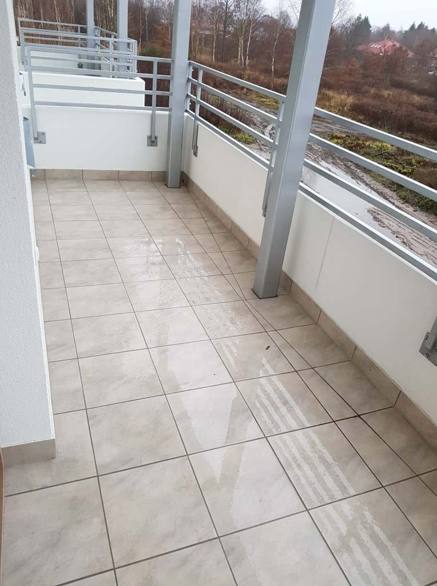

    

    

    

    
Od dwóch dni mieszkam już w moim nowym domu, w którym mam w końcu dostęp do Internetu. Szybko skreślam kilka słów i prezentuję parę zdjęć z mojego nowego mieszkania.

Niestety nie umiem się w pełni cieszyć, ponieważ dwa dni temu obył się pogrzeb mojego kumpla - Michała R.

Chodziliśmy do jednego przedszkola, później do jednej podstawówki, ale do innych klas. Po szkole podstawowej nasze drogi życiowe rozstały się. Z net’u  dowiedziałam się, że Michał od roku był poważne chory, walczył z nierównym przeciwnikiem - 4 grudnia przegrał - odszedł.

Jest mi bardzo smutno, był przygotowywany do przeszczepu już w styczniu, nie zdążył, zabrakło zaledwie, a jednak aż paru dni. Na sam koniec brak mi słów, szanujmy nasze życie.

Pozdrawiam.
