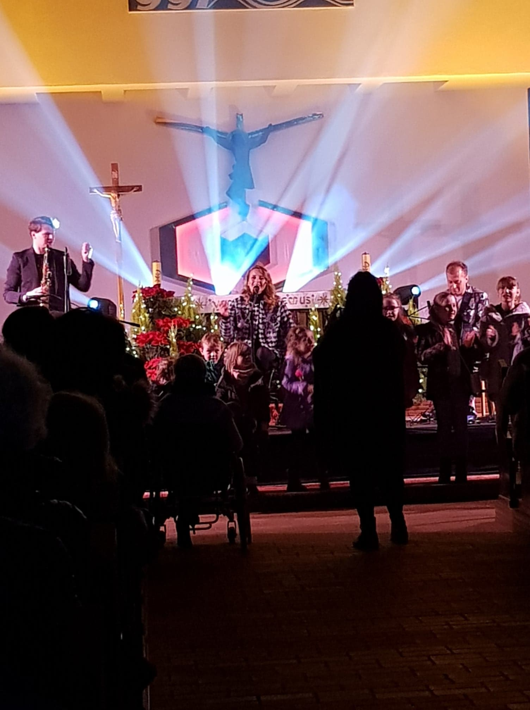
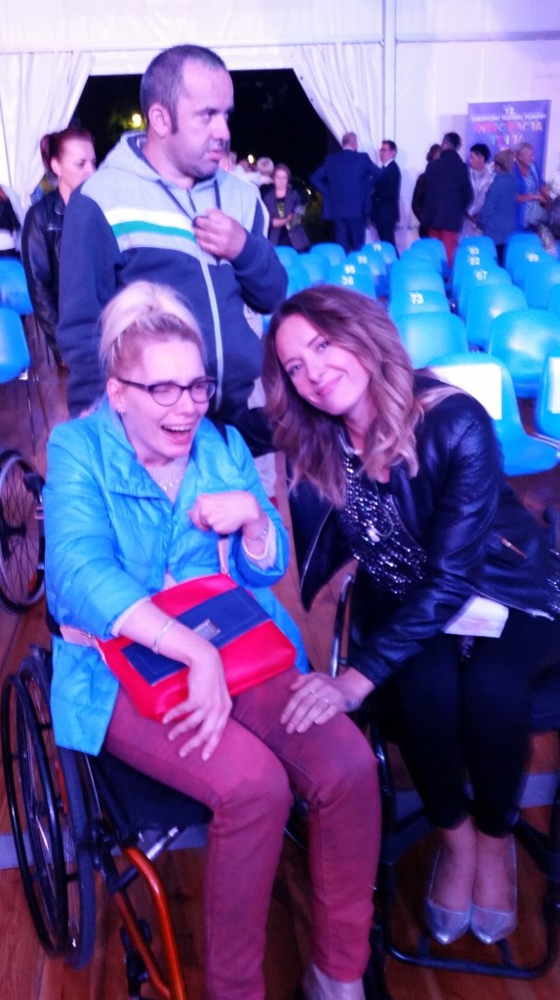
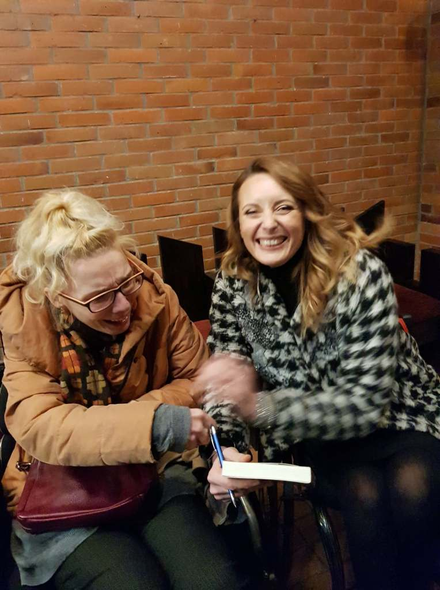
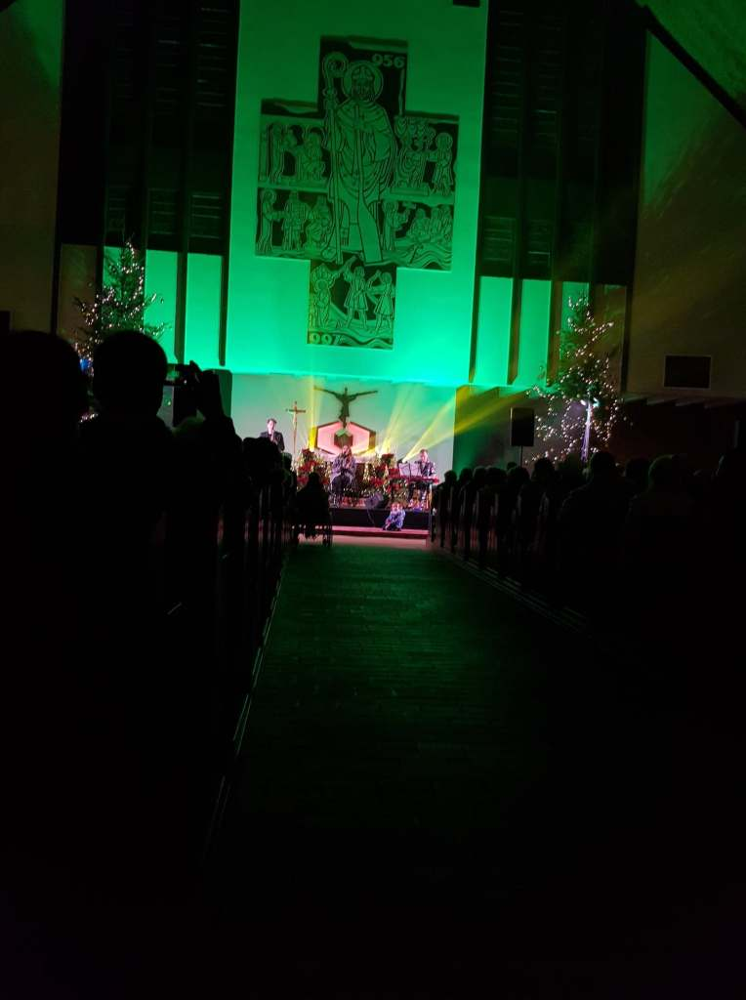
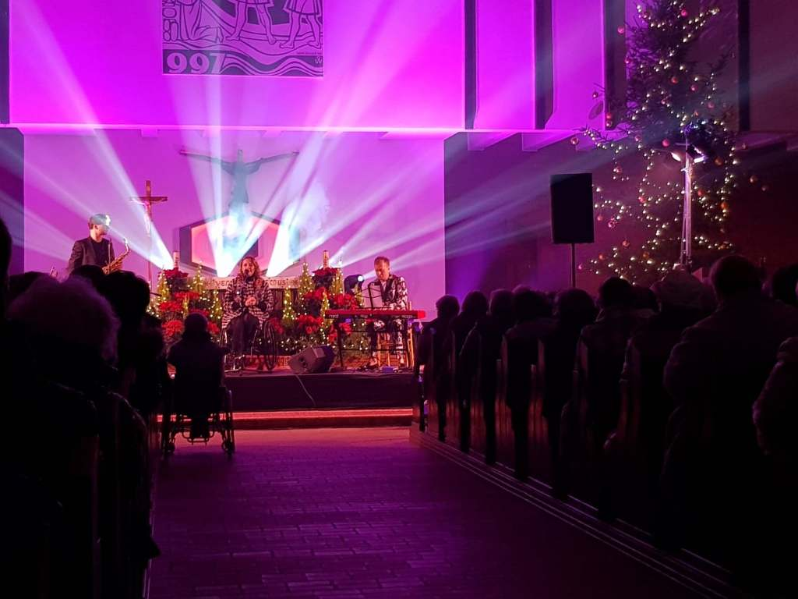

W pobliżu mojego nowego domu jest kościół Św. Wojciecha.

W ostatnią sobotę zostałam mile zaskoczona zorganizowaną przez proboszcza śpiewającą imprezą. Tego wieczoru z liczną publicznością i zaproszonym gościem Moniką Kuszyńską wspólnie kolędowaliśmy.

Po koncercie

Poznałyśmy się, tak odważę się powiedzieć z Moniką pięć lat temu na Festiwalu Filmowym Integracja Ja i Ty organizowanym od kilkunastu lat w Koszalinie. Pięknie wygląda, jest matką dwójki dzieciaczków. Koszalin jest dla Moniki szczególnym miejscem i bardzo lubi tutaj wracać. To u nas, dziesięć lat temu po dłuższej przerwie (spowodowanej jej wypadkiem samochodowym) pojawiła się na scenie po raz pierwszy poruszając się na wózku. Zaczęła nowy etap w swoim życiu, wokalistki na wózku. Fantastyczna dziewczyna, dla mnie niedościgniony wzór. Dowiedziałam się, że przyjedzie do nas ponownie we wrześniu 2020 r. na FF Integracja Ty i Ja, z czego się bardzo cieszę, może uda wtedy nam się trochę dłużej porozmawiać.

    

Przyszła mi do głowy refleksja.

Monika ma ograniczony ruch sceniczny (wiadomo - jest na wózku), a śpiewa, i fajnie, bo robi to dobrze, ja nie mogę mówić, staram się pisać, jako obywatelska dziennikarka (również od kilkunastu lat sprawna inaczej) zwracam uwagę, a widzę wiele rzeczy, z pozycji siedzącej, które są często  niewidoczne dla innych.
