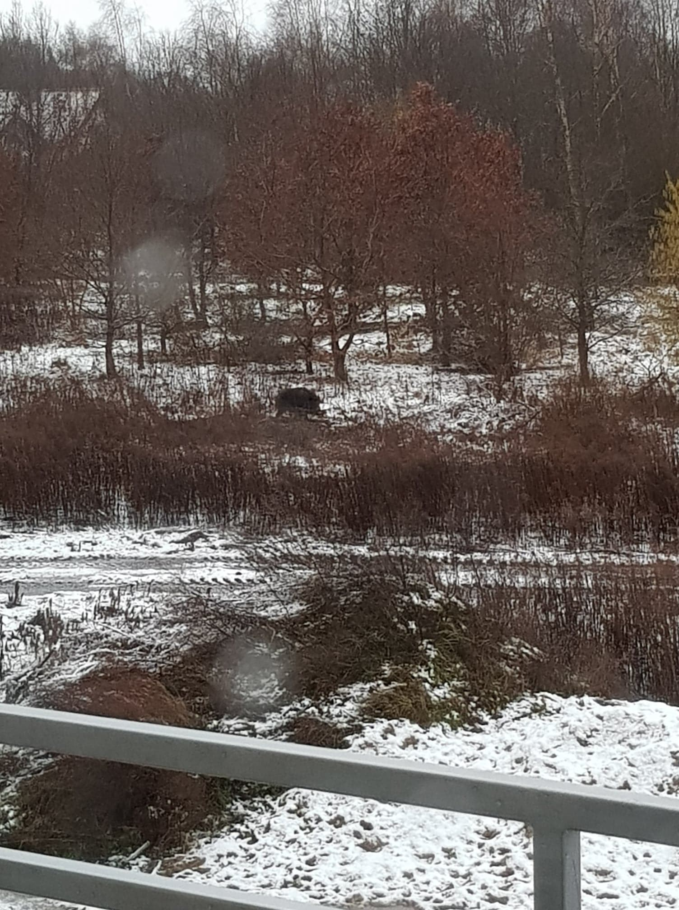
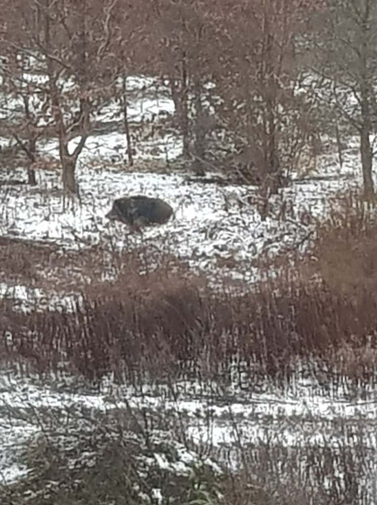
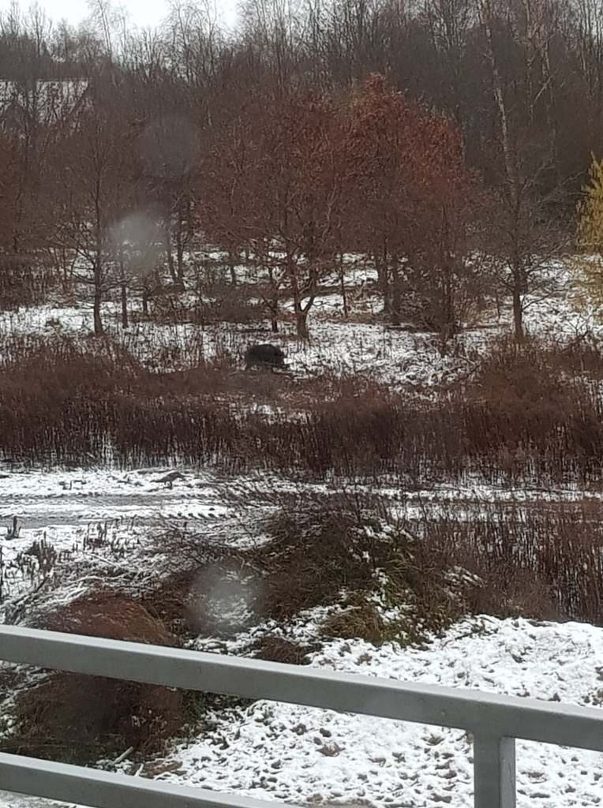
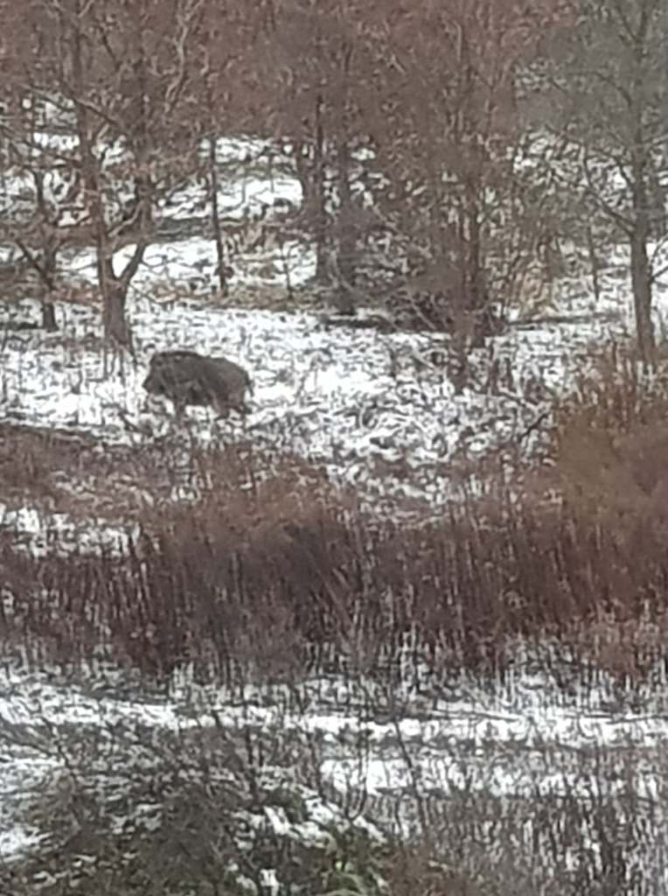

Dzisiaj rano wyjrzałam za okno i "ustrzeliłam" fotkę nowym dzikim sąsiadom. Od kilku dni kręciły się cztery dorosłe osobniki, został a raczej została jedna - locha, która mocno pracuje szarpie zarośla wyrywa gałęzie, z których buduje dość obszerny stos. Prawdopodobnie powstaje legowisko (barłóg) dla młodych tj.warchlaków. Zapewne powinnam zgłosić odpowiednim służbom obecność dzików blisko (około 10 metrów) od zabudowań, ale tego nie zrobię. Obawiam się, że jedynym sposobem pozbycia dzikich lokatorów byłby zwyczajnie odstrzał, a tego nie chcę.

    

    

Mam nadzieję, że powiększona o maluchy leśna rodzinka, w zdrowiu wróci szczęśliwie na łono natury.
