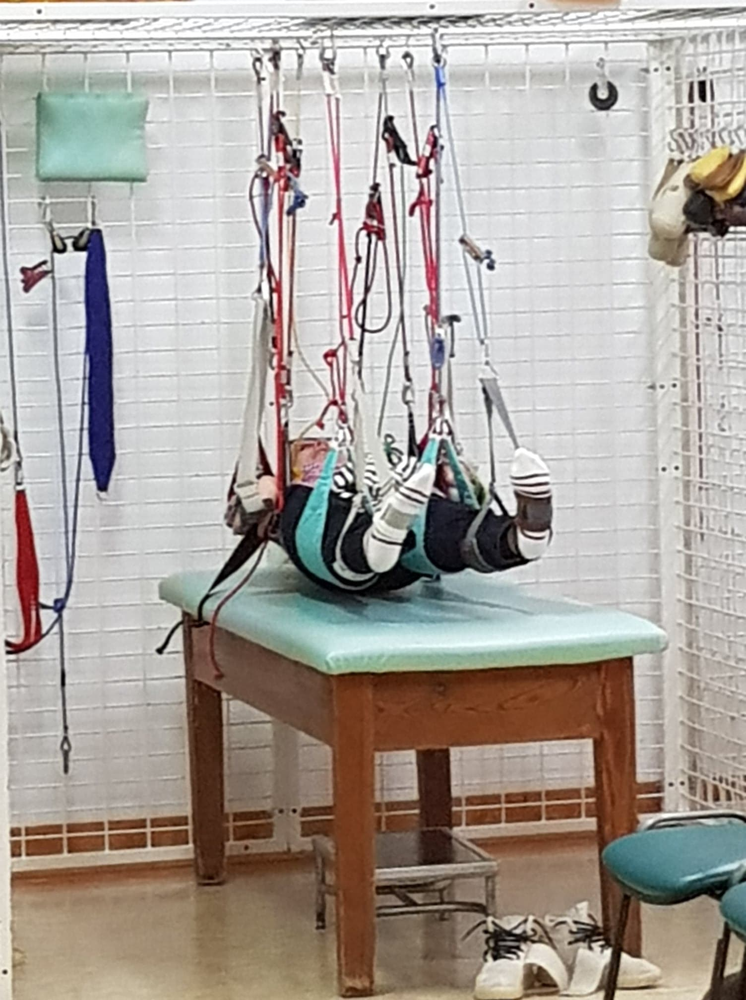
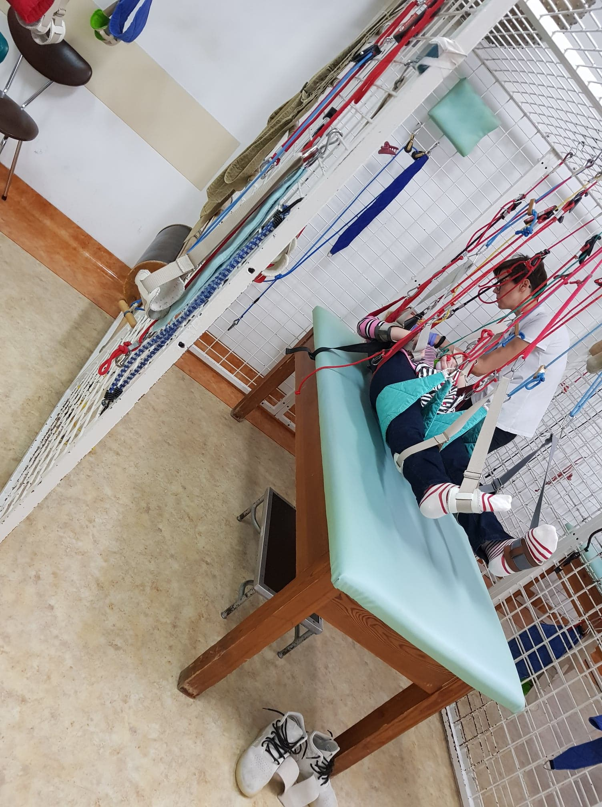
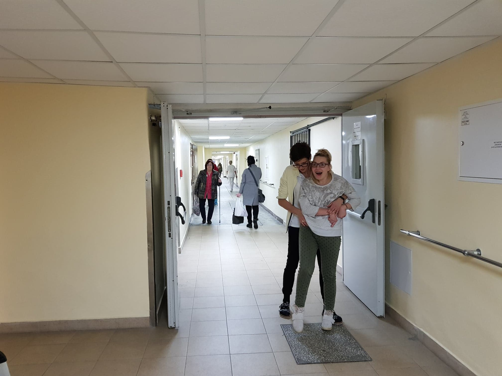

Od stycznia został zmieniony program mojej rehabilitacji, poznałam zespół nowych fizjoterapeutów koszalińskiego szpitala m.in; Beata, Renia oraz Magdę, która się mną zajmuje. Po rozmowach i po pierwszych ćwiczeniach po raz kolejny chcę powalczyć o moją samodzielność. Całkowicie nowym dla mnie zadaniem jest „zwis prosty równoległy do podłoża”, tj. przez 30 do 40 minut ‘’wiszę’’- trudno to opisać słownie, na zdjęciu dobrze widać o czym mówię.

Wówczas lekko bujam się w każdą stronę, ćwicząc jednocześnie mięśnie szyi i karku. Nie potrafię tego fachowo wytłumaczyć, ale czuję duże rozluźnienie w czasie mojego ”zwisu prostego”, po czym staję na nogi i w asyście Magdy sama idę przez około 150 do 200m. Na początku nie rozumiałam tego mojego wiszenia, w czasie którego nabieram mniej spastycznej mocy, mam fajne uczucia lekkości mojego ciała, szczególnie później przy moim chodzeniu. Po raz pierwszy mam wrażenie własnego stabilnego chodu, bardzo luźnego i lekkiego.

Po wypadku, abym czuła się bezpiecznie w czasie chodzenia zawsze była potrzebna asysta osoby drugiej.    Teraz w czasie chodzenia jakoś dziwnie potrzebuję więcej swobody, oby tak dalej.
