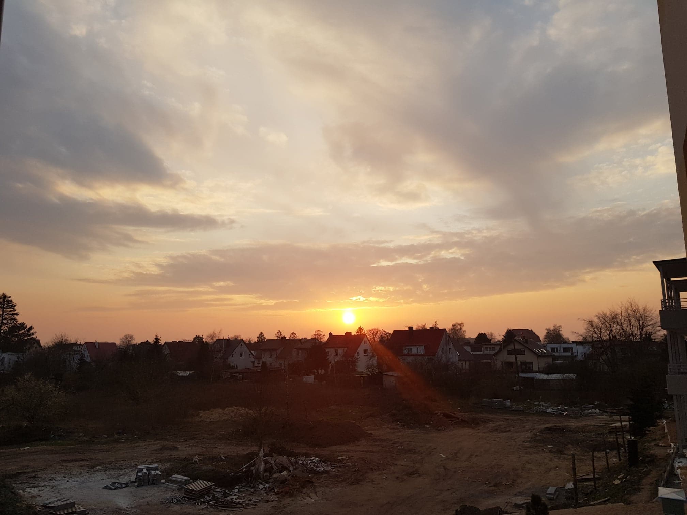
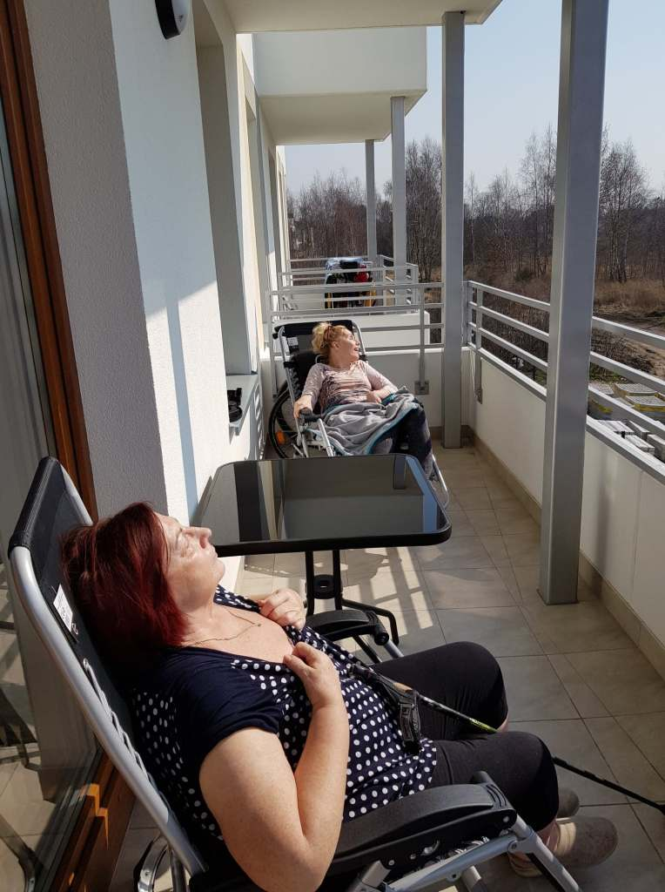
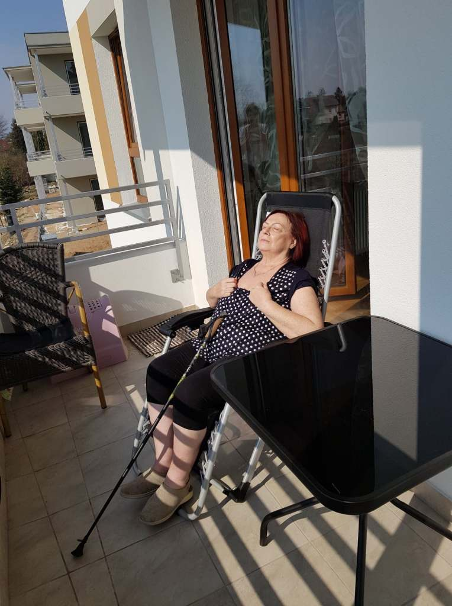

Mojej ograniczonej sprawności fizycznej, od dwóch tygodni towarzyszy ograniczona wolność. Powody są znane nam wszystkim, nie jest tak źle, damy radę. W trudnych chwilach potrafimy się cieszyć i docenić co mamy. Dzisiaj a właściwie wczoraj, mogłam powiększyć obszar mojej izolacji. Piękna pogoda w parze z własnym balkonem pozwoliły mi na oddech świeżego powietrza.Całe dwie godziny. Nie sądziłam, że tak prozaiczne chwile mogą sprawić tak dużo radości.

Sprawiły.        

Zadbajmy dzisiaj, nawet o te najmniejsze przyjemności.

Dla siebie, bliskich i dalszych znajomych, ale również nieznajomych.

Ciepło, które w takich chwilach napływa do naszego serca, zmniejsza ciężar ucisku strachu w klatce piersiowej.
