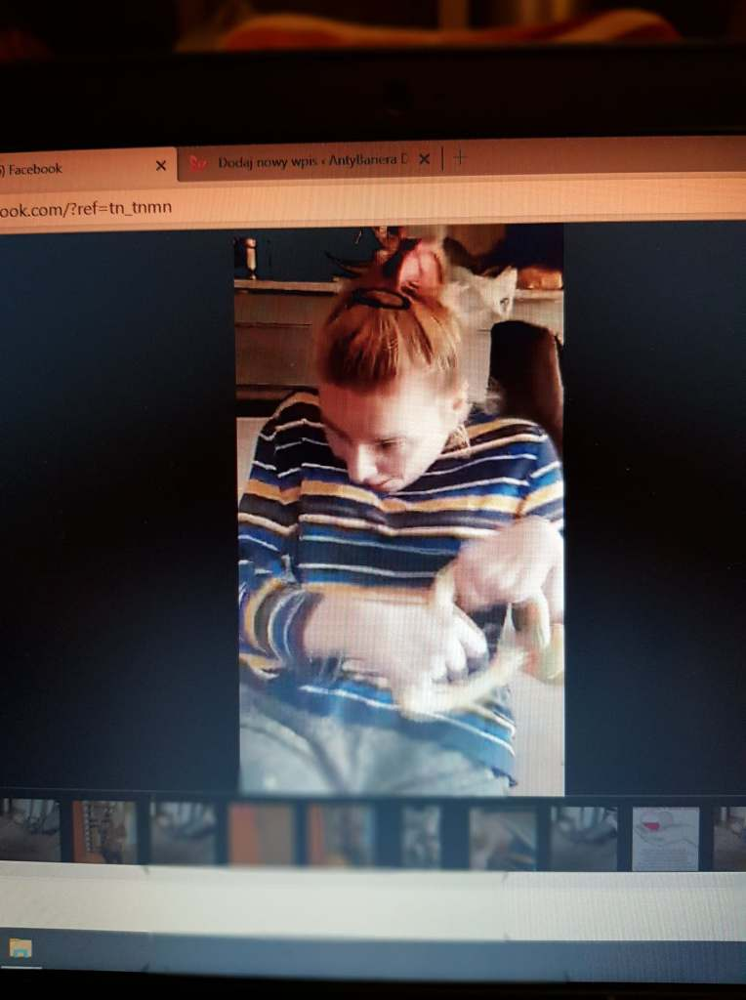
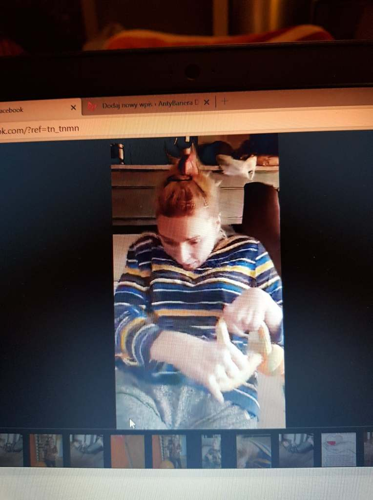
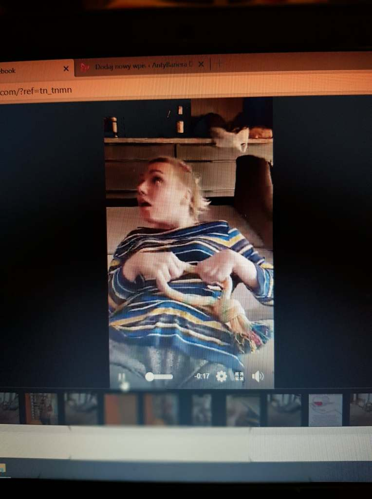
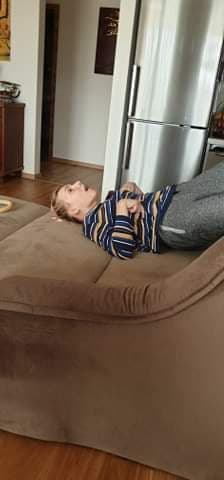
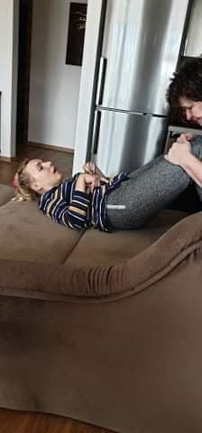

Teraz w najbliższym czasie (oby był dla nas wszystkich najkrótszy) jestem zmuszona całkowicie zawiesić moją rehabilitację. Z racji całkowitej izolacji odwołane są zajęcia w szpitalu i jednocześnie indywidualne w domu. Taki stan już trwa od trzech tygodni, teraz muszę to przedłużyć na czas trudny do określenia.

**Zostań w domu.**

Zostałam i wobec tego postanowiłam być dla siebie samej osobistym „trenerem”, ustalam program swoich ćwiczeń, które mogę przy niewielkiej asyście samodzielne wykonać.

Ćwiczę moje ‘’ulubione’’ brzuszki, ‘’skręty’’’ na boki, siad prosty na krześle, bez opierania się plecami.

    

    

   
Dbam bardzo o mięśnie siedzącej części ciała, które od czasu wypadku zdecydowanie nadwyrężam, lubię te ćwiczenia i nie ukrywam są efekty.

    

Na stałe w moich zajęciach domowych wpisane są częste spacery ‘’pod pachę’’ z moja Małgorzatą po płaskiej powierzchni mieszkania w wiadomych kierunkach.

W zależności od aury zażywam kąpieli w promieniach słonecznych na balkonie. Fajna sprawa.

Przeglądając portale społecznościowe zauważyłam duży ruch w organizacji różnych ćwiczeń sprawnościowych na wielu nowych powstałych stronach internetowych. Niestety nie są to zajęcia dla osób z niepełnosprawnością. Wiem człowiek sprawny inaczej musi ćwiczyć w asyście specjalisty a poza tym przeważnie są to zajęcia bardzo indywidualne. Ja to wszystko wiem, ale w mojej sytuacji brak ćwiczeń na dłuższą metę bardzo szybko zniszczy efekty długoletniej rehabilitacji, dzięki której mogę troszeczkę samodzielnie funkcjonować w życiu.

**Pozdrawiam serdecznie wszystkich fizjoterapeutów, których znam, ale również tych których nie znam.**

Zapewne jak większość z nas potrzebujących specjalistycznej rehabilitacji, ja też zaczynam odczuwać jej brak. Proszę o pomoc, może ktoś z wspólnych znajomych-fizykoterapeutów poprowadziłby na odległość w krótkich nagraniach instruktażowych, kilka ćwiczeń, które mogłabym wykonywać z pomocą Gosi. Po wdrożeniu się w konkretne ćwiczenie, mogłabym je umieścić na moim blogu w postaci krótkich filmów. Pomysł wydaje się być dobry, dawałby szansę wielu ludziom na podtrzymanie podstawowej formy fizycznej. Zobaczymy.

