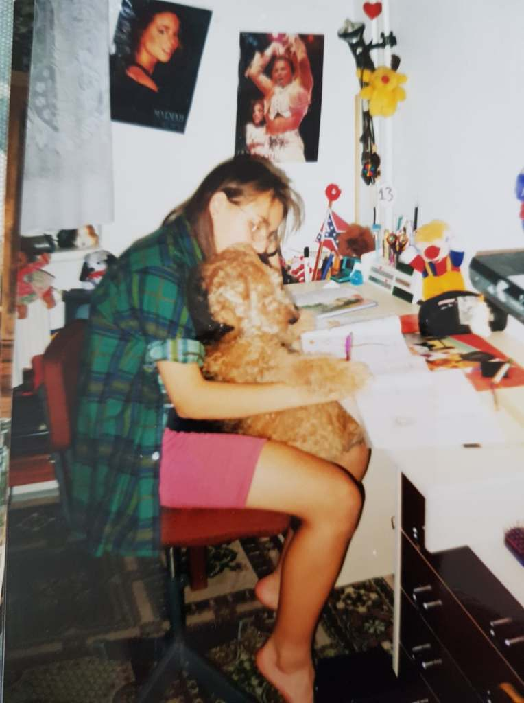
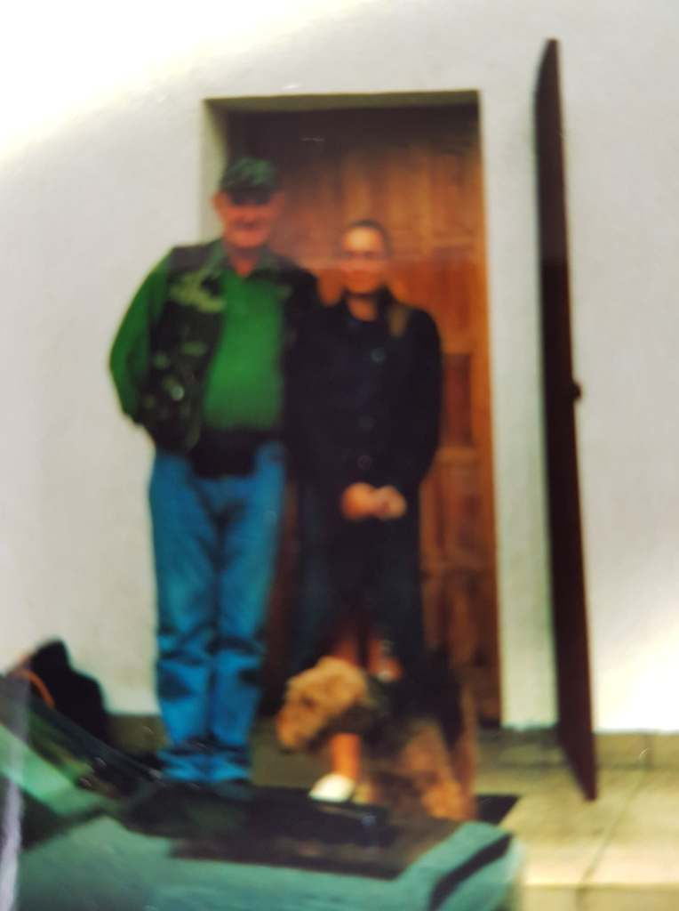
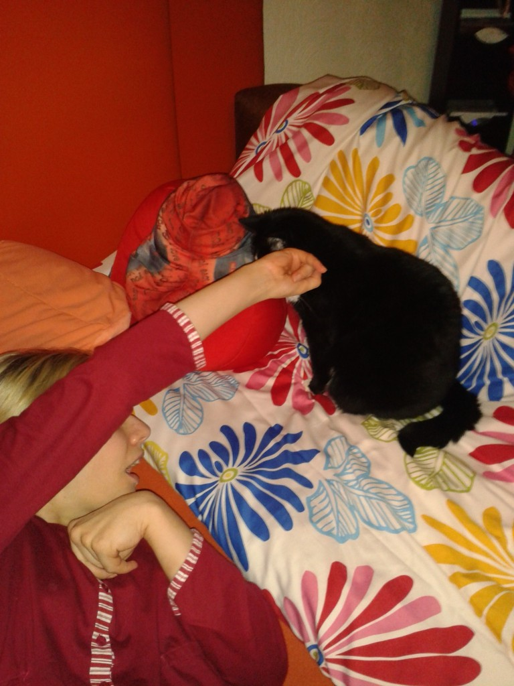
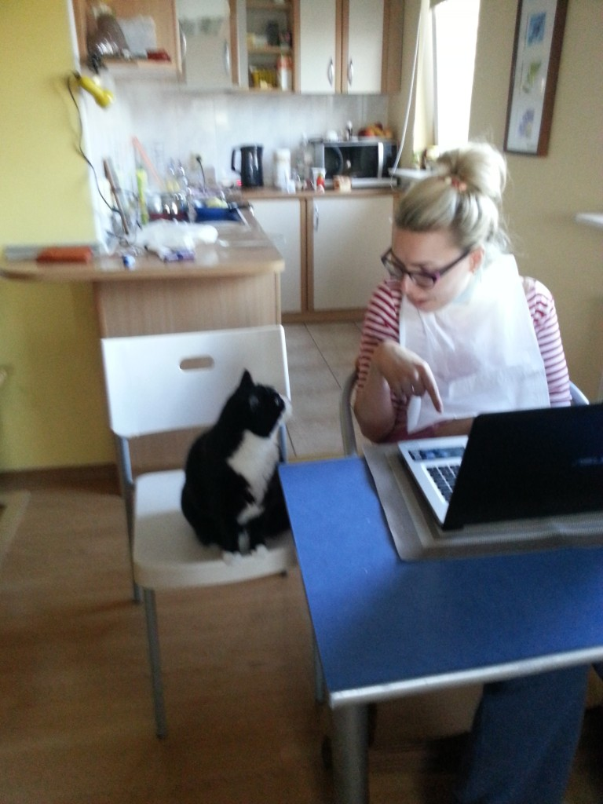
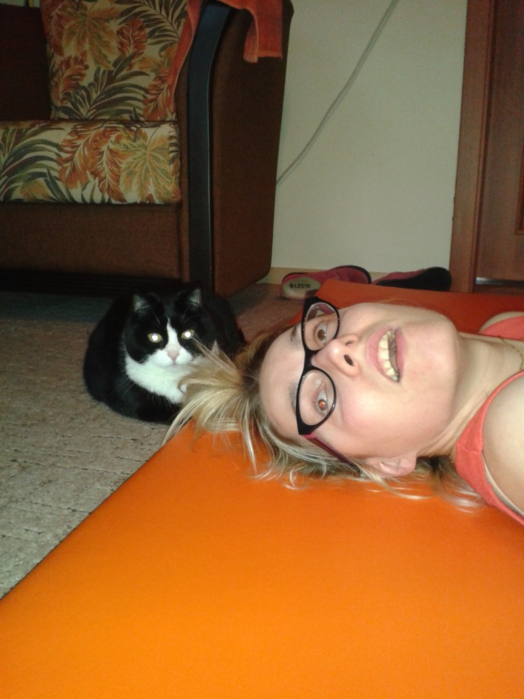

Chociaż na chwilę pragnę odskoczyć od koronawirusa. Czy jest to możliwe, czy zacznę dyskusję wśród nas?

Ostatnio poruszyła mnie, nie tyle treść przeczytanego artykułu, _fakty.interia.pl/ciekawostki/news-psy-rozrozniaja-slowa-podobnie-do-ludzi, nId,3378754_ co komentarze poniżej, tj. Dyskusja na zadany temat.

W skrócie naukowcy amerykańscy badaniami próbują udowodnić, że nasze domowe czworonogi potrafią odczytać zdecydowanie więcej słów niż podstawowe polecenia typu: siad lub leżeć. Ja to wiem, ponieważ przez całe moje życie zawsze towarzyszył mi pies, kolejny członek rodziny. Wiele czynności wykonywałam w asyście kosmatych rudzielców -terierów walijskich (Ażot, Erol I, Erol II).

    

    

    

    

    

Sadzę, że każdy wielbiciel mokrych nochali ma podobne zdanie. Jestem natomiast smutno zaskoczona wpisami pod artykułem, znalazło się kilka wpisów, gdzie mogę powiedzieć jedynie: **Jeżeli nie ma się nic do powiedzenia to lepiej pomilczeć…**

Od kilkunastu lat towarzyszy mi kotka Megutka, która jest najpiękniejszą, najlepszą moją asystentką i równocześnie opiekunką. Od chwili wypadku nie mówię, mimo tego Meggi doskonale orientuje się we wszystkim. Tak jakby czytała w moich myślach, znała moje doraźne potrzeby. W czasie snu czasami zdarza mi się coś „powiedzieć”, Meggi bez względu, gdzie się znajduje po chwili jest już obok mnie (przed mamą). Wymieniamy się miejscami, ja zwalniam jej miejsce siedzące w moim fotelu, Meggi miejsce leżące w moim łóżku. Kiedyś przesiadywała mi na kolanach, dzisiaj lokuje się w pobliżu mnie np. na blacie biurka.

    

    

    

    

    

Jest zawsze i wszędzie przy mnie, budzi mnie, jest przy kąpieli, towarzyszy przy posiłkach kładzie się razem ze mną. Zasypia dopiero, gdy upewni się, że jest wszystko ok. Czy ktoś potrafi w logiczny sposób wytłumaczyć? Przecież nie rozumie moich słów, ponieważ ich zwyczajnie nie zna, nie słyszy.
