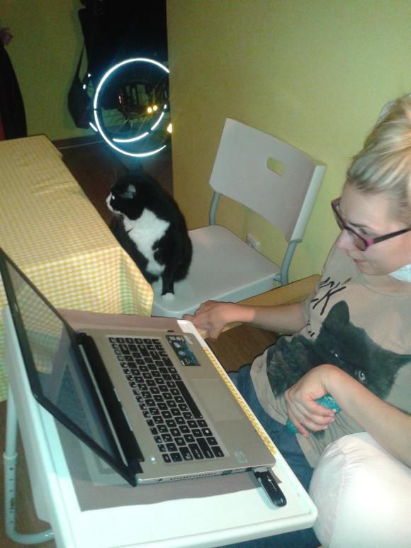
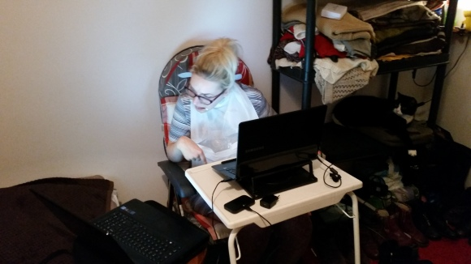
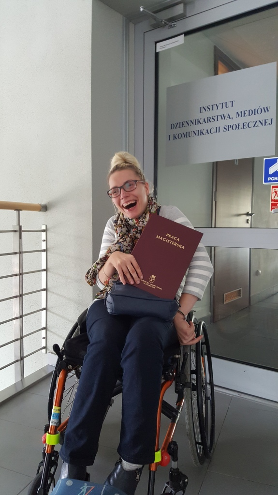

Rozpoczął się nowy rok szkolny.

Niestety z powodu przedłużającej się pandemii wszyscy mamy społeczny dylemat: rozpocząć naukę metodą tradycyjną, czy zabezpieczyć nas wszystkich i pozwolić młodzieży uczyć się zdalnie.

Ja to przerabiałam...

Po wypadku, za zgodą władz uczelni kontynuowałam studia w formie online. Była to jedyna możliwość nauki przy mojej bardzo ograniczonej sprawności fizycznej. Łącza internetowe były  niezawodne, bez problemu mogłam komunikować się z wykładowcami, koleżankami, kolegami z roku. Moja nauka przebiegała bez większych barier, jednak bardzo tęskniłam za bliskim kontaktem z ludźmi. Człowiek jest istotą stadną, stara się na dłuższą metę unikać ciszy i samotności.

Skoro nie ma innej alternatywy myślę, że trzeba przyjąć formę nauki najbardziej bezpieczną dla nas wszystkich. Jestem żywym przykładem, że można osiągnąć to o czym się marzy i pragnie nawet w ekstremalnych warunkach. Zdalna nauka pozwoliła mi dokończyć studia.

