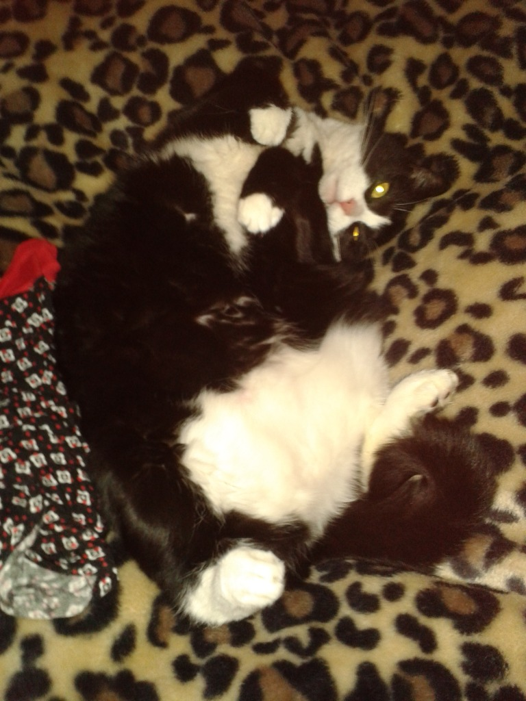
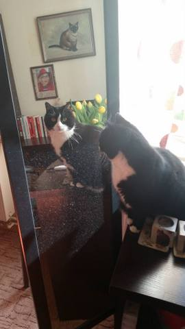

W medialnych tytułach znajduję przypadki smutnego traktowania domowych pupili. Coraz częściej słychać o porzucaniu zwierząt w lesie, w bardziej ludzkiej wersji w znacznym tempie przybywa lokatorów w schroniskach dla zwierząt. Jednym słowem pozbywamy się futrzaków z domu, z powodu nękającej nas od kilku miesięcy epidemii Covid19.

Mam pytanie: kto w tej sytuacji jest bardziej bezbronny, traci poczucie bezpieczeństwa i nie rozumie za co został ukarany?

Wierny towarzysz i świadek, też trudnych chwil w naszym życiu – nigdy nas nie zawiedzie i nie zdradzi. Uważnie w nas wpatrzony, zaczepia, trąca swoim mokrym nosem „mówi” – …nie martw się, nie pozwolę Ciebie skrzywdzić …damy radę. Nie wiem jak u was, koło mnie od zawsze kręci się kudłaty przyjaciel na czterech łapach –obecnie jest to kocica Meguta, która opiekuje się mną od szesnastu lat.

Badania wykazują, że domowe psiaki, kociaki i inne futrzaki w żaden sposób nam nie zagrażają. Nie róbmy im krzywdy, nie zasłużyły na wygnanie.

Wystarczy zachować kilka zasad postępowania i wszyscy będziemy bezpieczni.

**Jakie zasady bezpieczeństwa należy zachować w przypadku psów i kotów?**

Choć nie ma dowodów, aby zwierzęta domowe przenosiły korona wirusa, warto pamiętać o pewnych środkach bezpieczeństwa oraz zalecanych zasadach higieny.

Warto pamiętać przede wszystkim o:

1. częstym myciu rąk, zwłaszcza po zabawach lub głaskaniu zwierzaka;
2. unikaniu spania razem z psem lub kotem;
3. spacerowaniu z dala od zatłoczonych miejsc oraz skupisk ludzkich – najlepiej wybierać np. las.

Bardzo ważne jest również, aby posiadacze psów, którzy przebywają na kwarantannie, zorganizowały sobie pomoc w wyprowadzaniu i opiece nad psem. Inną możliwością jest oddanie psa do zwierzęcego hotelu na dwa tygodnie, czyli na czas kwarantanny.

- [Koronawirus: Pytania i Odpowiedzi - Jak się chronić, czy psy i koty mogą zarazić się koronawirusem.](Pytania i Odpowiedzi - Jak się chronić, czy psy i koty mogą zarazić się koronawirusem.)

**Ciekawe!**

Kochani, bardzo ważna hipoteza!

Dr Sabina ze szpitala w Madrycie (duma, GOGHANKA!) poczyniła bardzo ważne obserwacje, przyjmując pacjentów, którzy mieli kontakt z korona wirusem: osoby posiadające koty i psy nie wykazywały objawów, nie rozwijała się u nich choroba, bądź przechodziły ją bardzo łagodnie. Obserwacje dotyczyły grupy ok. 100 pacjentów i wymagają dalszych badań. Istnieje przypuszczenie, ze możemy mieć tu do czynienia z wyższą odpornością ze względu na kontakt z korona wirusami specyficznymi dla zwierząt domowych oraz sprawniej działającym układem odpornościowym, należałoby może sięgnąć do zagadnienia odporności krzyżowej.

- [Właściciele psów i kotów są odporniejsi na koronawirusa według lekarki z hiszpanii](https://plus.gloswielkopolski.pl/wlasciciele-psow-i-kotow-sa-odporniejsi-na-koronawirusa-wedlug-lekarki-z-hiszpanii-zwierzeta-domowe-moga-zwiekszac-odpornosc-u/ar/c1-14883093)
