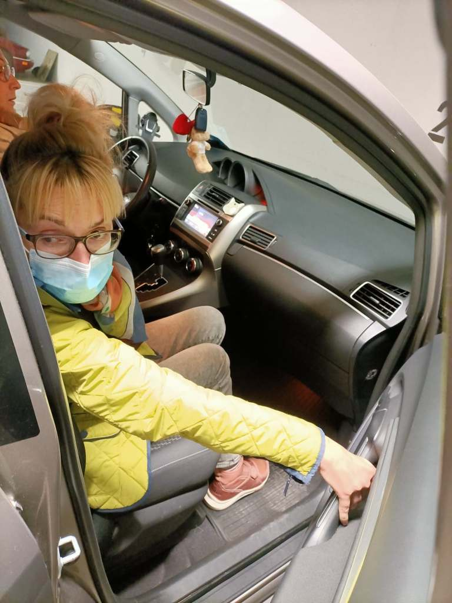
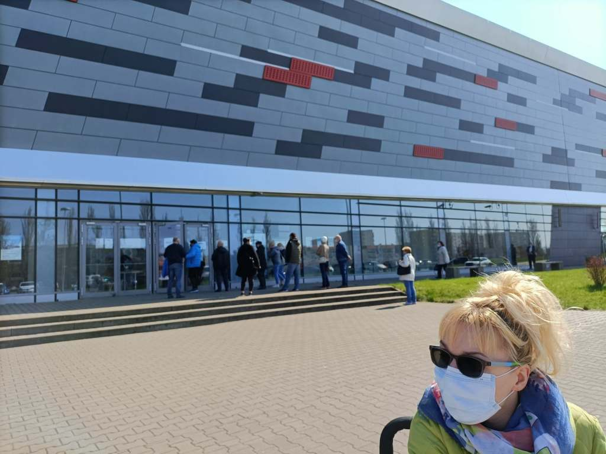
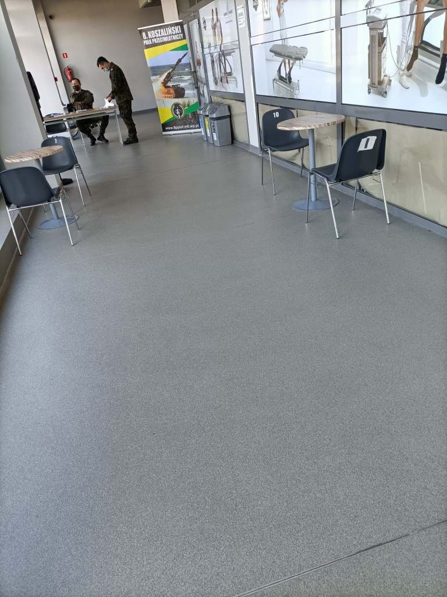
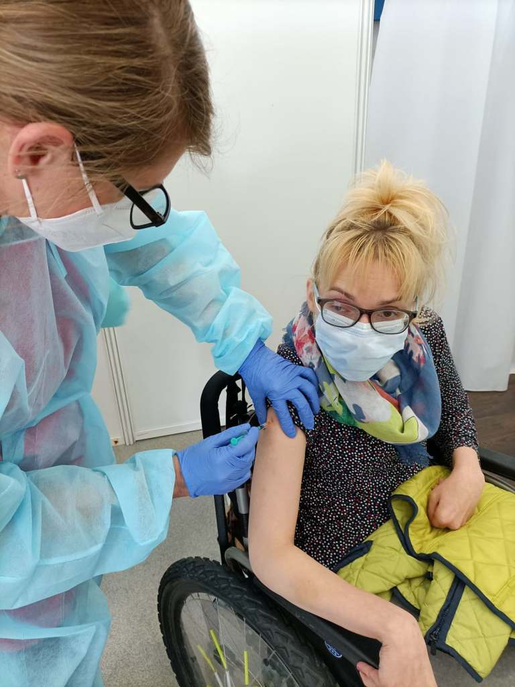
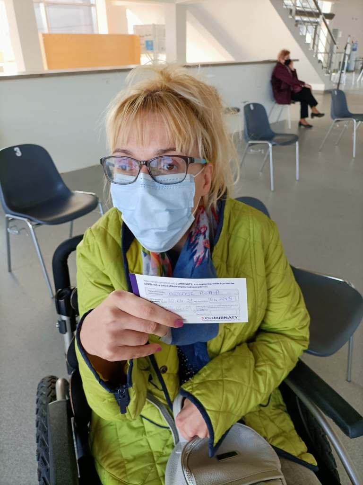
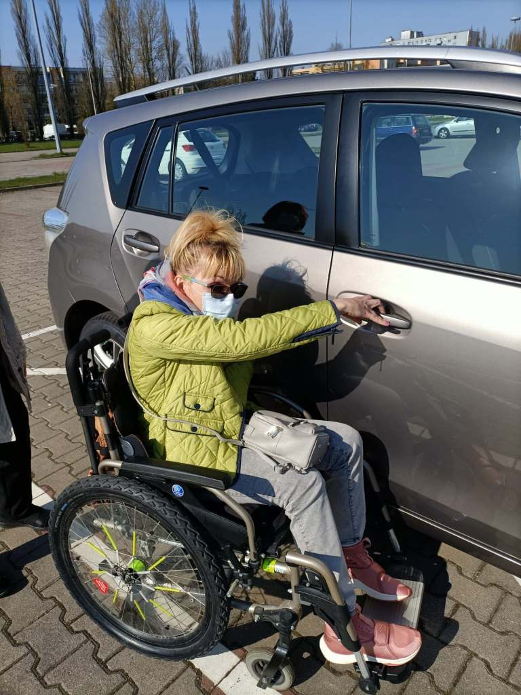

Jestem po pierwszej dawce szczepienia, pierwotny termin 13 maja przesunięto mi na 20 kwietnia.W sumie dobrze, bo czekanie zaczęło mnie męczyć.

Punkt szczepień okazały (Hala sportowo widowiskowa), porządku pilnowali żołnierze i robili to dobrze.

    

    

    

Po wypełnieniu ankiety i  krótkiej rozmowie w rejestracji skierowano mnie na już bezpośrednio na szczepienie. Osoba, która miała jakieś wątpliwości dotyczące odpowiedzi w ankiecie, była kierowana na badanie lekarskie. Samo szczepienie (nie bolało) i formalności przebiegły sprawnie, następnie musiałam 15 minut odczekać w strefie odpoczynku.

    

