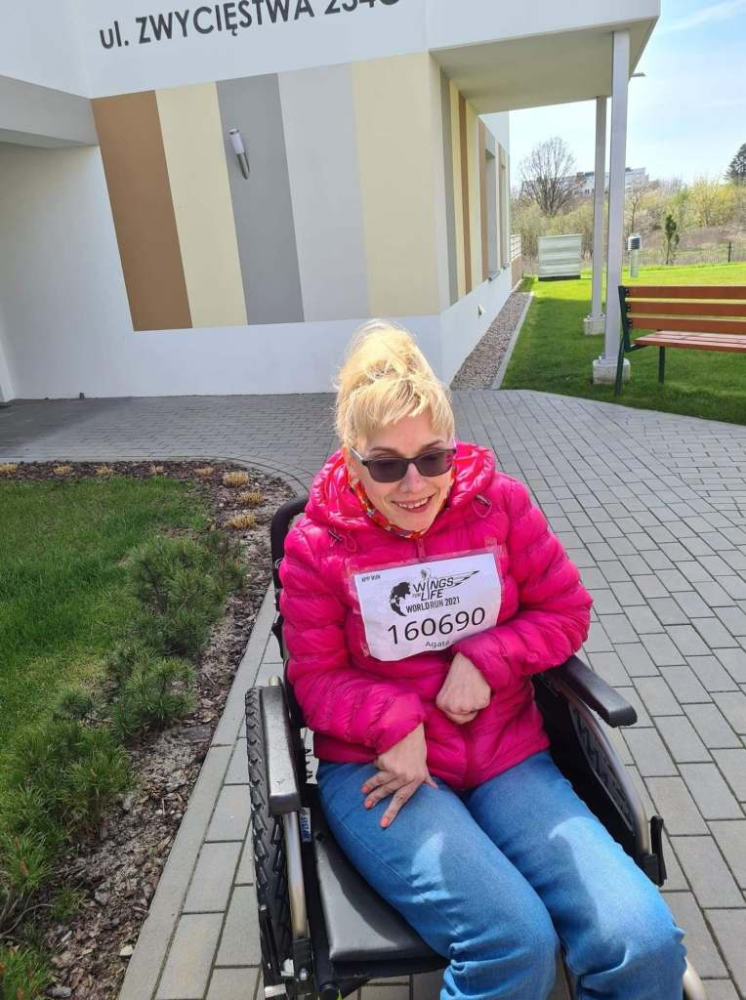
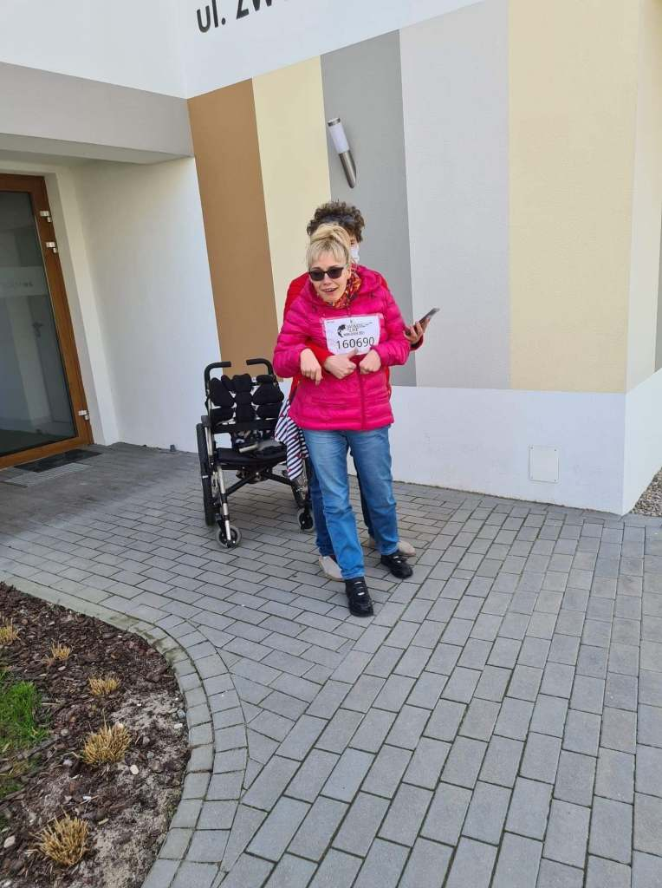
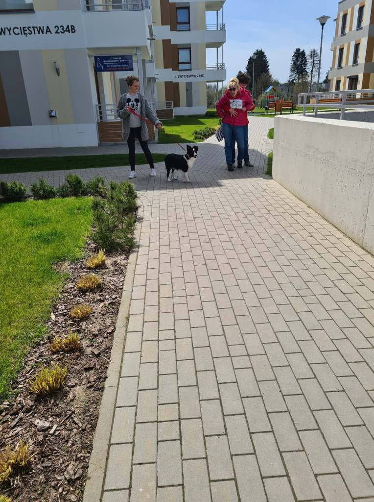
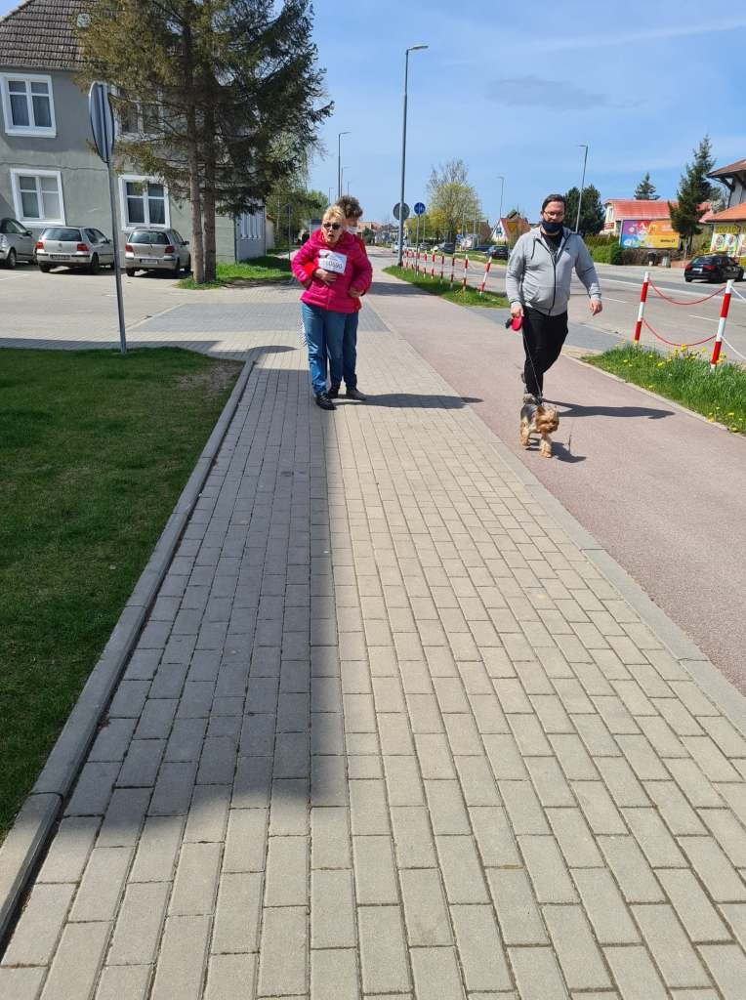
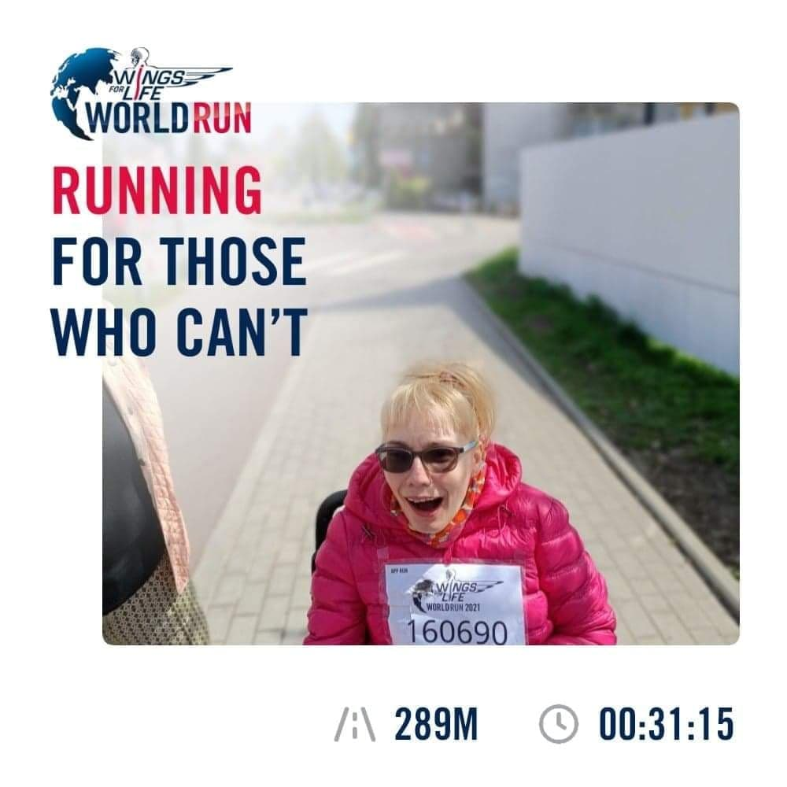

- 
    
- 

Dzisiaj – 9 maja po raz drugi brałam udział w tym biegu – moje wspomnienia z tamtego biegu razem ze zdjęciami opublikowałam na mojej antybarierze, wtedy pokonałam – 204 metry. Dzisiaj przeszłam 289 metrów (po dość długiej przerwie mego  niechodzenia).

Podczas mojego „biegu” miałam fanów – na początku trasy suczka, która mieszka w  moim bloku, później  miałam kibiców, którzy dopingowali z okien swoich domów.

    

    

Pogoda dopisała, mijały mnie osoby na rowerach, hulajnogach. Za rok, nie obiecuję bo nie mogę, ale chciałabym ponownie poprawić swój wynik.

Już dzisiaj czuję, że po całym roku intensywnego treningu będzie moc. Warto się sprawdzić, swoje siły.  Do zobaczenia na starcie w  przyszłym roku.
