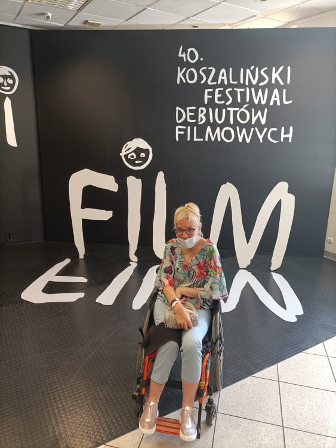
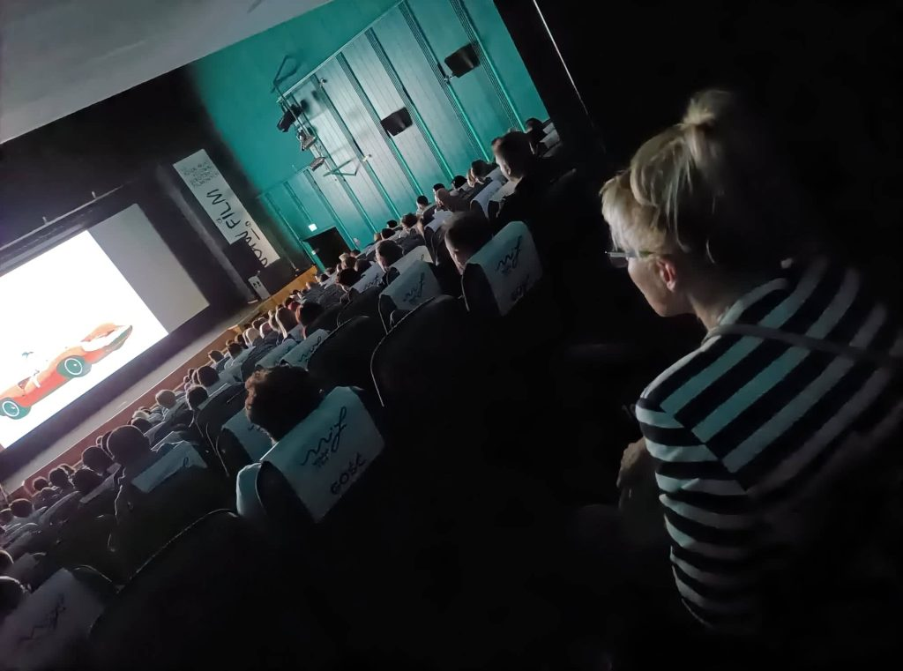
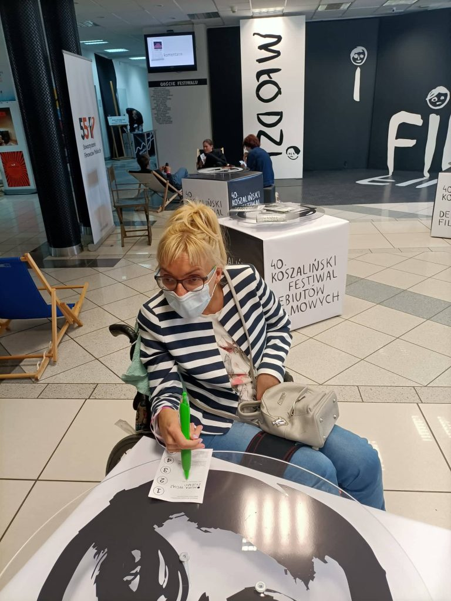
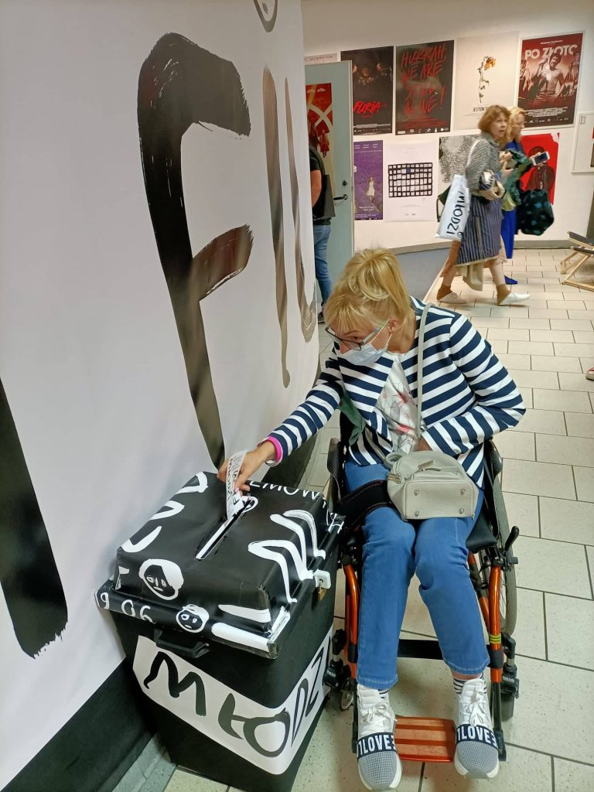
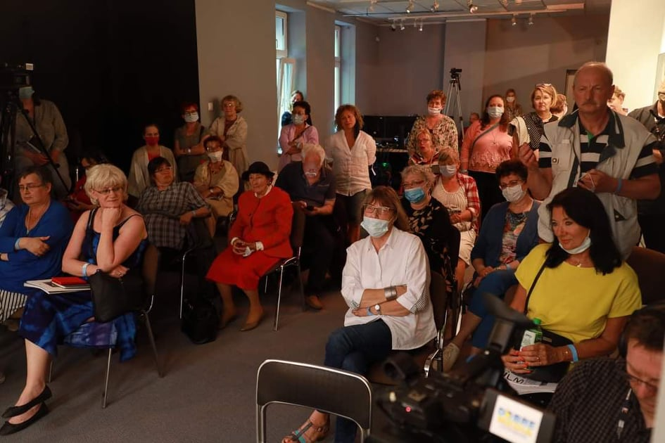
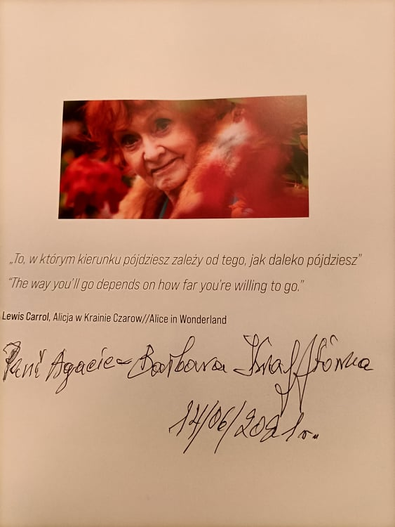

Bardzo, ale to bardzo cieszę się, że mogłam wziąć udział w tak ciekawej imprezie. Wszyscy tęsknimy za naszą zwyczajną komunikacją międzyludzką.

Przedstawiono kilkadziesiąt ciekawych krótko i długometrażowych filmów, po których odbywały się spotkania z twórcami i bohaterami wyświetlanych obrazów. Każdy dzień seansów filmowych kończył się nocnym koncertem muzycznym. Fantastyczna impreza, chciałoby się uczestniczyć w każdym wydarzeniu, niestety doba za krótka, nie dałam fizycznie rady. Lista zwycięzców jest oficjalnie dostępna, również na stronie 40\. Koszaliński Festiwal Debiutów Filmowych MŁODZI I FILM mój faworyt znalazł się wśród laureatów.

    

    

We wspomnieniach zachowam spotkanie z Barbarą Krafftówną, aktorką seniorką, która w niekończących się opowieściach, przy wielu zaskakujących wątkach, doprowadziła do salw śmiechu i owacji na stojąco. Mam bardzo cenny dla mnie autograf.

    

    

Dziękuję organizatorom festiwalu za niezapomniane przeżycia. Do zobaczenia za rok. Jeszcze jedna sprawa, podczas trwania imprezy nie miałam żadnych barier w uczestnictwie festiwalu, związanych z moją niepełnosprawnością.
