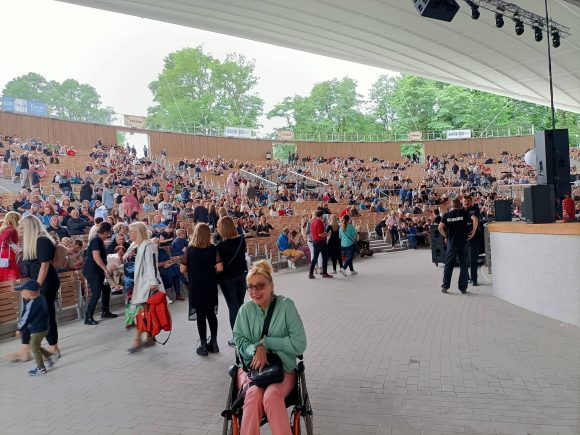
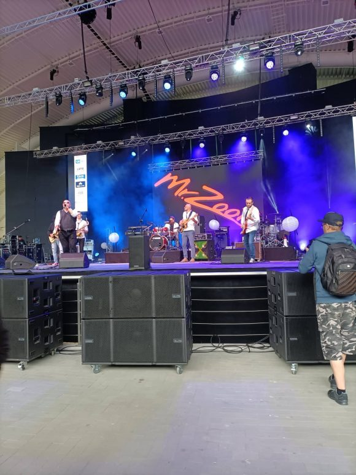
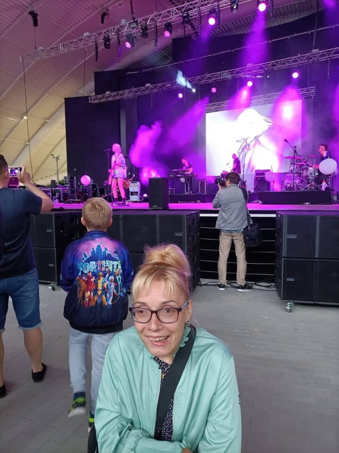
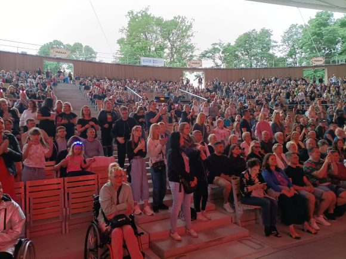
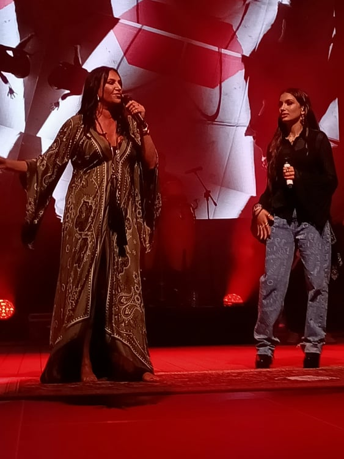
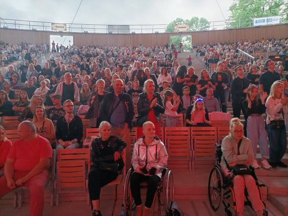
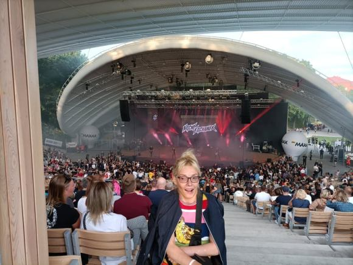
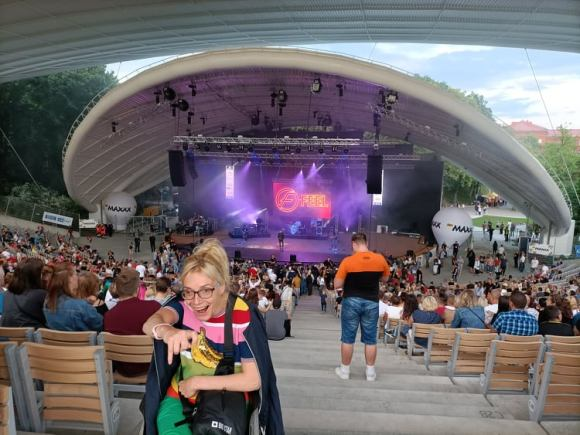
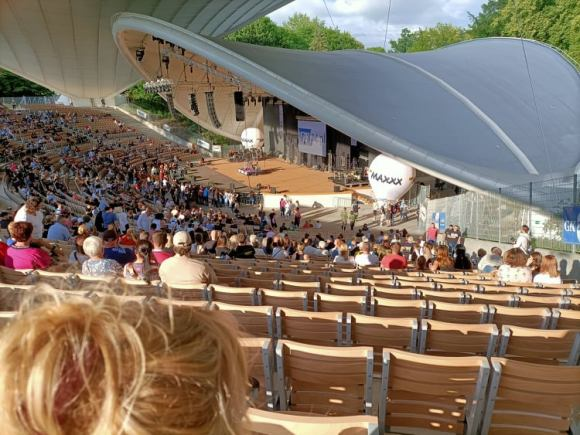
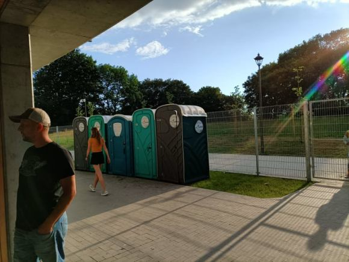

Sympatycznie, bo nareszcie w otwartej przestrzeni spędziłam ostatni weekend, tj.2-4lipca21r.Po dwóch latach ciszy spowodowanej remontem, „odezwała” się scena naszego lokalnego amfiteatru, który dzisiaj spełnia prawie standardy światowe.

Obecnie amfiteatr jest piękny, okazały, duża otwarta przestrzeń, składane krzesła, dach, który ochroni każdego widza przed zaskakującą zmianą pogody. Organizacja imprezy była na odpowiednim poziomie, duży zespół ochrony skutecznie dbał o bezpieczeństwo nas wszystkich. Dobre nagłośnienie oraz oświetlenie podczas koncertów, pozwoliły na jeszcze lepszą wspólną świetną zabawę. 

    

    

    

W pierwszym dniu wystąpił zespół Mr Zoob, następnie Daria Zawiałow widownię wypełniało kilka pokoleń, co nie przeszkadzało w doskonałej zabawie przez prawie trzy godziny.

    

    

 Drugi dzień był wyznaczony na występy Wiki Gabor   i Kayah (wymieniam w kolejności występów), wspólne śpiewanie a także tańce zapewniła Kayah. -swoim występem porwała dosłownie wszystkich do przepięknej zabawy. Mnie też, szczególnie ujął mnie utwór „Ramię w ramię „wykonywany w duecie z Wiki Gabor i „chórkiem „z widowni. W takich momentach uwierzcie mi trudno jest siedzieć sztywno, bez ruchu. Kaya jest pięknym człowiekiem, słowa, które wypowiedziała na scenie długo zapadną w moim sercu.

    

    

Trzeci dzień był w połowie dla mnie zaskoczeniem-pierwszy wystąpił Nocny kochanek- zespół mocnego rocka. Byłam przekonana, że to nie dla mnie klimaty, nic podobnego, ponownie wszyscy doskonale się bawili i ja też. Ostatni na scenie w tym mocno muzycznym koszalińskim weekendzie był zespół Fell   w swoich standardach, które śpiewane były przez wszystkich obecnych na imprezie.   

  Cieszę się, że wakacyjny grafik imprez w naszym amfiteatrze jest mocno napięty. Planuję wziąć udział we wszystkich imprezach.

Jest jednak kilka małych niedociągnięć, dotyczących miejsc dla widzów na wózkach inwalidzkich (zbyt mała ich liczba, nietrafiona lokalizacja-zła widoczność, oraz bardzo słabe oznakowanie, gdzie mogą stać wózki, kolejnym ważnym problemem jest też brak naszej tj.większej toalety.

    

    

Wszystkie nowe inwestycje wymagają dotarcia, mam nadzieję, że i tutaj też tak się stanie. Potrzeba trochę czasu i będzie wszystko grało.

 Pomyślałam sobie, że fajnie jest, gdy ktoś może przyjechać do kogoś, (sprawiając mu wielką radość) kto nie ma za dużo możliwości podróżowania.

 Dzisiaj, zwyczajnie dziękuję ORGANIZATOROM za pięknie spędzony czas.
