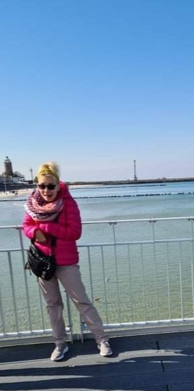
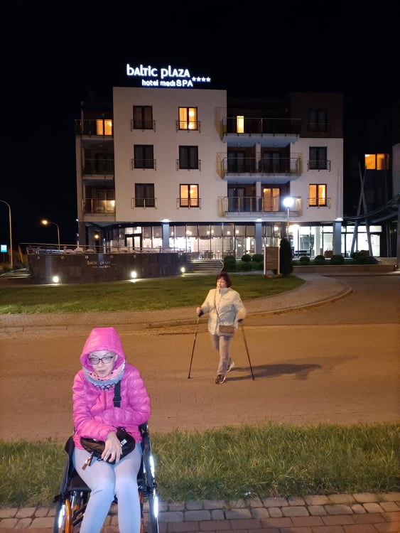
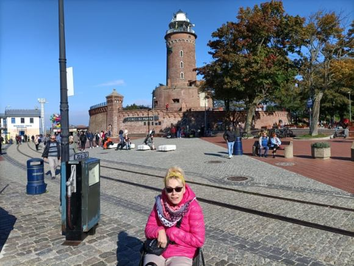
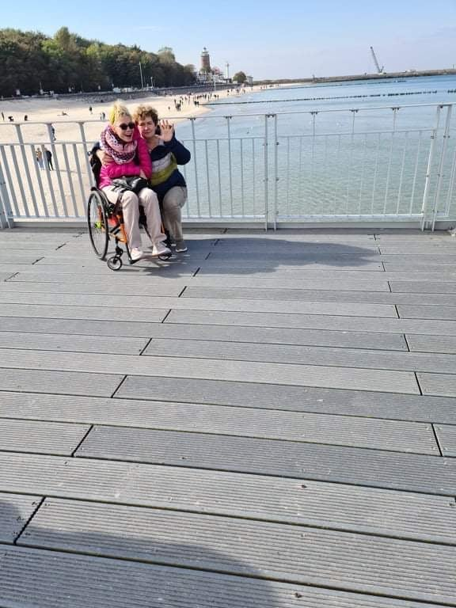
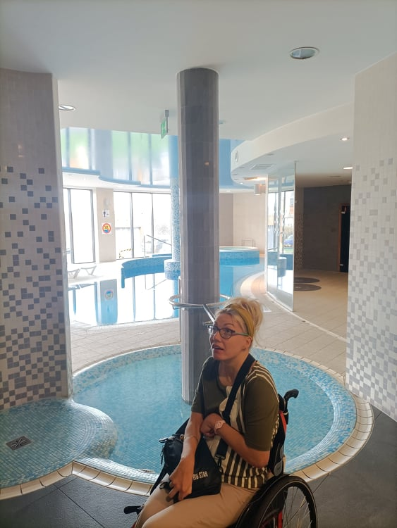
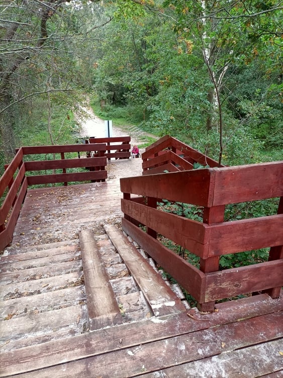
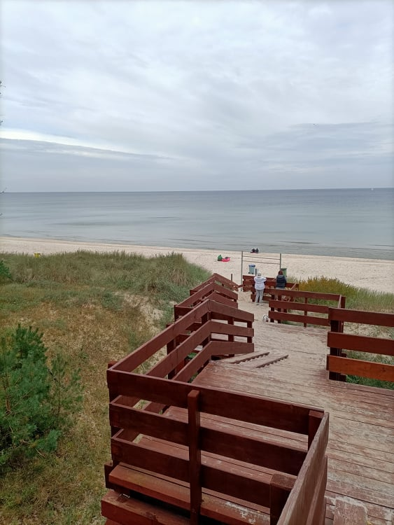
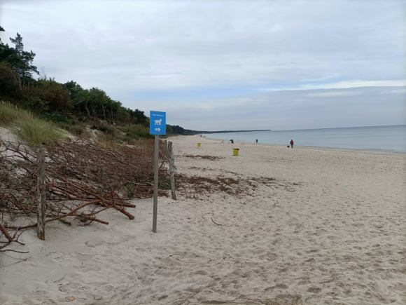
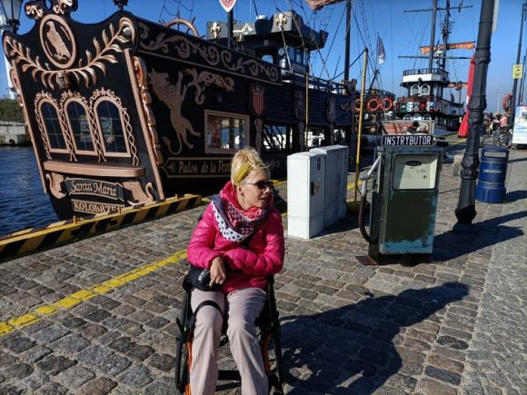
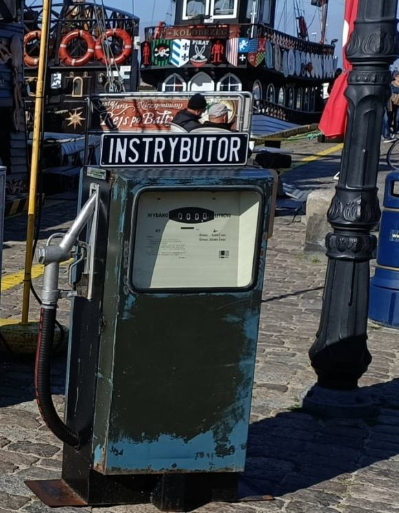

Mijający weekend zaskoczył nas piękną pogodą. Dwadzieścia kilka stopni temperatury, piękne błękitne niebo z cieplutko grzejącym słoneczkiem i plaża nad naszym morzem. Przypadek i trochę spontaniczności przeniosły mnie na klika dni do Kołobrzegu.

    

    

    

Mieszkałam w hotelu media-spa, gdzie na szczególną uwagę zasługuje człowiek dbający o nasze apetyty, pan w czarnej czapce, swoim rzemiosłem zadał nie tylko mi, wątpliwość w twierdzeniu, że „_... jeszcze się taki nie narodził, który by wszystkim dogodził..._" Oświadczam, że Pan kucharz swoim mistrzostwem kulinarnym dogodził podniebieniom obecnym na tym turnusie. Specjalnie dla mnie przyrządzona jajecznica niewiele odbiegała od smaku potrawy przyrządzonej przez moja babcię (do tej pory nikomu to się nie udało).

Powodzeniem wśród dzieci cieszył się dostępny basen oraz dość pomysłowo funkcjonujące sale i place zabaw. Dla dorosłych wszelkie zabiegi fizjoterapeutyczne z powodu pandemii zostały wstrzymane, pozostał basen, jacuzzi oraz plaża nad morzem znajdująca się kilkaset metrów od hotelu.

Niestety dla mnie niedostępna, zbyt dużo stromych śliskich schodów przy dojściu do wody, prawdziwą radochę na tej plaży miały pieski i ich właściciele, bo to jest teren specjalnie dla nich wyznaczony.

    

    

    

Kołobrzeg jest atrakcyjnym turystycznie miastem, mam nadzieje, że w niedługim czasie stanie się bardziej „miły” dla nas, parkowanie samochodu graniczy z cudem, albo z przekroczeniem przepisów. Następnym piątym kołem u wozu są kocie łby, którymi wybrukowane są drogi portu i niech tak pozostanie, nam wystarczyłby wąski półmetrowy gumowy pas, położony wzdłuż atrakcyjnych turystycznie miejsc.

    

    

Wciąż istnieją luki w realizacji przepisów dotyczących dostępności miejsc publicznych dla nas wszystkich(Dz.U. 2019 poz. 1696 z dnia 19 lipca2019r. powinna być realizowana od 5 września 2021r.)Teoria już istnieje, planuję jej praktyczną realizację. Zobaczymy.

**_https://www.funduszeeuropejskie.gov.pl/strony/o-funduszach/fundusze-europejskie-bez-barier/dostepnosc-plus/ustawa-o-dostepnosci/_**

Pozdrawiam wszystkich serdecznie, a dzisiejszy wpis dedykuję mojej rodzince, z którą tak się zdarza, że spotykamy się w Kołobrzegu.
