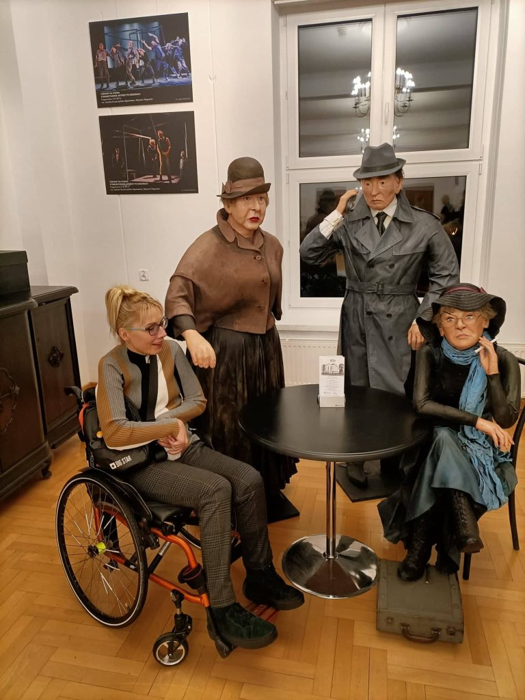
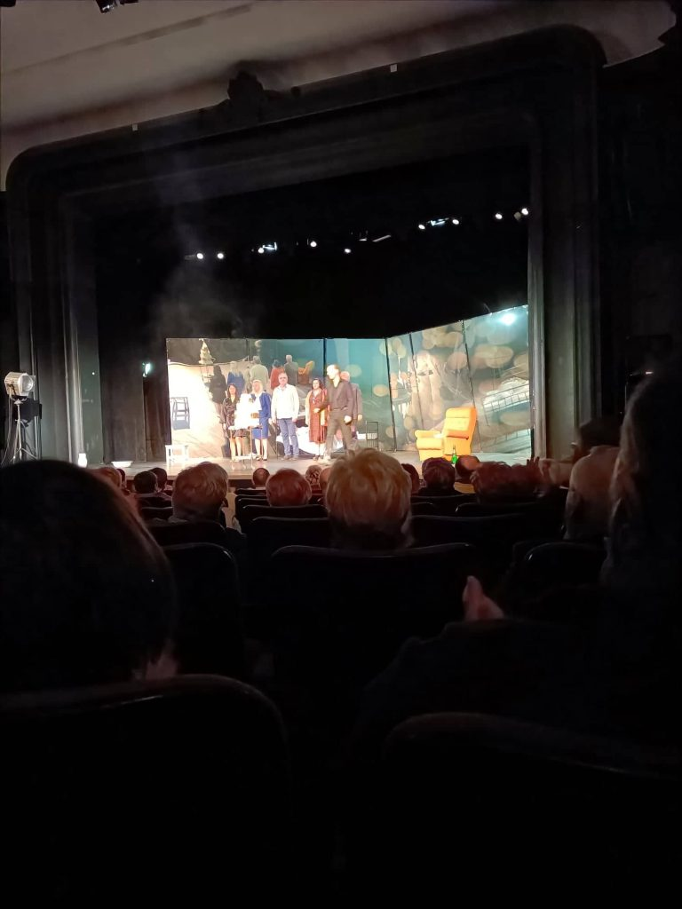

W czasach obecnie nam panujących(mam na myśli pandemię i związaną z nią naszą izolację)niełatwo jest się zrelaksować, coraz trudniej o szczery naturalny śmiech. Na zewnątrz świat jest szary, snujemy się  w półkrytych twarzach, w których widać jedynie mało wyraźne, smutne oczy. Nie chce mi się oglądać ,nie chce mi się słuchać, a jeszcze pisać… Komu by się chciało?!Jednak udało się mi wyrwać (chwilo trwaj )z objęć pesymizmu.

     Wybrałyśmy się stałą ekipą do naszego starego poczciwego koszalińskiego teatru, na deskach którego przedstawiono  warszawską sztukę pt. ”Wieczór panieński plus”. Komedia obyczajowa, wartka akcja, zaskakujące sceny, zabawne dialogi w znanej medialnie obsadzie. Fajnie jest pośmiać się w większym gronie, mimo wszystko jeszcze potrafimy.

    

    

     Kolejna impreza jak się uda, to noc sylwestrowa w…..

    Będzie się działo.
