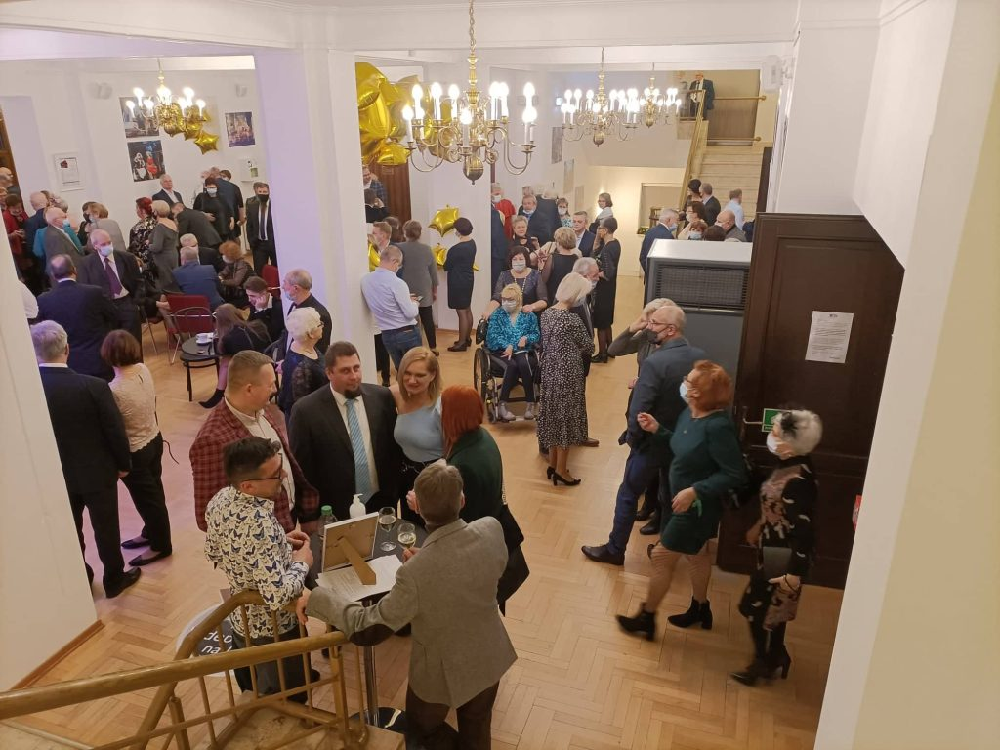
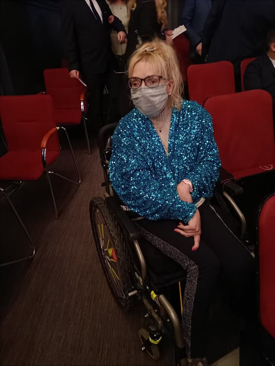
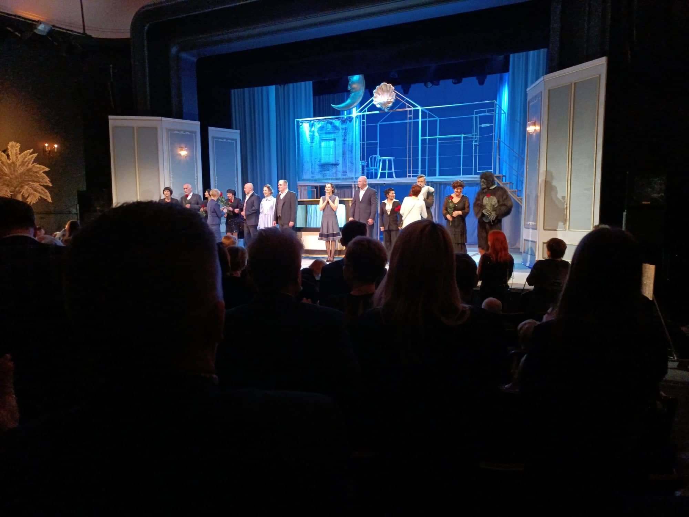
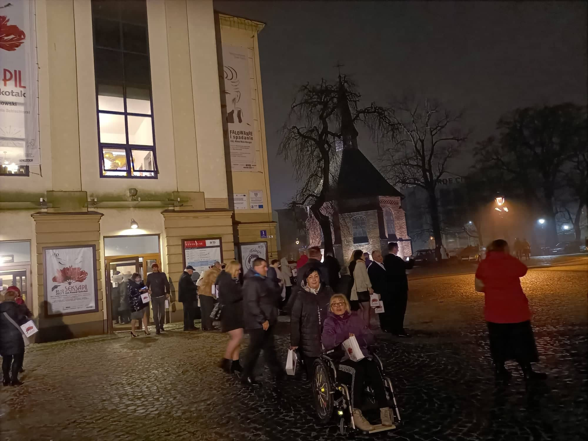
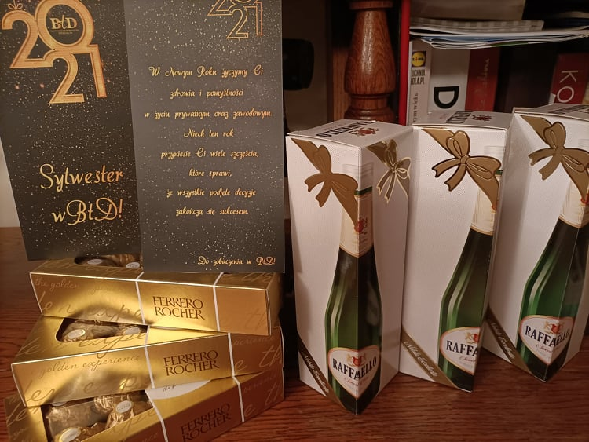
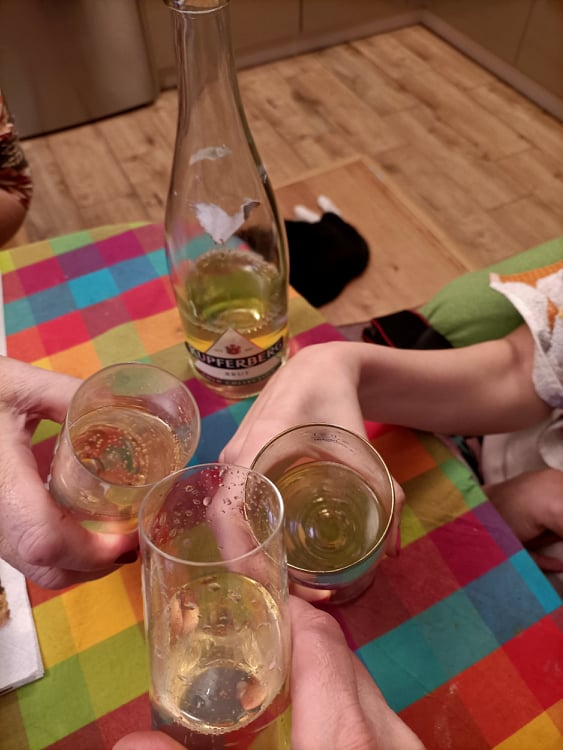

 Nowy Rok 2022 przywitałam w naszym koszalińskim teatrze w wybornym towarzystwie. Scenę wypełniała kilkunastoosobowa ekipa rodzimych aktorów, przedstawiającą komedię „Seksapil”, która wymagała od grających dodatkowych zdolności seksapil scenki, wywoływały na widowni (wypełnionej do ostatniego miejsca) salwy śmiechu i owacje na bieżąco.

 Tradycją tych naszych noworocznych teatralnych spotkań, jest składanie sobie wspólnych życzeń przy lampce szampana. W tym roku, z powodu pandemii zadziało się inaczej. Przy wyjściu dla każdego widza czekała milutka niespodzianka. Osobista mała butelka szampana oraz słodkości. 

 Życzę radości i spełnienia pragnień i marzeń na ten rok.
