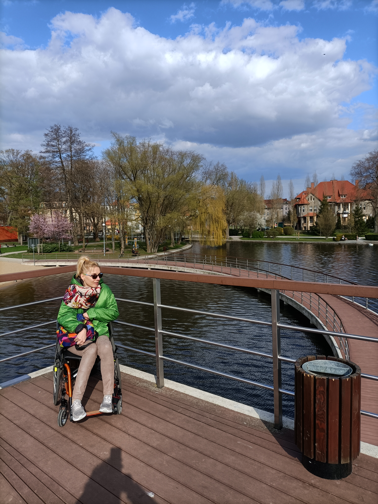
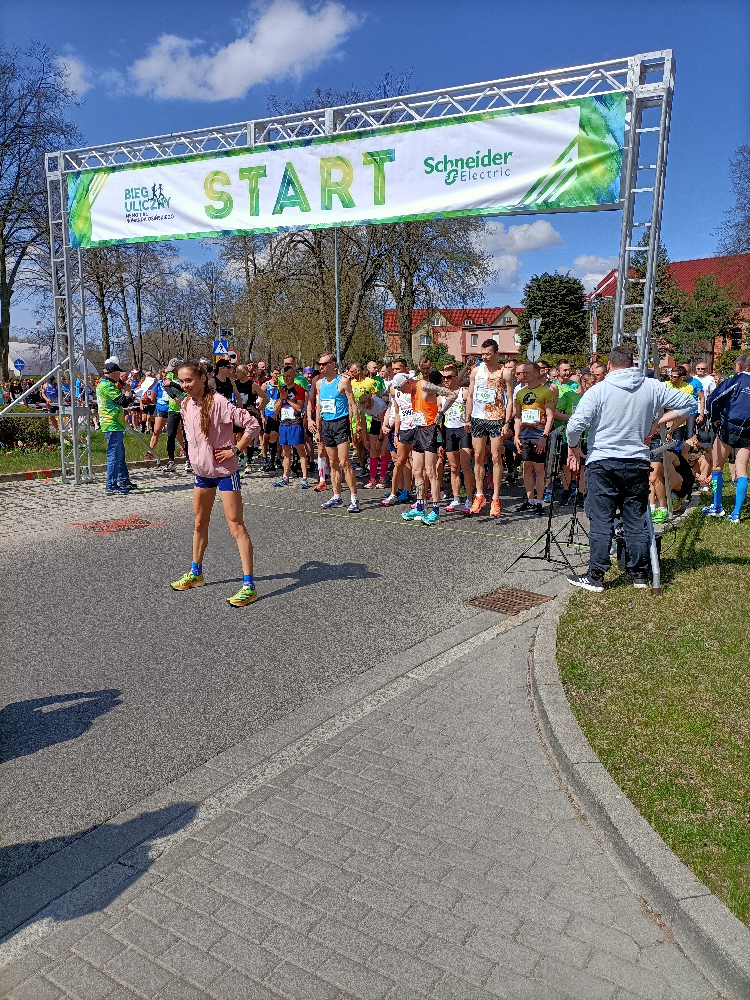
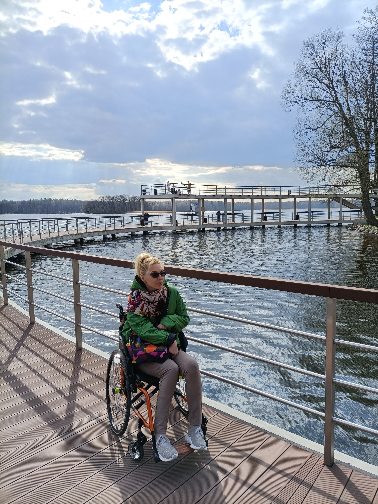
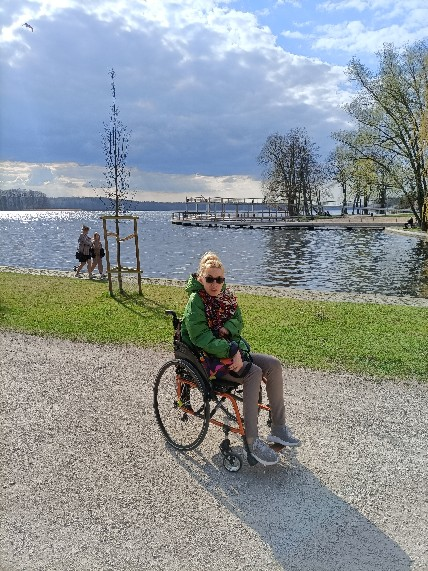
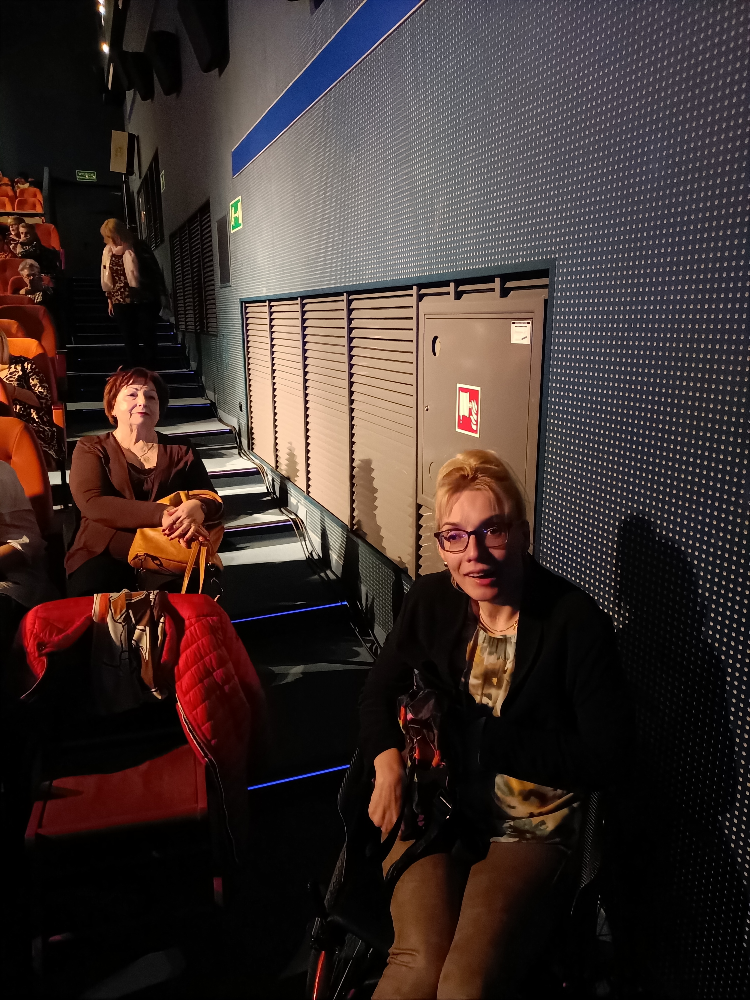
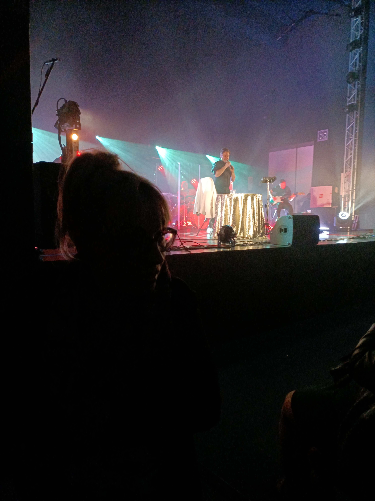
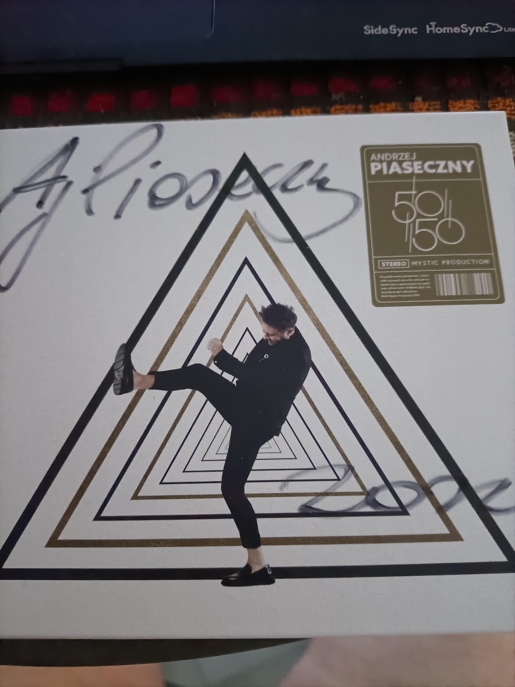

    Mam kilka powodów, aby tak twierdzić.

Po pierwsze Szczecinek jest miastem rodzinnym moich rodziców. Całe dzieciństwo związane było z moją najukochańszą babcią Eleonorą.

Po drugie jest miejscem, gdzie zadbano o wypoczynek i rekreację mieszkańców. W centrum miasta jest malowniczo położony park, otaczający jezioro Trzesiecko, gdzie znajdują się: wodny wyciąg narciarski, molo i ścieżka rowerowa obejmująca całe jezioro. Popularnością cieszą się również dostępne miejsca aktywnego wypoczynku i smakowitego relaksu. Popularnością w sezonie letnim cieszy się, strzeżone miejskie kąpielisko i plaża.

W końcu jest i trzeci powód, weekendowe imprezy kulturalne, gdzie 23 kwietnia w kinie „Wolność” zapowiedział się koncertowo Andrzej Piaseczny. O biletach mogłam tylko pomarzyć. W realizacji spełnienia moich marzeń pomógł mi wujek Janusz, który mieszka w Szczecinku od wielu lat i załatwił mi wejściówkę.

Koncert różnił się od poprzednich recitalów Andrzeja (ostatni obejrzałam w Koszalinie w 2015r.) Ten opowiadał o miłości i szczęściu, jednak w nucie nostalgii. Mimo wszystko, pięknie spędzony, niezapomniany czas.

Dziękuję, wujku.
