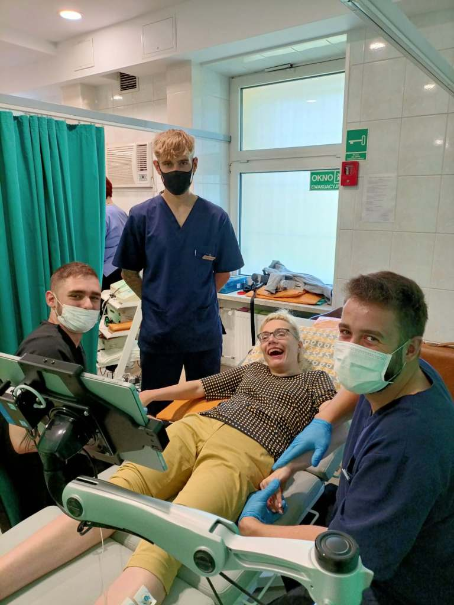
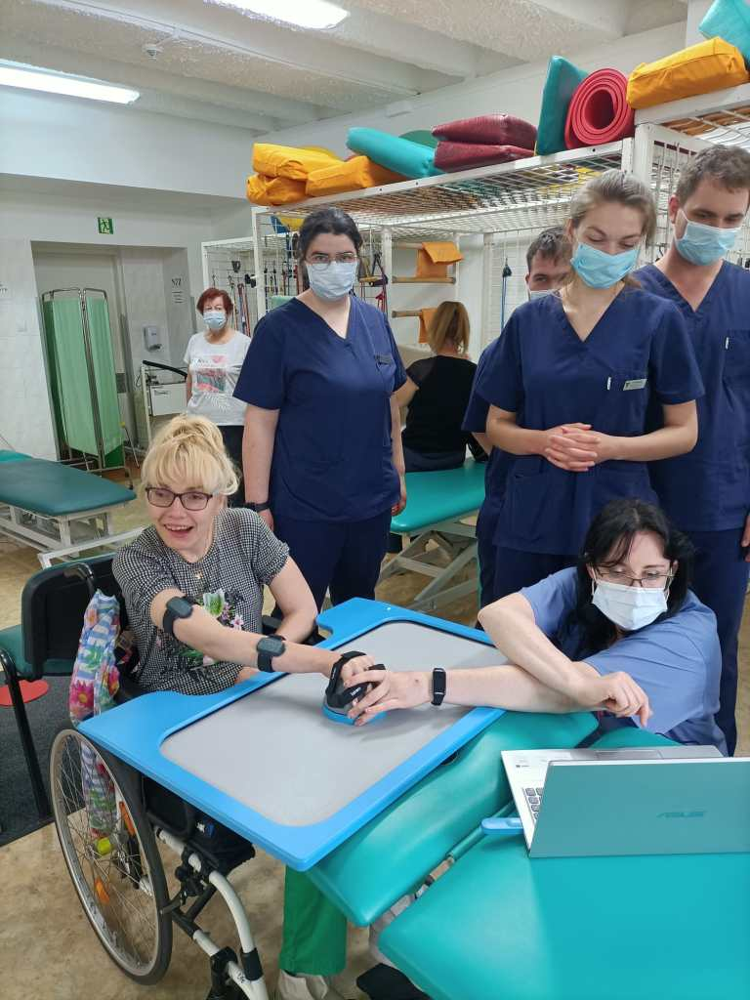
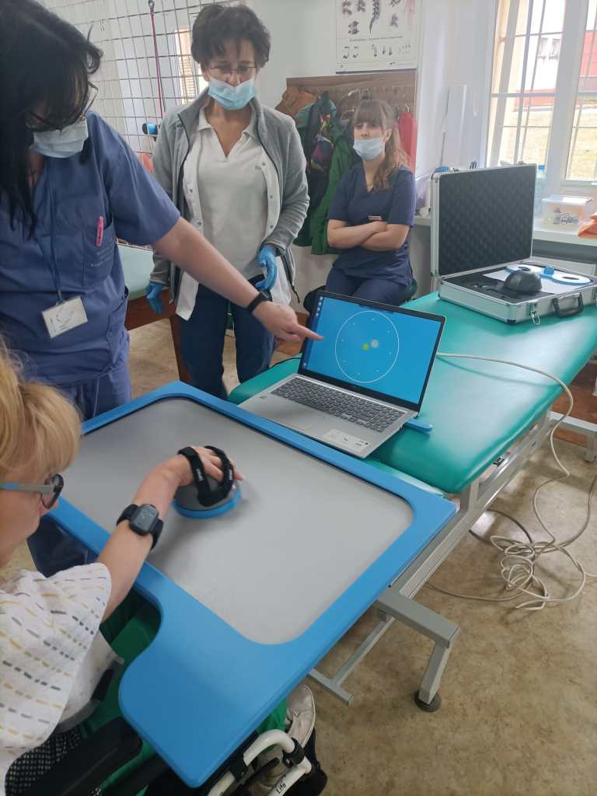
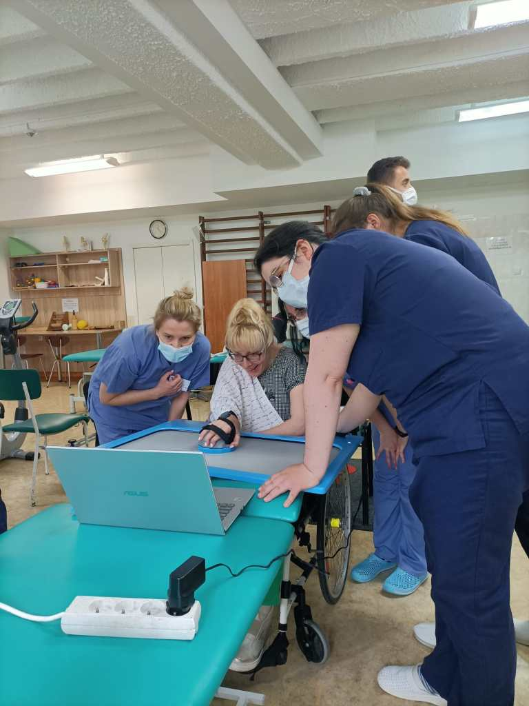

Zapewne pamiętacie, że od prawie dwudziestu lat systematycznie „ćwiczę”. W ostatnich tygodniach sporo atrakcji dostarczyły mi zajęcia w oddziale rehabilitacji koszalińskiego szpitala. Rozpoczęłam współpracę z „Luną”, która nie wiem w jaki sposób potrafi uaktywniać moje spastyczne mięśnie.

      Drugie urządzenie, którego nazwy jeszcze sobie nie przyswoiłam, wbrew pozorom, nie jest takie łatwe obsłudze. Należy olbrzymią myszą na dużym touchpadzie (gładziku) bardzo precyzyjnie przełożyć obrazki, ale widoczne na malutkim ekranie dopiętego laptopa. Uwierzcie mi bardzo ciężka praca,ale w towarzystwie trzech muszkieterów jest łatwiej.

      Pozdrawiam wszystkie Panie fizjoterapeutki z tego oddziału.
