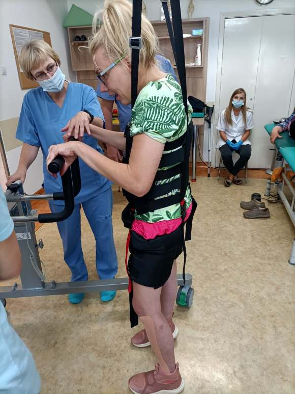
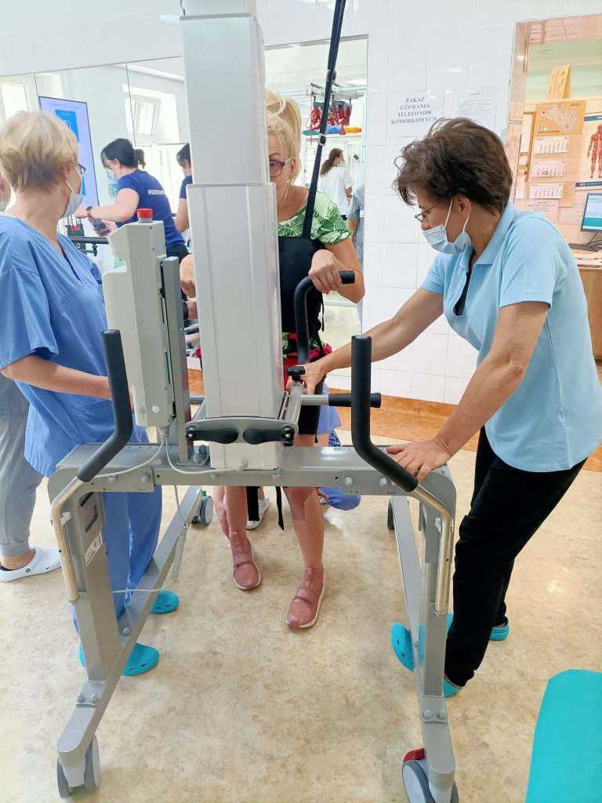
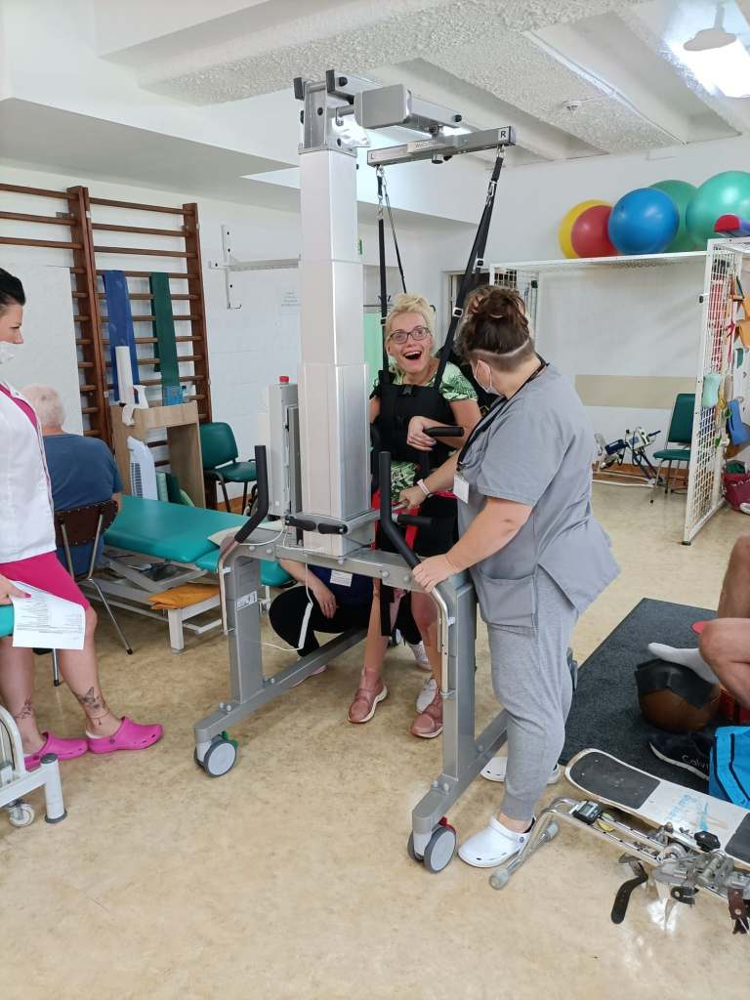
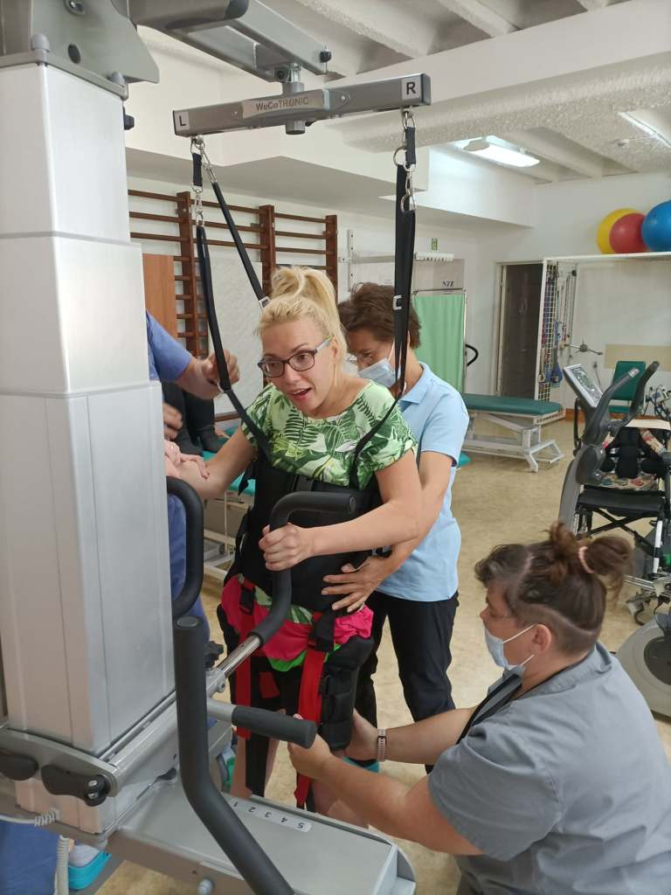

Trudno uwierzyć, ale ja wczoraj tj.20 lipca 2022r. po dwudziestu latach otrzymałam szansę samodzielne pójść. I Poszłam, nikt mnie nie pchał, nie ciągnął. Może mój krok nie był prawidłowy, ale szłam, szłam  i nikt, i nic nie umiał mnie zatrzymać. Po 30 minutach choć nogi miałam jak z waty chciałam nadal chodzić.

Prezentuję kilka fotek ze mną w roli głównej, sama nie wierzyłam, że mogę tak chodzić, dlatego publikuję kilka „dowodów” - ja z „Ricardo” (tak nazwałam nowego asystę przy nauce mojego chodzenia). Nikt nie umie sobie wyobrazić mojej radości z niby (dla pełnosprawnych) zwykłego chodzenia.

 Hurra!

Dziękuję całej ekipie rehabilitacji koszalińskiego szpitala za moje pierwsze trochę pokraczne kroki, ale za to w 100% własne.

Filmik opublikuję na facebooku.
