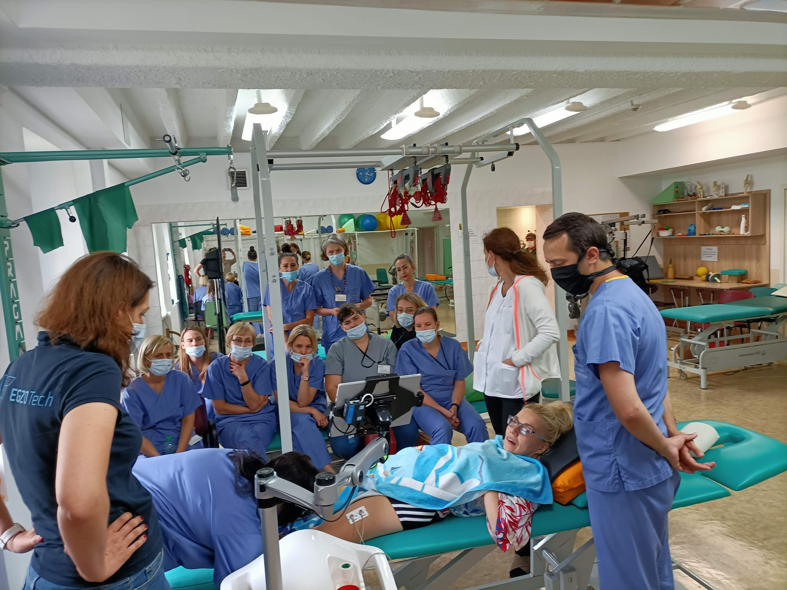
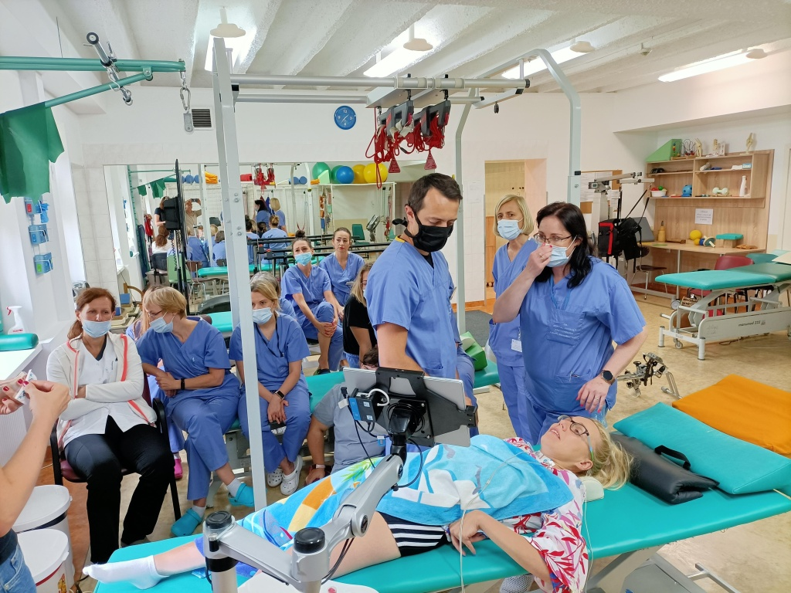
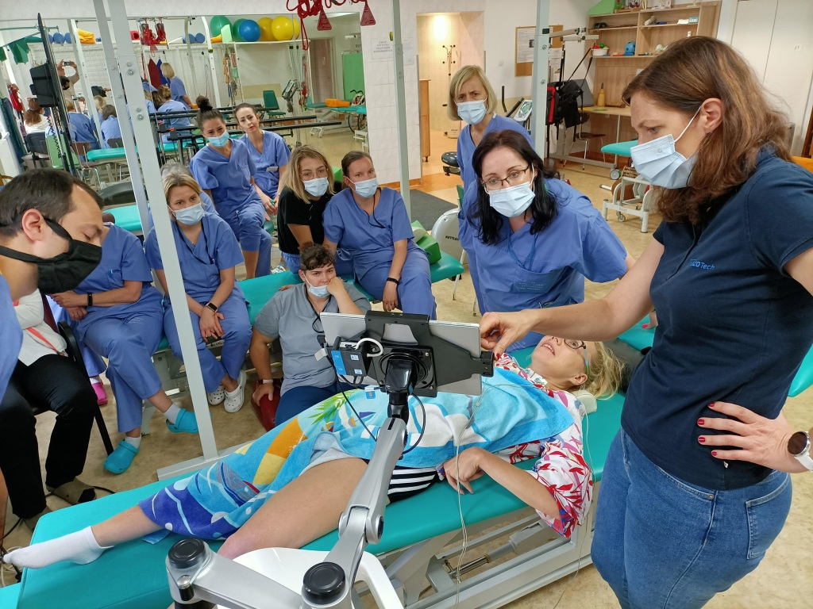
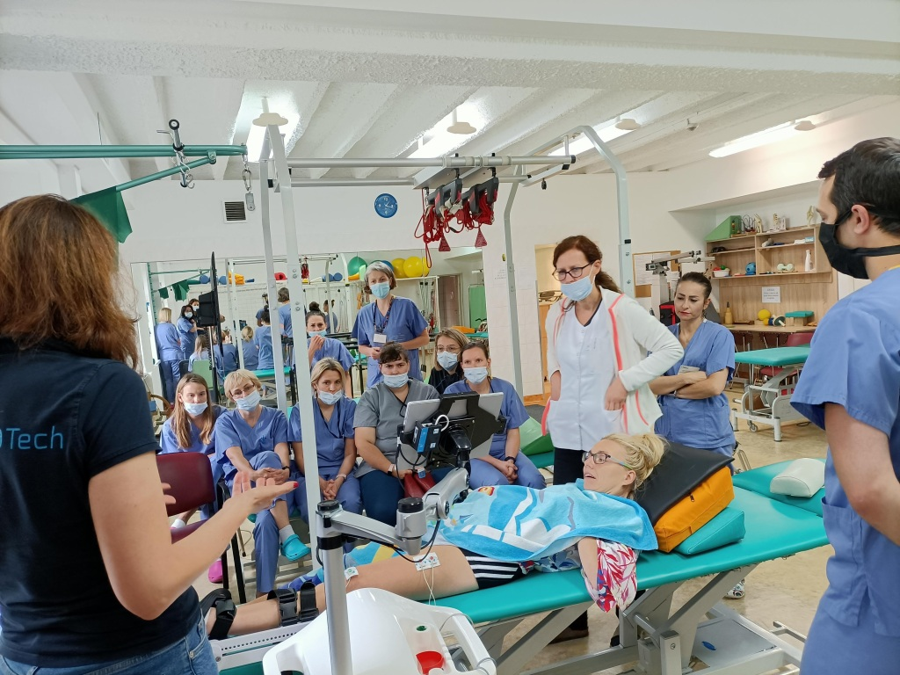

Ostatnio wspominałam o mojej nowej znajomej w zajęciach rehabilitacyjnych tj. o LUNIE. Dzisiaj miałam okazję uczestniczyć prezentacji i w szkoleniu w obsłudze tej aparatury jako ….modelka na leżąco.

Elektrody Luny podłączone do moich mięśni, pozwalają na odczyt i kontrolę(na monitorze)pracy moich kończyn. Podglądam ten zapis i chociaż nie znam się na tym, to po pierwsze ciepłym uczuciem jest widok pracy własnych mięśni, po drugie szokuje mnie coraz większy zakres pracy moich spastycznych mięśni. Jest to bardzo malutki postęp ,ale jest.

Teraz przy chodzeniu mam bardzo różne odczucia, mimo miękkich nóg jak z waty, czuję własny ciężar i  większą stabilność ciała. Chce mi się chodzić.

W trakcie pokazu, (na moją prośbę) podłączone zostały elektrody na mięśnie szyi, które pokazały napięcie i możliwości ich sama, po się, że pracują tylko potrzebują większego treningu, który mogłabym wykonywać sama, po konsultacji neurologopedycznej.

Aparatura, aparaturą, a ja wiem jedno, nic bym nie wywalczyła bez wsparcia i pomocy rzeszy specjalistów w dziedzinie rehabilitacji.

Dziękuję wam kochani za poczucie, że nie wszystko jest stracone.       Warto walczyć.
