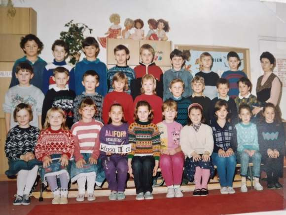
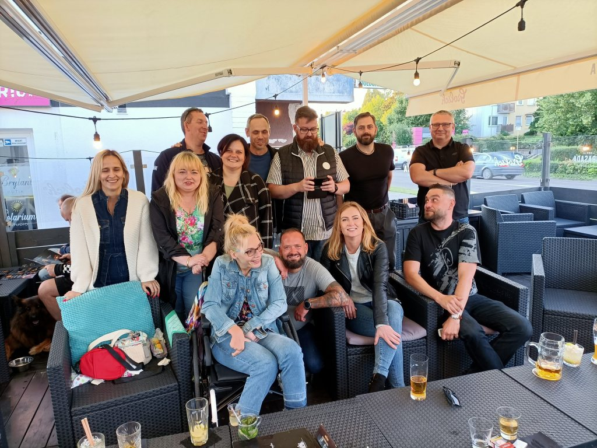
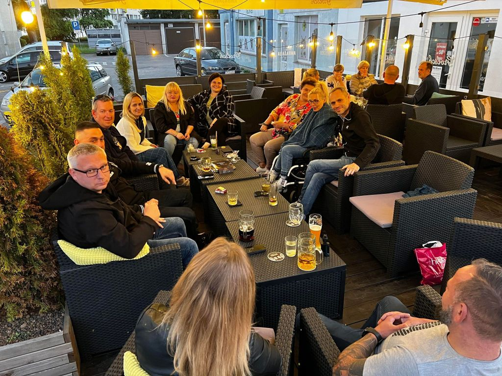
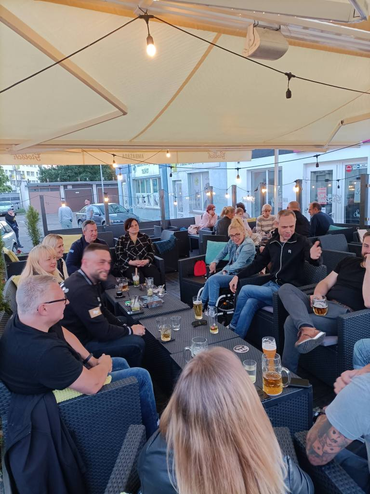
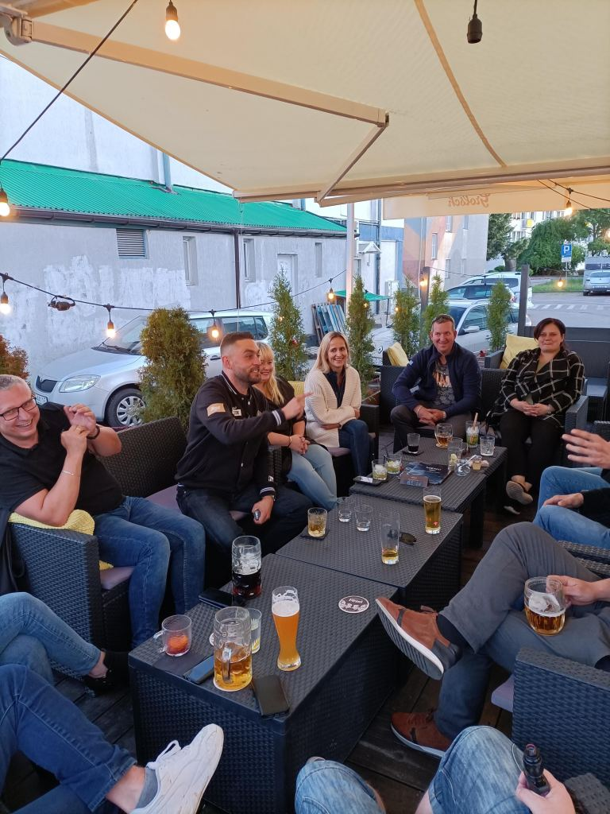
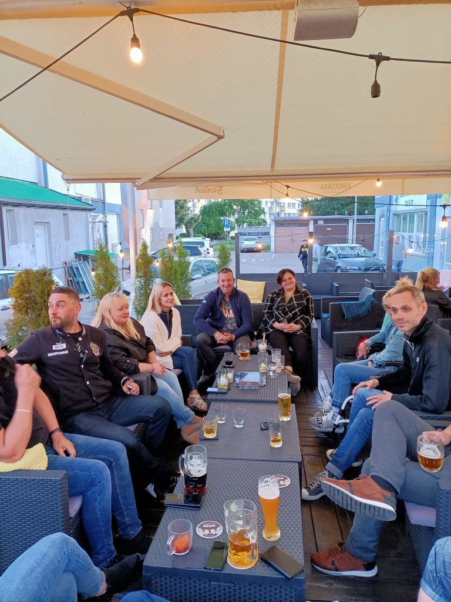

W czwartek miałam niezwykle spotkanie. Kosmiczne, bo po 25 latach udało się nam spotkać w kilkanaście osób z podstawówki.

 Dawno tak szczerze się nie śmiałam, było mnóstwo wspomnień, niekończące się opowieści z ławy szkolnej  oraz z tamtego jakże bogatego życia podwórkowego.

Po małym zamieszaniu na przywitanie (szczególnie panowie mieli problem z rozpoznaniem kolegów ze szkolnej ławy), po chwili odniosłam  wrażenie, że czas stanął w miejscu, tylko ktoś poprzestawiał ławki. Ktoś jeszcze, może Krzysiu poprzyklejał brody niektórym kolegom. Zdecydowanie również zmienił się bufet. Reszta obrazów pozostała bez zmian, kto by pomyślał, że to tyle lat już minęło.

Trochę obawiałam się spotkania po latach. Niepotrzebnie, świetnie się bawiłam, ten kogo nie było może tylko żałować.

Pozdrawiam wszystkich obecnych, ale również tych nieobecnych.  Może kiedyś powtórzy się szansa spotkania w jeszcze większym gronie.

Dziękuję wam kochani.
