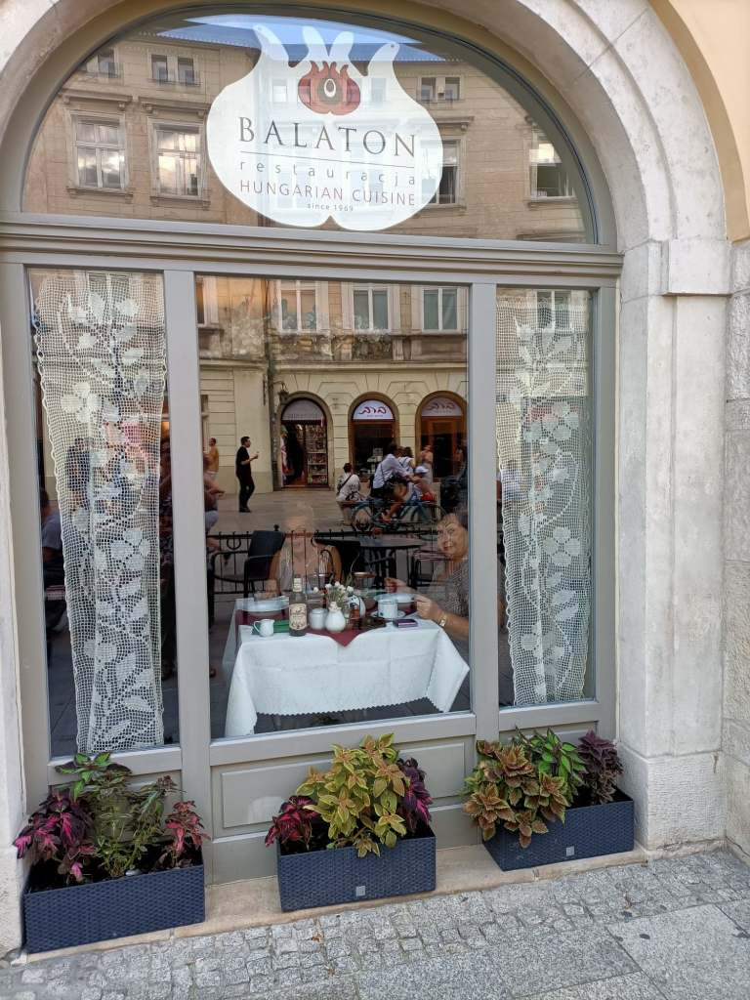
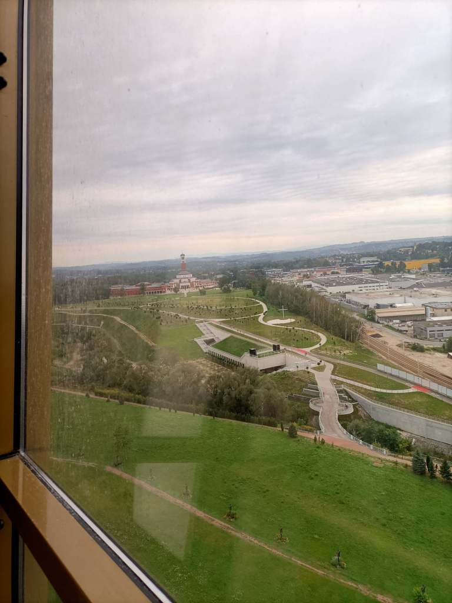
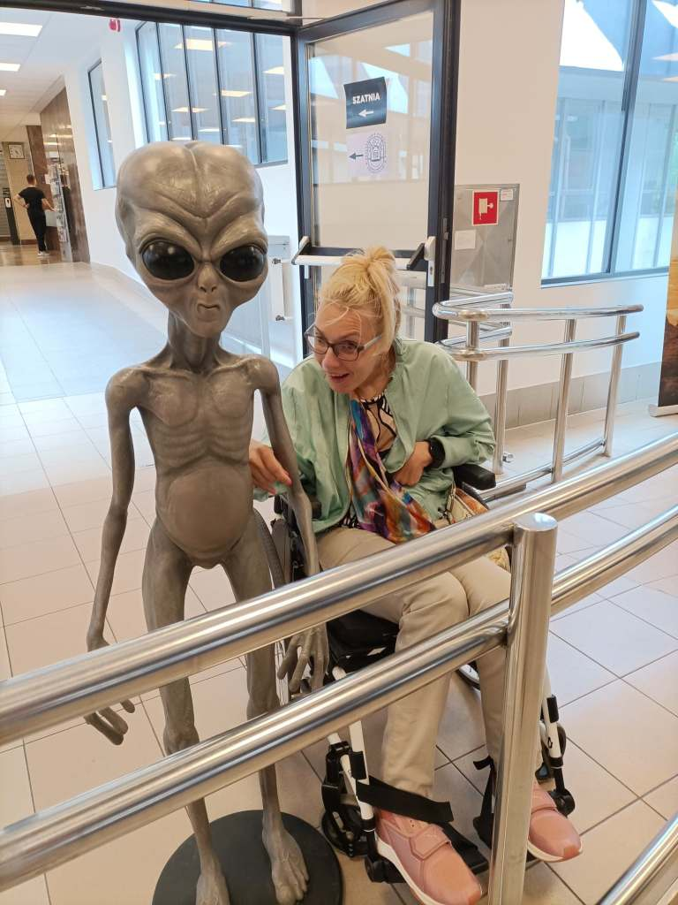

Dlaczego chwilo nie chcesz trwać wiecznie? Wakacje się skończyły,   od tygodnia jestem  w domu ,życie pomału wraca na regularny tor dnia codziennego.

Dzisiaj po raz pierwszy po wakacjach  w końcu mogłam zrealizować plan  fitnessu(rehabilitację).  Nie ukrywam brakowało mi ćwiczeń, trzy tygodnie przerwy to długo, mięśnie stają się słabsze. Teraz spróbuję z podwojoną siłą, wspólnie z zespołem fizjoterapeutów nadrobić zaległości. Warto było, czasami trzeba zrezygnować z ważnych rzeczy dla potrzeb pięknych przeżyć. Ktoś po drodze zapytał mnie ,dlaczego czas relaksu spędzam zawsze w Krakowie ,tyle jest pięknych i ciekawych miejsc na świecie i Polsce .

Moim miejscem na świecie jest Kraków ,czekam cały rok na podróż do miejsca ,które blisko dwadzieścia lat temu miało się stać  domem, pracą i spełnieniem mojego życia. Niestety ,nie zdążyłam dostrzec znaków ostrzegawczych i już….

Dzisiaj na sali usłyszałam pytanie, dlaczego na moim blogu panowała martwa cisza. Zrobiło mi się ciepło na sercu, jednak są sympatycy mojego jednego „paluszka ” ,przy pomocy którego mam możliwość pisania  , ale trwa to nieokreślenie długo .Dziękuję za cierpliwość .Moje milczenie było wynikiem zwyczajnej głupoty ,zapomniałam z domu wziąć mojego narzędzia pracy ,czyli laptopa.

Chciałam pisać o wakacjach ,emocje pokierowały inaczej .    Co robić ?Można być bardzo ostrożnym ,można uniknąć wielu smutnych niespodzianek. Warto.

Już wkrótce cdn. .Pozdrawiam bardzo serdecznie.
