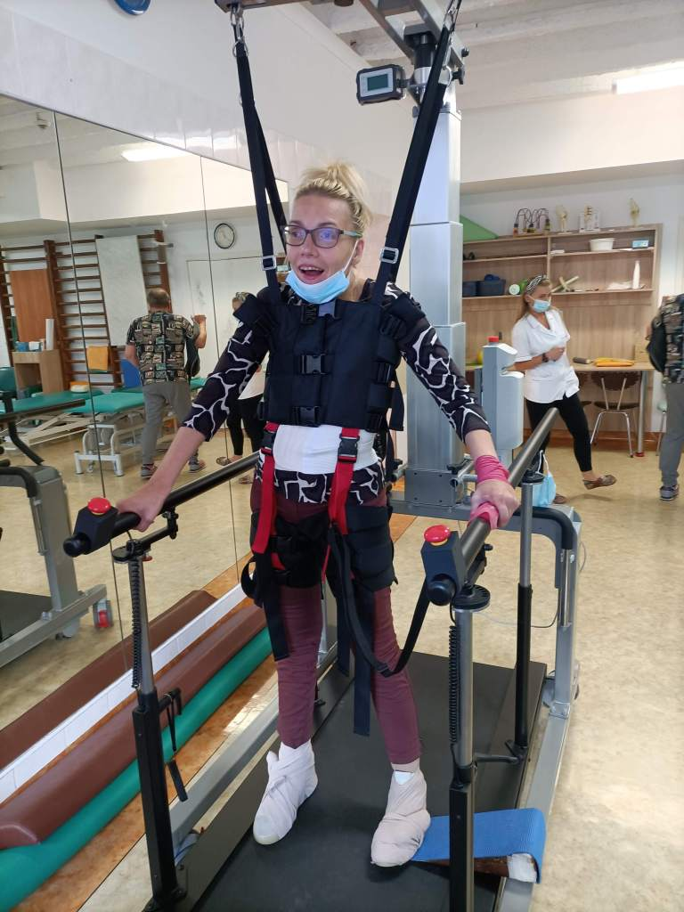
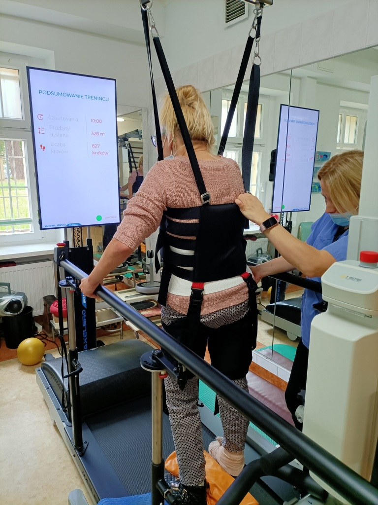
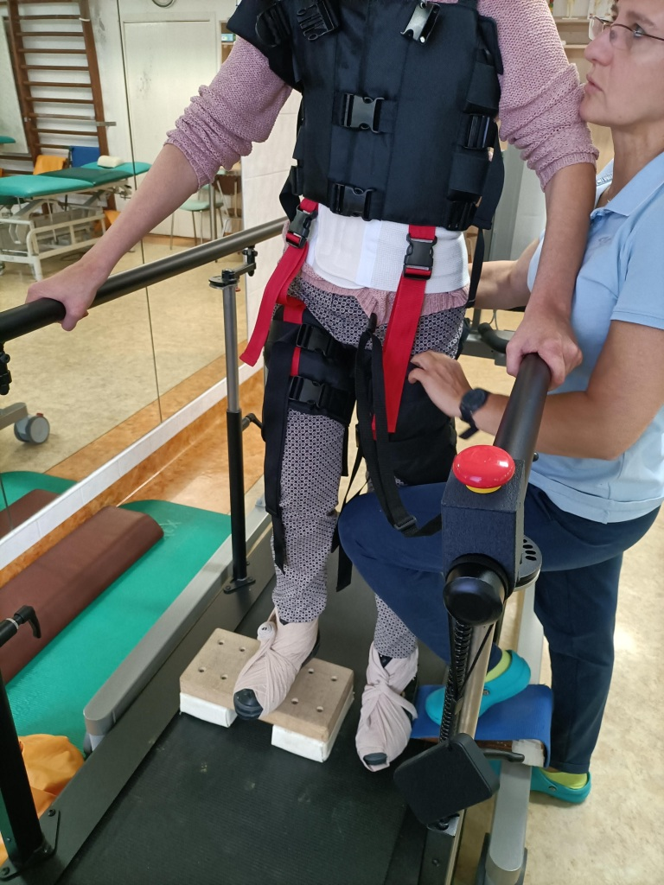
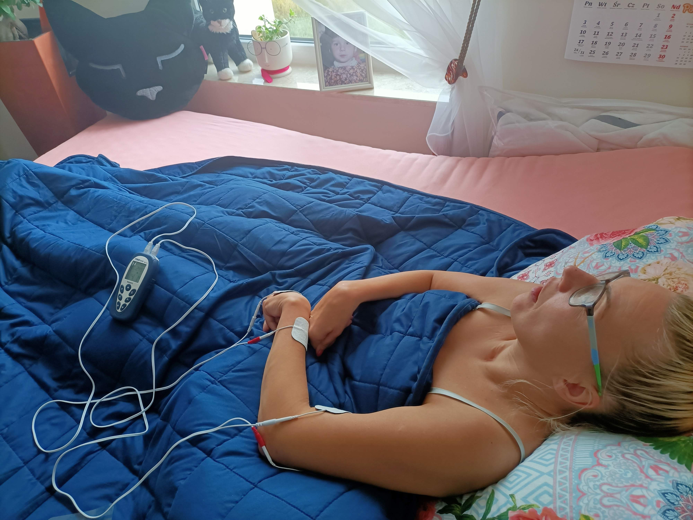

Po wakacjach moje zajęcia na sali rehabilitacyjnej nabrały jeszcze innego, większego tempa. Kto by pomyślał? Stawiam na bieżni swoje pierwsze(bardzo koślawe)kroki. Dzieje się i to niemało. Przed sobą mam duży ekran, na którym kontroluję swój chód. Dobrze pomyślane, widzę czas i ilość pokonanych kroków a przede wszystkim siłę swoich nóg. Kroki stawiam z różnym obciążeniem, muszę to poprawić, wytrenować. Nie ukrywam, są to ćwiczenia wymagające dużego skupienia i spójności moich ruchów. Czasami spóźniam lewą nogę, chwilami głowa staje się za ciężka, a lewa dłoń nie ma siły podtrzymać mojej i tak słabej stabilności. Mięśnie słabną po siedmiu minutach, nogi uginają się pod ciężarem ciała, ale…    

JA NIE CHCĘ PRZESTAĆ CHODZIĆ.  

         W czasie zajęć najbardziej ucierpiała lewa ręka, ale po skutecznych zabiegach ból ustąpił.

   Jestem gotowa do następnych zajęć.
