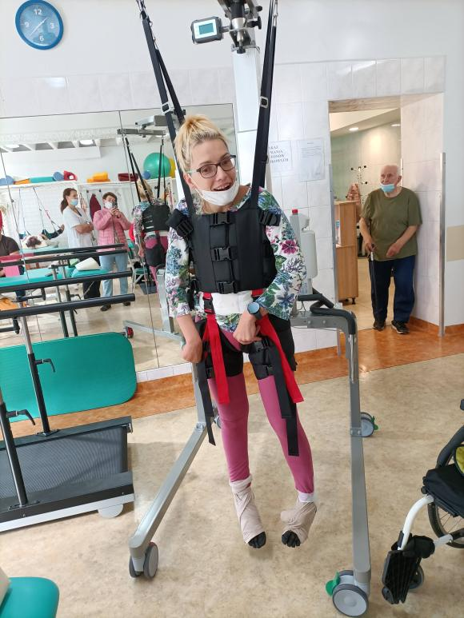

Jestem po szóstym treningu na bieżni w „objęciach” Ricarda-chodzika, na poziomie: w ciągu dziesięciu minut, stawiam 200/220 kroków i pokonuję około 50 metrów. W dniu zajęć wykonuję trzy takie „przebieżki”, czyli w ciągu 30 minut pokonuję blisko 150 metrów. Od dwóch lat ”biegam „ -_**WINGS FOR LIVE WORLD RUN**_ i chciałabym również wziąć udział w przyszłorocznej  imprezie, poprawiając mój rekord,196 metrów w 32 minuty(przy dużej współpracy z moim osobistym bio -egzoszkieletem tj. Gosią). Masowy bieg organizowany jest w maju, mam pół roku na poprawienie wyniku, jednak( jak dam radę) to trochę na innych warunkach. Gosia pobiegłaby ze mną, ale ramię w ramię- obok mnie. Tak zwyczajnie każda z nas osiągnęłaby swój rekord. Wiem, że to bardzo poważne wyzwanie, ale... Coś we mnie się zmienia, zaczęłam czuć własne ciało. Prawa ręka stała się aktywniejsza, taka normalna- wykonuję nią bardzo subtelne i precyzyjne ruchy.Łapię się na tym,  że wielką frajdę sprawia mi jednoczesne unoszenie nóg dość wysoko z prostymi kolanami. Rozruszałam się, to za dużo powiedziane, ale mogę swobodniej ruszać głową, obracać się na boki, lewa ręka jest mniej spastyczna, mniej obolała. Dla mniej wtajemniczonych spastyczny mięsień boli i to bardzo. Nie uwierzycie jak wielką radością jest po dwudziestoletniej przerwie, ponownie na stojąco wziąć prysznic. Malutkie kroczki, których może nie widać, ale sprawiają, że stałam się  ciekawa przyszłości, również tej najbliższej. Bardzo fajne uczucie, już dzisiaj czekam na to co pokaże jutro.
