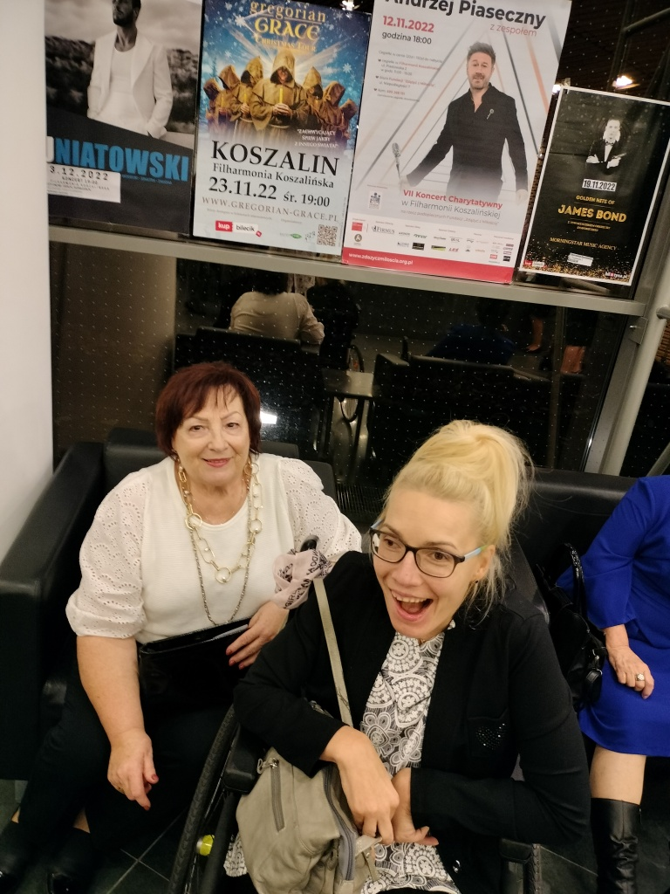
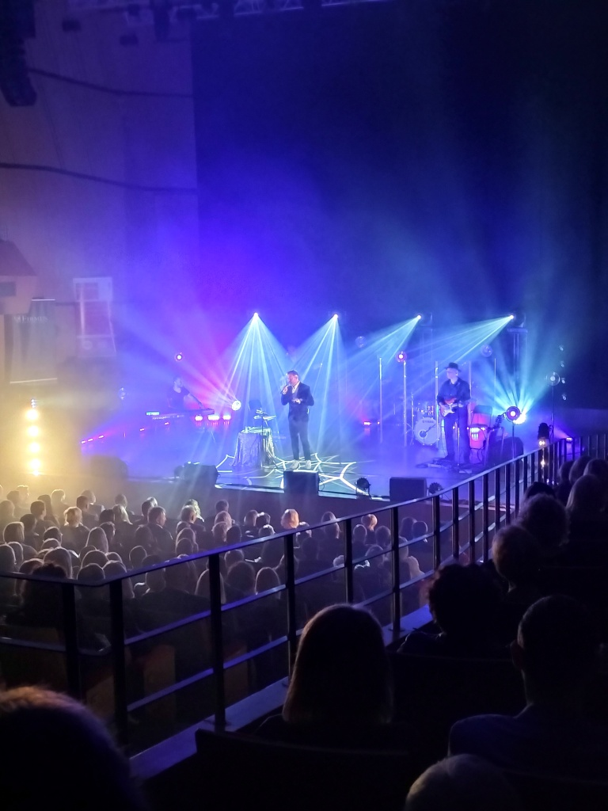
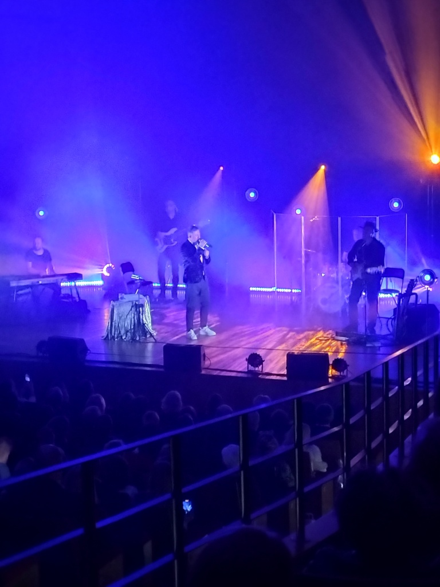
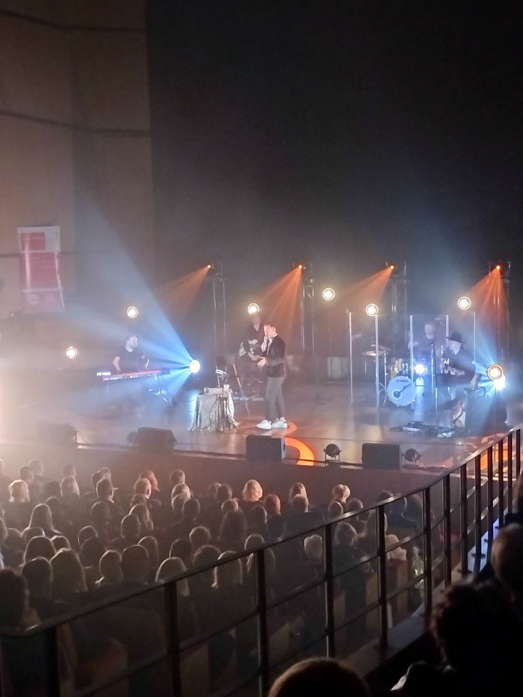

Jaką wielką radość i przepiękne chwile przeżyłam w ostatni piątkowy wieczór, dzięki fundacji „Zdążyć z Miłością” .W koszalińskiej filharmonii zaśpiewał z dedykacją miłości w tytule Andrzej Piaseczny. Listy patronatów i sponsorów niestety nie byłam w stanie zapamiętać, ale bardzo, bardzo wszystkim dziękuję.

Widownia wypełniona była do ostatniego miejsca, zabawa, wspólne śpiewanie  i taniec pozytywnie zaskoczyło nas wszystkich. Licytowano obraz, który  w bonusie w podziękowaniu zawierał  osobisty uścisk dłoni Andrzeja Piasecznego. Niestety, nie był w moim zasięgu.

Może następnym razem…
