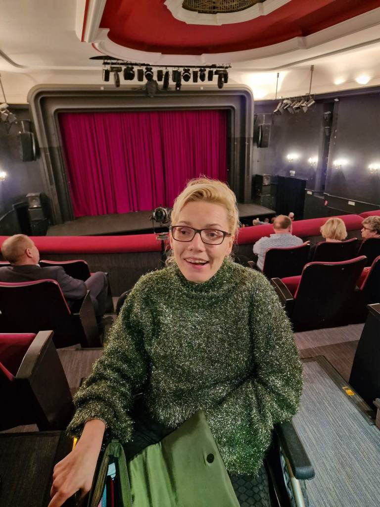

Zacznę od tego, że w roku 2022 zakupienie biletów na coroczną imprezę w naszym teatrze graniczyło z cudem. Udało się z listy rezerwowej, ale na przyszłość muszę dokonywać wcześniejszej rezerwacji. Warto było ,bo po raz kolejny ubawiłam się po pachy. Publiczność nie zawiodła, widownia wypełniona do ostatniego miejsca.

” Stosunki na szczycie” to lekkie, zabawne przedstawienie   w angielskim stylu oparte na komedii pomyłek, dowcipnie (jak zawsze) odgrywane przez naszych koszalińskich aktorów. Treści sztuki nie zdradzę, ponieważ na scenie dużo się działo i trudno jest ją w skrócie opowiedzieć, ale serdecznie zachęcam idźcie.

W przewie spektaklu na scenę z wielkim bukietem wspólnych życzeń dla wszystkich wkroczył dyrektor Bałtyckiego Teatru Dramatycznego, dziękując publiczności za piękną (liczną) współpracę(udział). Dla wszystkich gości przygotowano słodki prezencik    z bąbelkami.

Toast i życzenia noworoczne tym razem były dla mnie niezwyczajne, bo w samochodzie w drodze do domu, ale jednak ciekawie. Po drodze mijałyśmy grupki bawiących się ludzi. Dobrze, że w tak trudnych czasach potrafimy znaleźć jeszcze dla siebie i bliskich chwile radości, szczęścia i miłości.
