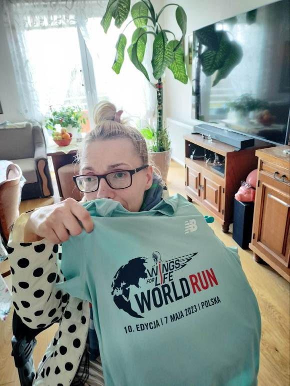
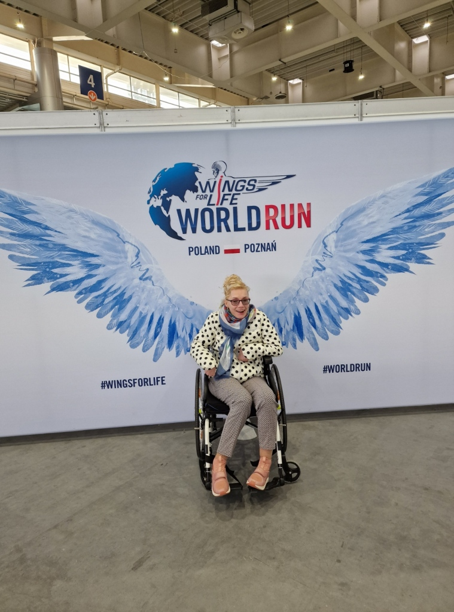
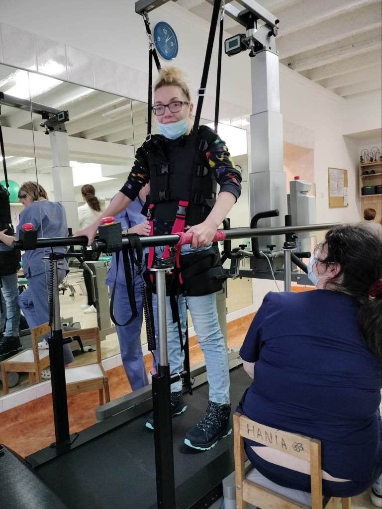
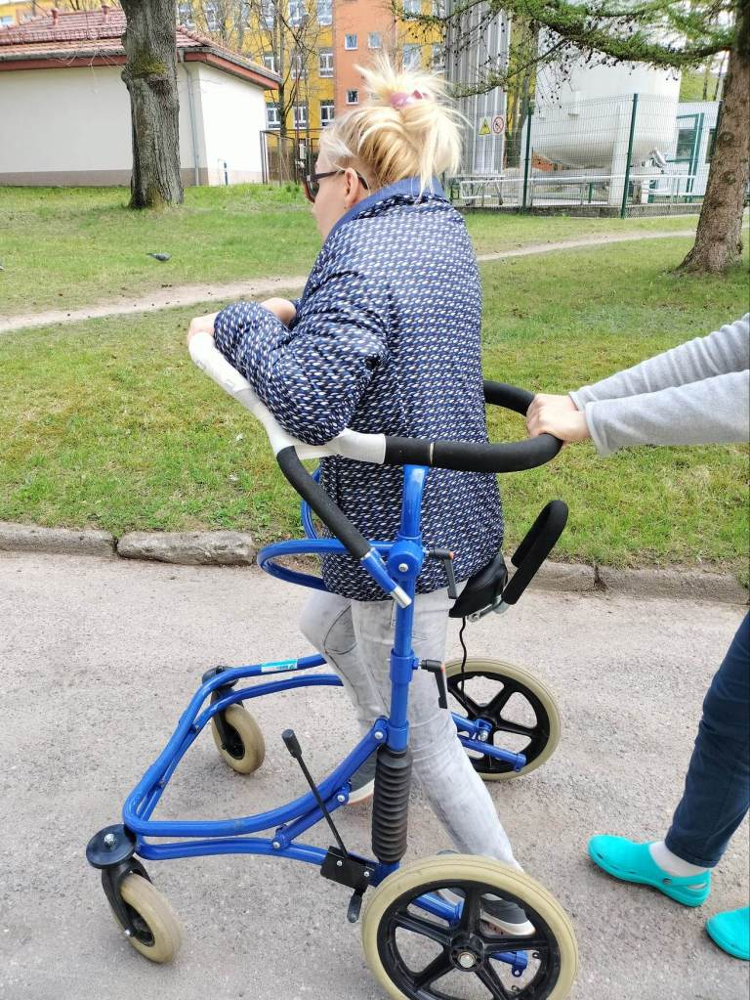

Każdy z nas w swoim życiu ma czas, który jest trudno ogarnąć. Dodatkowe zajęcia kradną czas i dezorganizują kalendarz wydarzeń dnia codziennego. Przepraszam za zbyt długą ciszę na moich łamach, poznając powody jej trwania wiem, że mi wybaczycie.

    Od kilku miesięcy nabieram formy i mięśni na bieg WINGS FOR LIFE- WORLD RUN 10 EDYYCJA- „biegnę” 7 maja (niedziela)2023br.- start o 13-tej.w Poznaniu. Jest to idealna pora na spacery, czy mogę liczyć na wasze wsparcie? Będzie moja relacja na żywo, wystarczy ,że zalajkujecie. Mile widziane zdjęcia w komentarzach. Już teraz serdecznie dziękuję za wirtualne kibicowanie. Dlaczego Poznań?!Jest szansa, że popracuję z egzoszkieletem, zobaczymy. Teraz startuję w asyście mojego osobistego bioszkieletu tj.Gosi. Mam w planie poprawić swój rekord, ale już teraz czuję się medalistką bez względu na wynik.  

O moją kondycje fizyczną w Koszalinie zadbały panie fizjoterapeutki, Beacie, Asi, Agnieszce, Kamili, Karolinie Gosi i Maji i innym bardzo serdecznie dziękuję. Mam okazję trenować na różnym sprzęcie, pisałam o tym w poprzednich wpisach. Ostatni czas spędzam z nowym kumplem-Blumenem (pionizator aktywny), po 40 minutowym spacerze jestem zmęczona, czuję każdy kawałek własnego ciała. Nie śmiejcie się, jest to trudne do przekazania uczucie. Zadyszka, szybkie bicie serca, wypieki na policzkach, nogi stają się miękkie jak  z waty, pokonuję krok po kroku- pomimo niemocy idę dalej. Chwilo trwaj i tyle. Dobrze się czuję po tzw. spełnieniu i realizacji planów, ale to chyba tak ma każdy z nas.  Pakuję bagaż i do zobaczenia w Poznaniu.
