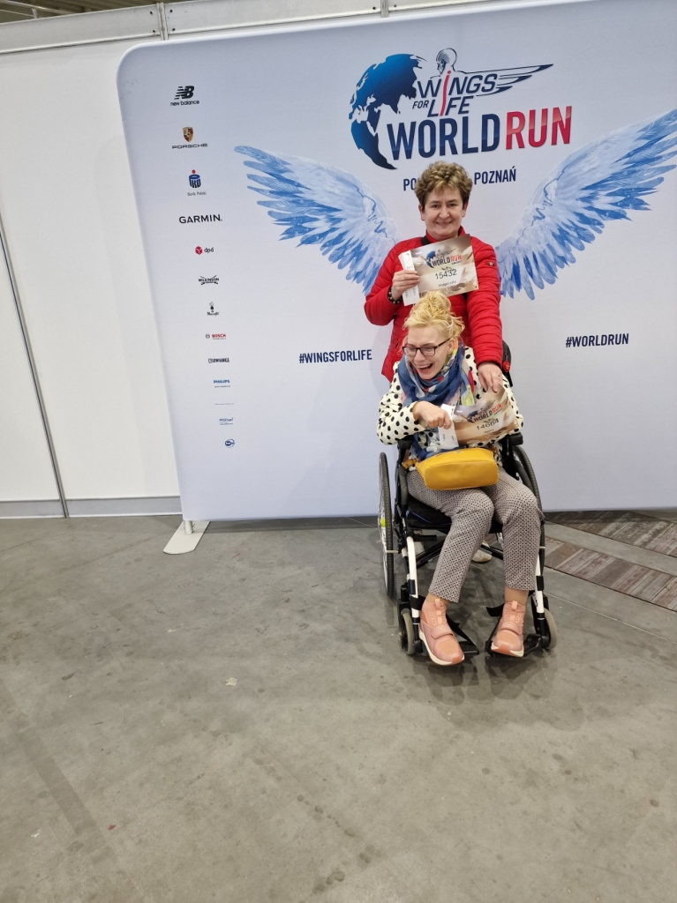
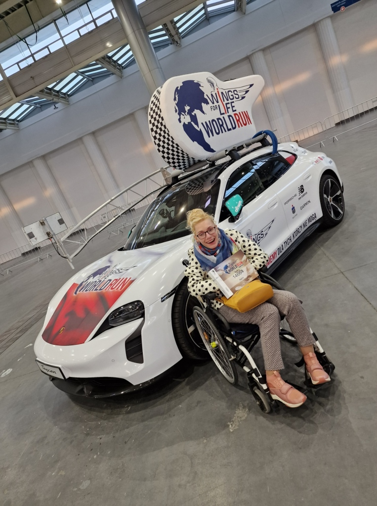
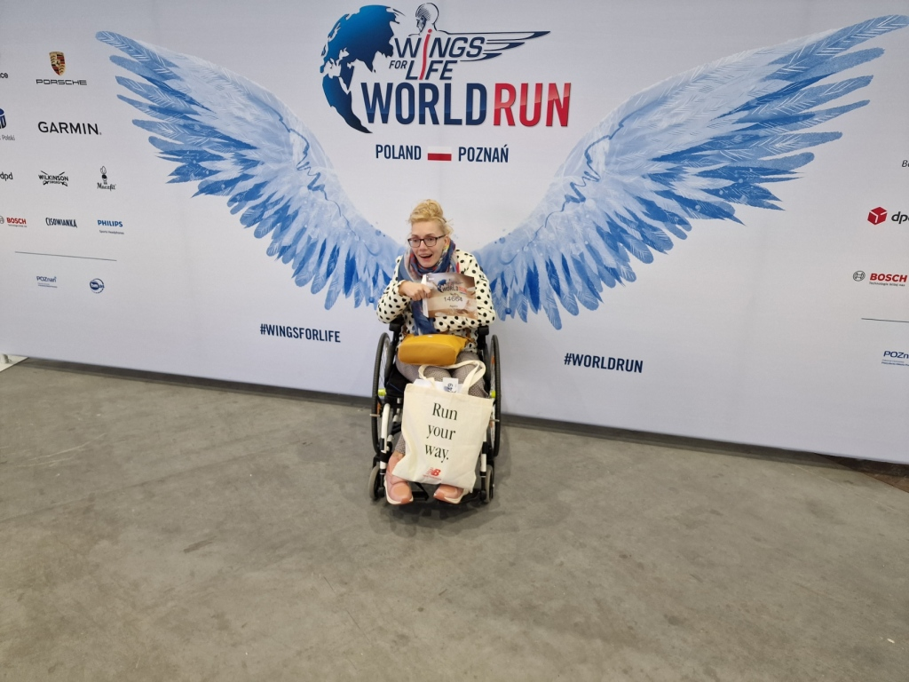
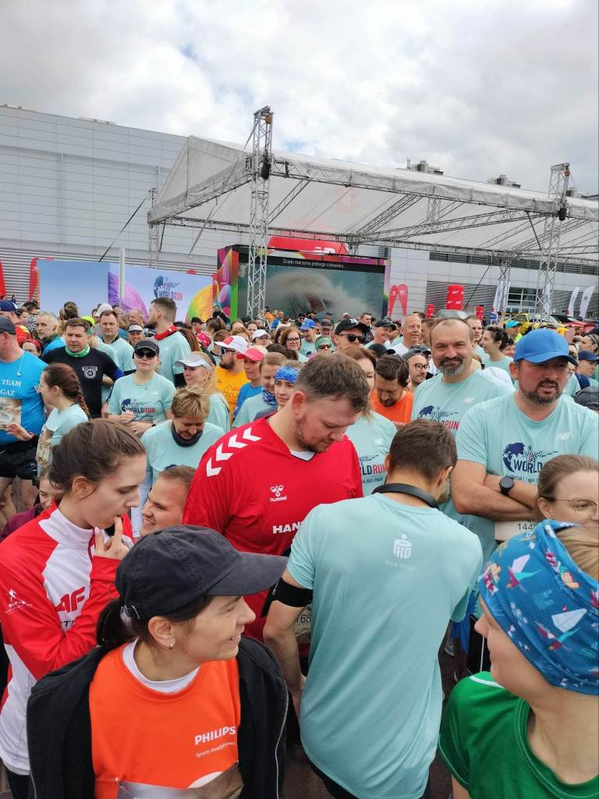
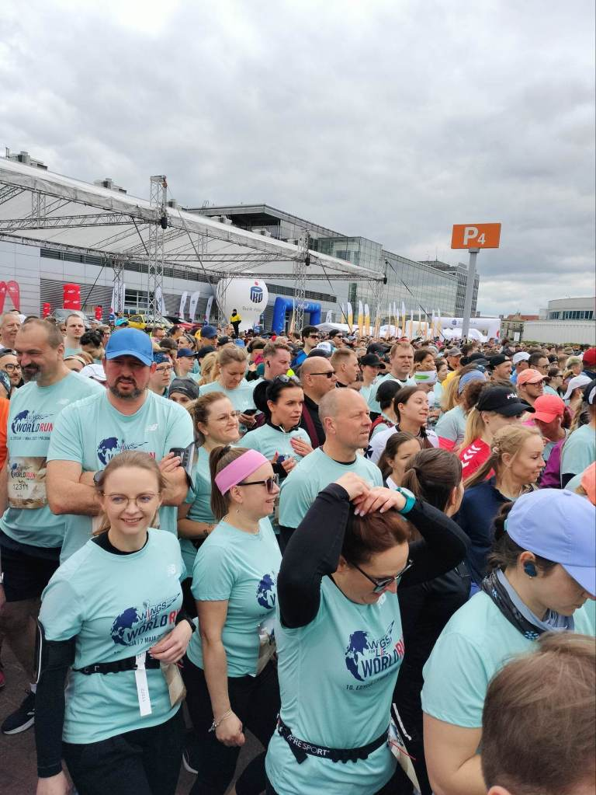
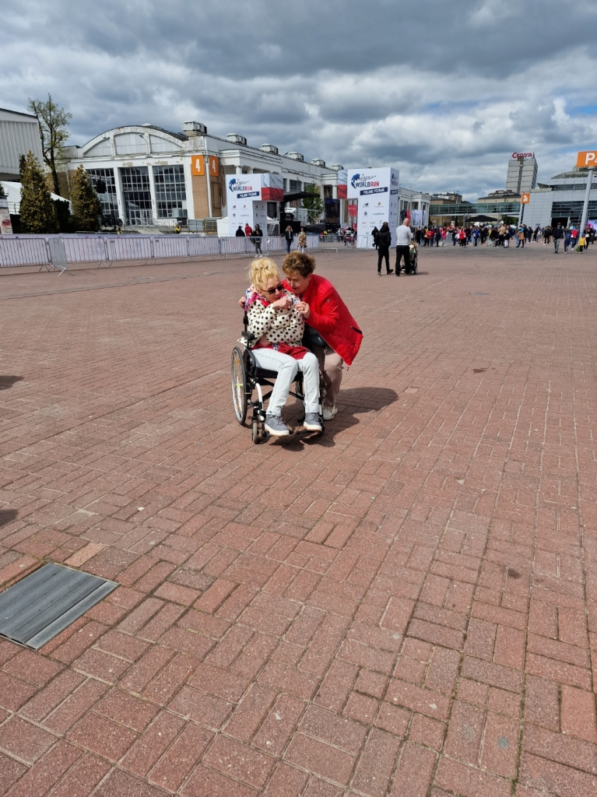
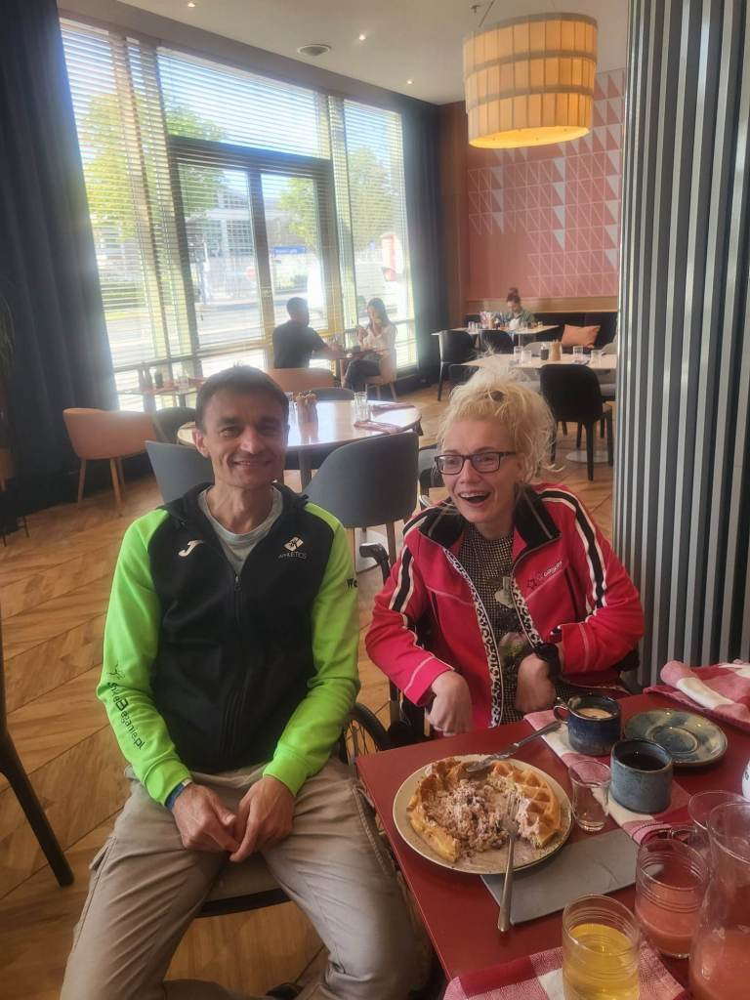

Mimo przenikliwego zimna, gorące minuty przeżyłam w Poznaniu na starcie  w biegu „Wings for life world run”-Skrzydła dla życia światowy bieg. To co miałam na sobie ładnie ukształtowało moją „sportową sylwetkę”, w trakcie biegu-chodu było już cieplej. Nie miałam, pojęcia że ta impreza cieszy się takim wielkim powodzeniem. Centrum dowodzenia całej akcji oraz początek biegu miał miejsce na terenie słynnych Targów Poznańskich. Nie ukrywam  na początku ogarnął mnie strach widząc masę ludzi-osiem tysięcy uczestników biegu plus następne rzesze wiernych i dzielnych kibiców.

Po chwili złapałam drugi oddech, znalazłam się w gronie fantastycznych ludzi. W dzisiejszych czasach trudno wśród nas znaleźć uśmiech ,radość, otwartość ,szczerość i bezinteresowność. Trudno mi określić słowami uczucie jakie towarzyszy nam  w momencie:  ZROBISZ COŚ DLA KOGOŚ KIEDY ON SAM TEGO ZROBIĆ NIE MOŻE. Jestem dumna w imieniu nas wszystkich. Trudno mój udział zakwalifikować do typowego biegu, ale uwierzcie mi atmosfera towarzysząca imprezie dodaje skrzydeł, niestety moja Gosia nie nadążała za mną. Pierwsze dwieście metrów pokonałam na wózku ponieważ był to dystans niezaliczany   do wyników(swojego rodzaju  rozgrzewka  przebieżka).Po niej zapewne moje nogi byłyby już trochę miękkie. Dlatego mój bieg chód zaczęłam od rzeczywistej  linii startowej. Po drodze(dla uważnych widoczni na filmiku)miałam okazję poobserwować chód  w egzoszkielecie. Dajcie spokój, to sprzęt dla Arnoldów,  raz ,że mnie to rusztowanie przygniotłoby do ziemi, po drugie nie ruszyłabym z miejsca. Zdecydowanie wolę mojego nowego prowadzącego Blumen-a.      Na całej długości trasy towarzyszyli nam wierni kibice z owacjami i szczerym dopingiem. Pokonałam 360 metrów w 22min.i mam swój nowy, wyjątkowy rekord, to ja  pierwsza mijałam mobilna metę -auto prowadzone przez Pana Adama Małysza.

Bonusem po biegu była dla mnie króciutka rozmowa ze zwycięzcą biegu w Poznaniu i zdobywcą drugiego miejsca na świecie Darkiem Nożyńskim , jest  bardzo pozytywnym i otwartym człowiekiem.

Imprezę skończyliśmy dość nietypowo. Ja mijając metę pierwsza byłam ostatnia, Darek  metę mijał ostatni a został liderem. Jakby nie patrzył wszyscy zostaliśmy zwycięzcami, każdy otrzymał medal pamiątkowy . Piękne podziękowania i szczere gratulacje dla organizatorów tej masowej imprezy.  W Poznaniu chciałam pobiec ten jeden raz, ale obawiam się ,że gdy tylko odblokują listę startową w przyszłym roku, będę próbowała się zapisać.  Jak ja mogę to Ty tym bardziej.  Do zobaczenia.
