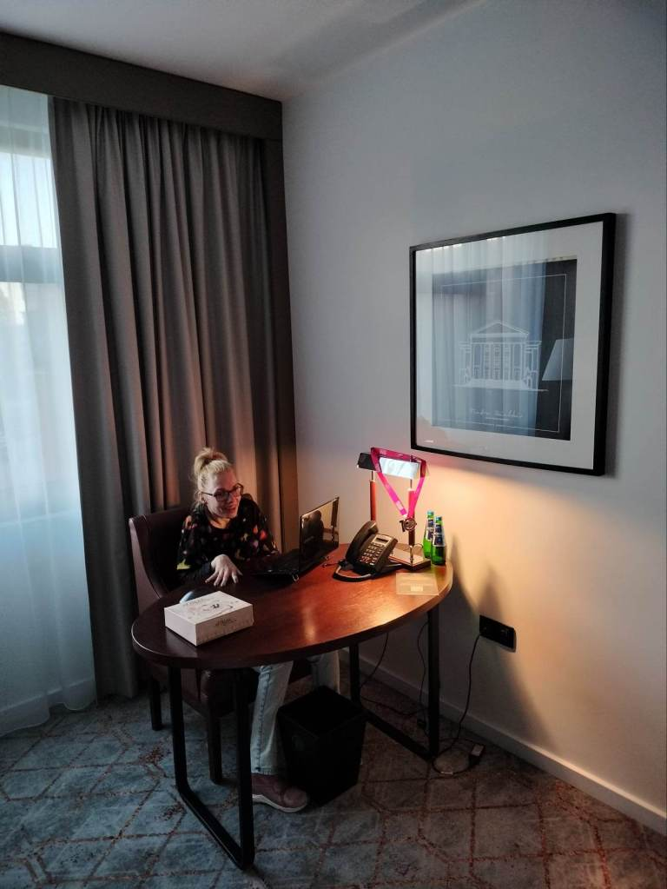

Do Poznania pojechałam m.in. w konkretnym celu, pobiec dla skrzydeł, poprawić swój poprzedni rekord. Dałam radę o czym napisałam w ostatnim wpisie.

 W jednym z pawilonów Targów Poznańskich od kilku lat otwarta jest wyjątkowa wystawa . ”Historia Polski w klockach Lego”. Podstawowym budulcem obiektów udostępnionych w ekspozycji są klocki lego, miliony klocków lego.

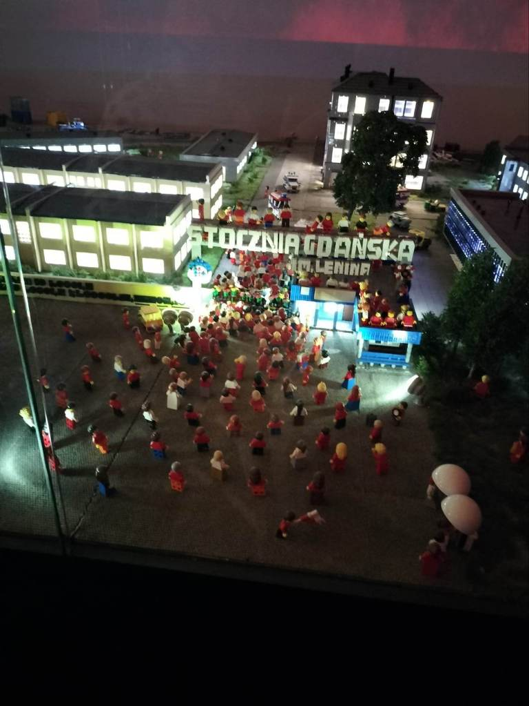

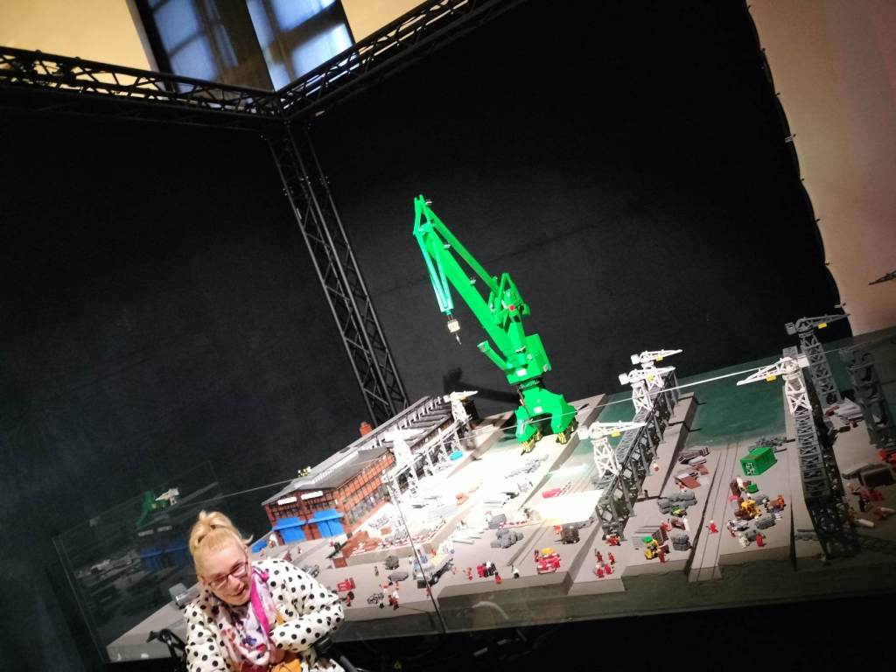

Moje pokolenie wychowywało się na tych precyzyjnych układankach, ja niestety nie . Męczyły mnie te wielogodzinne nasiadówki, zdecydowanie wolałam coś bardziej aktywnego np. taniec. Jednak od zawsze lubiłam historię, więc zaintrygował mnie oryginalny sposób jej przedstawienia. Ważne wydarzenia historii Polski zbudowane klockami Lego- w malutkiej formie.

Niesamowite wrażenia, olbrzymie makiety przedstawiające jedne  z ważniejszych wydarzeń naszej historii. Bitwa pod Grunwaldem, morska bitwa pod Oliwą (ruch sterem zmieniał pogodę), bitwa pod Monte Casino (wyjątkowa inscenizacja), wsparte o wrażenia audio- wideo.

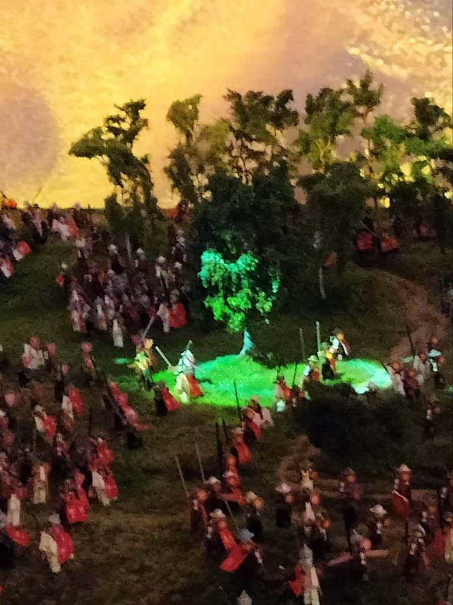

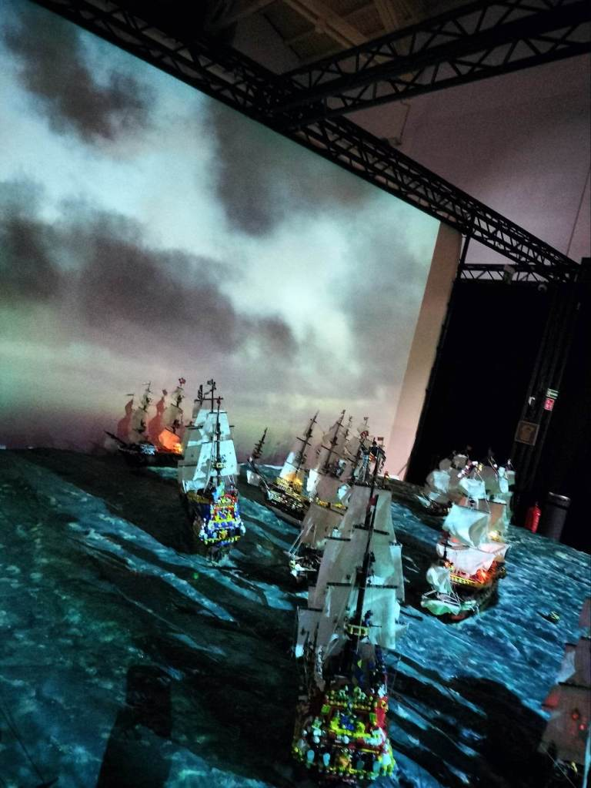

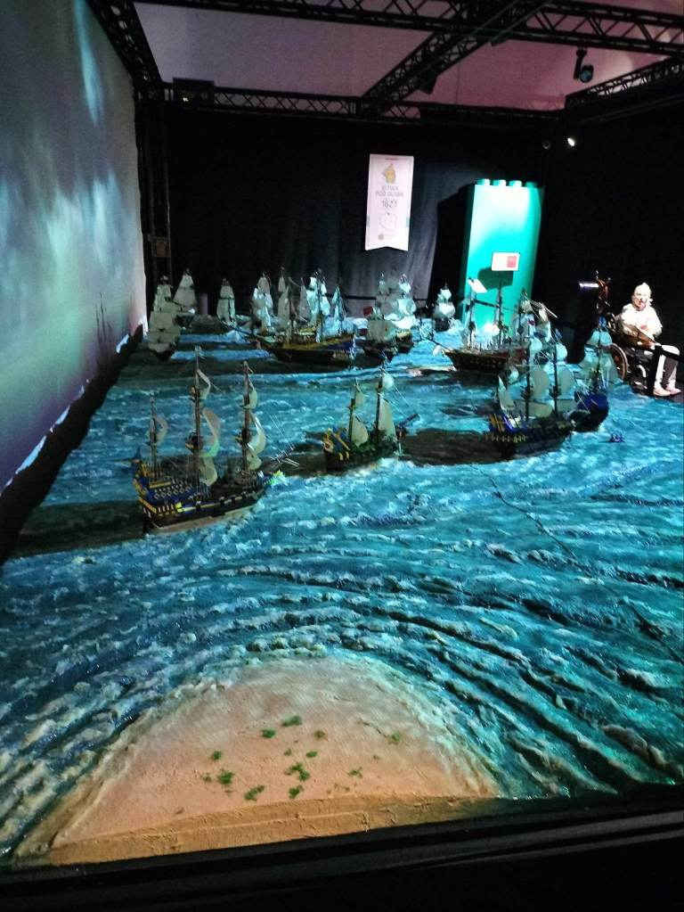

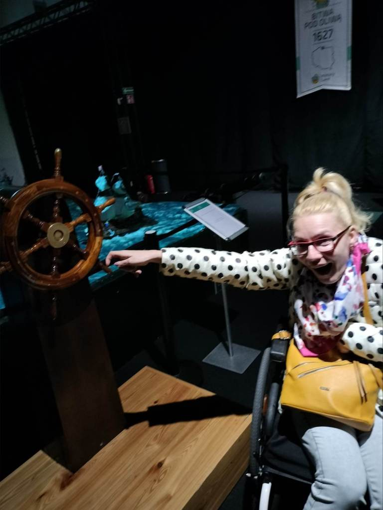

Nie chcę za dużo zdradzać, powiem krótko, jeżeli wasze drogi dotrą do Poznania polecam szczerze to miejsce. Przedstawiony klasztor Jasnogórski, Sukiennice, Bazylika oraz Wawel w oprawie audiowizualnego ataku smoka wawelskiego ziejącego ogniem.

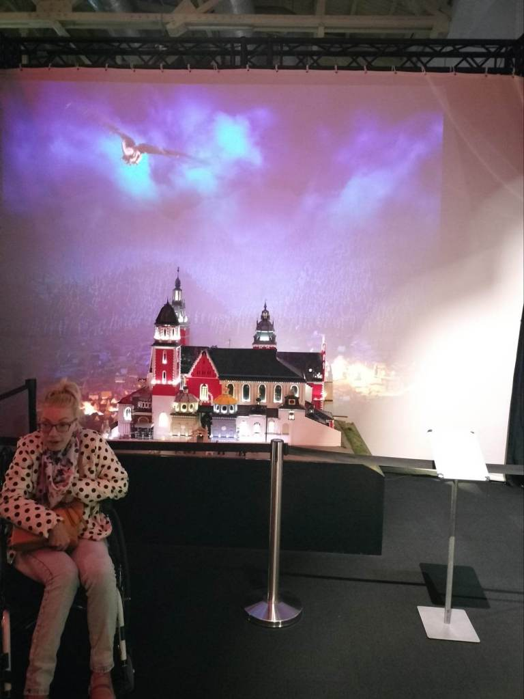

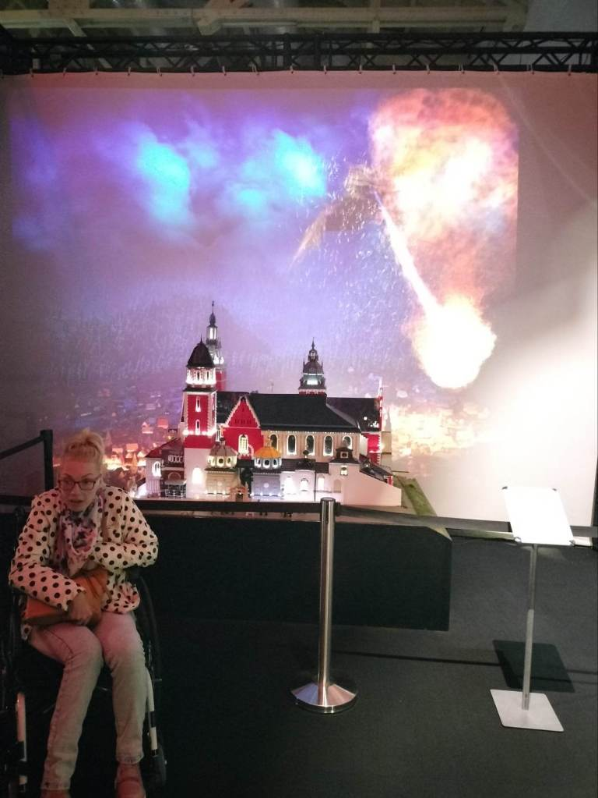

Wiele rekwizytów dostępnych dla odwiedzających, z jednym wyjątkiem- nie wolno dotykać klocków. Przede mną wystawę zwiedzała grupa dzieci, ku mojemu zaskoczeniu było widać ich ogromne zainteresowanie, również z kart przeszłości Polski. Osoby oprowadzające po galerii w ciekawy sposób łączą strony naszej historii z historią powstawania każdej z makiet.

Wyjątkowe miejsce, zwiedzanie zajęło mi około dwóch godzin. Nie ujawniam szczegółów, trochę trudno opisać wrażenia słowami. Trzeba to zobaczyć na własne oczy. Polecam.

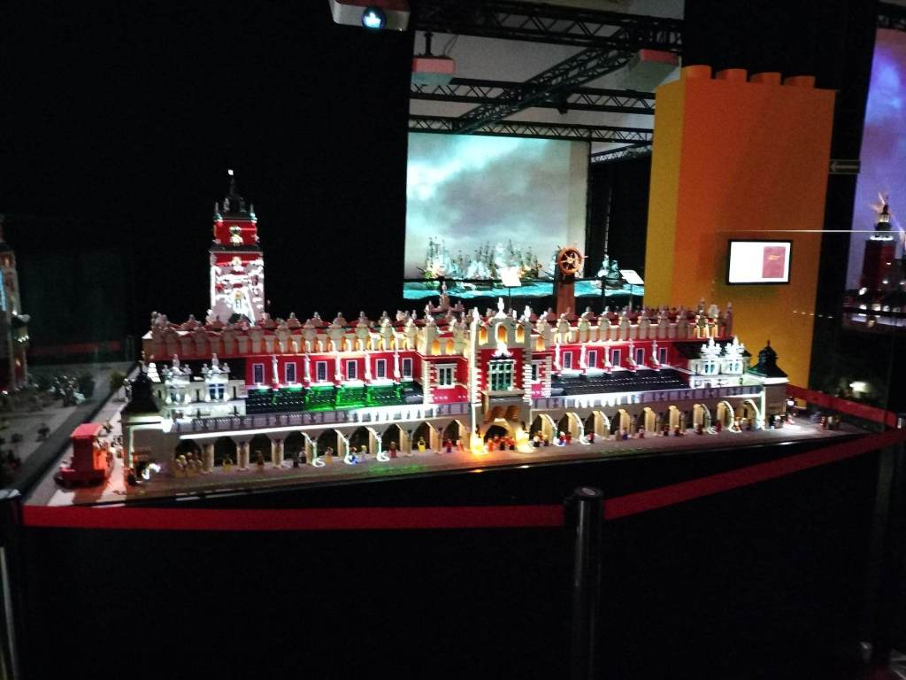

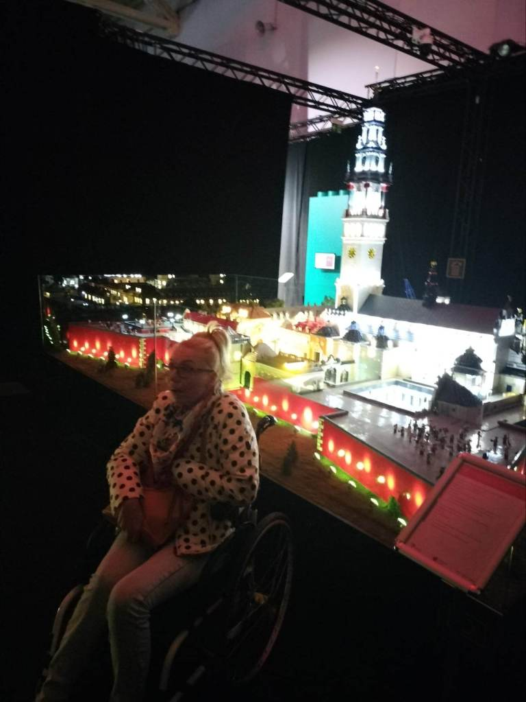

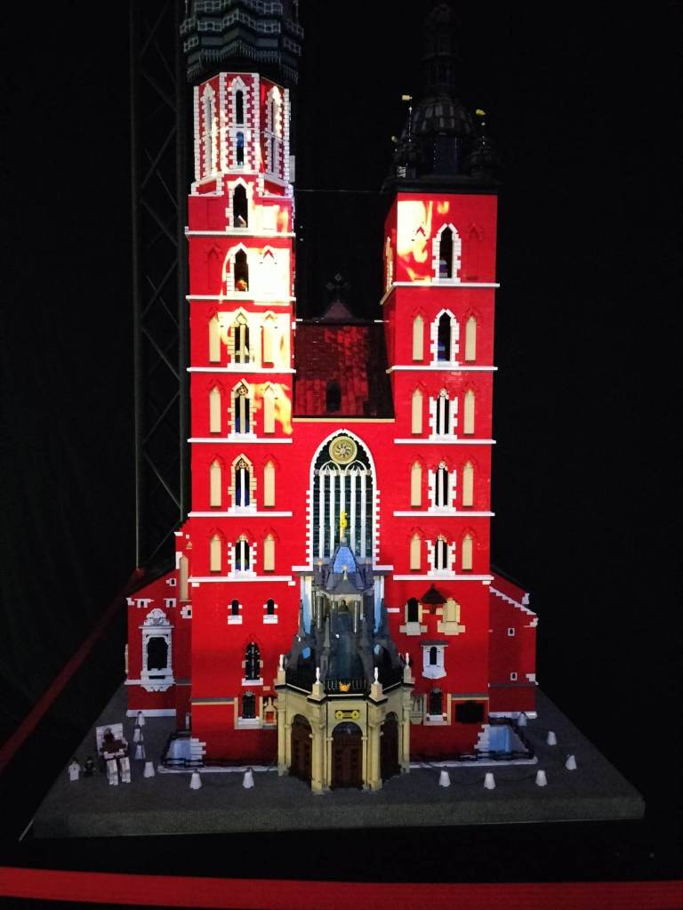
