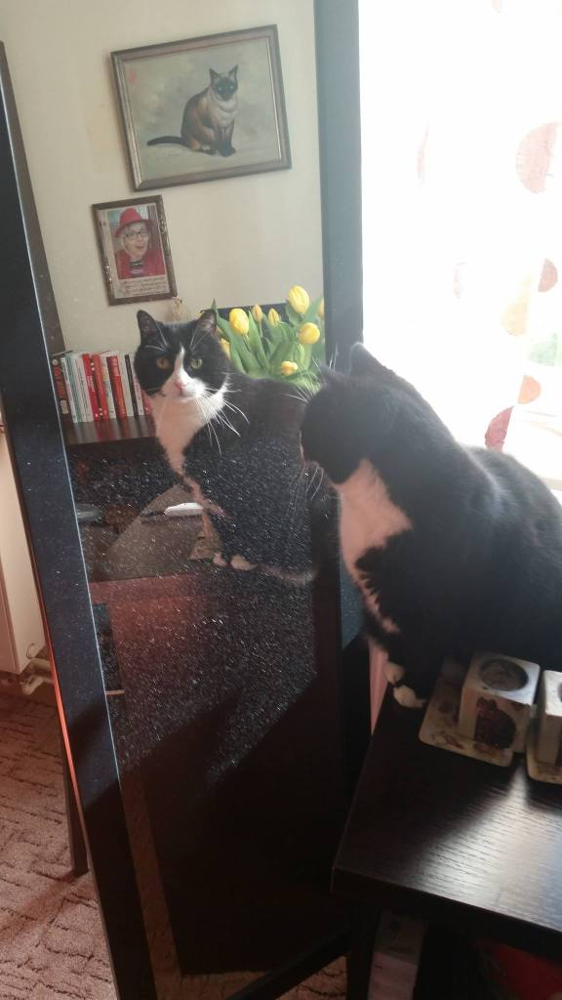

 Odeszła, bo musiała, nie miała siły walczyć ze starością. Dzielna była BARDZO, do końca, we wrześniu miałaby szesnaście lat. 

Czy można płakać rozpaczać po cichu?!Taaaaaaaaaak! Tak sobie cichutko płaczę wspominając nasze wspólne życie. 

 Była ze mną, na dzień dobry, na dobranoc, na fitnessie, przy nauce, przy bufecie i tak bardzo mnie pilnowała.

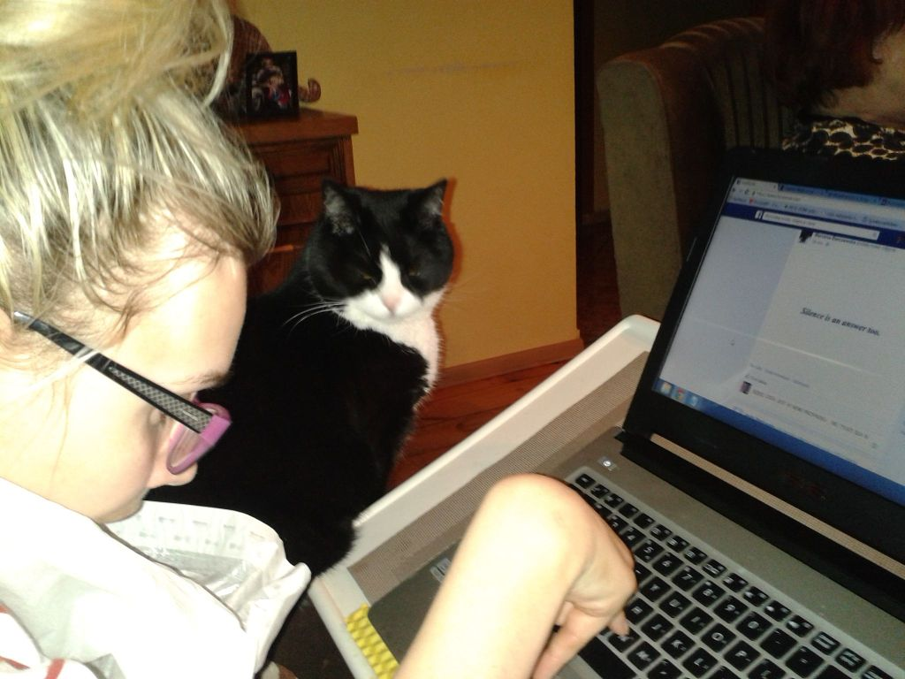

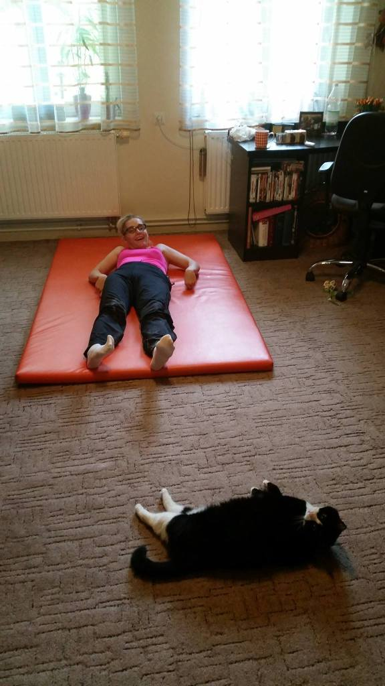

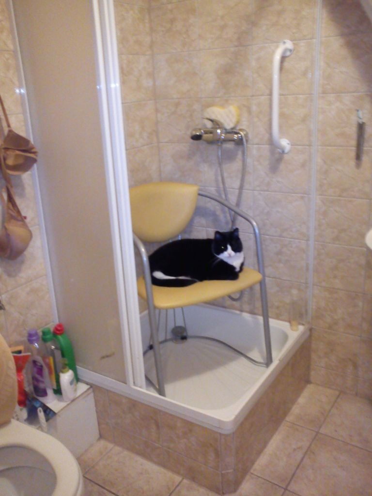

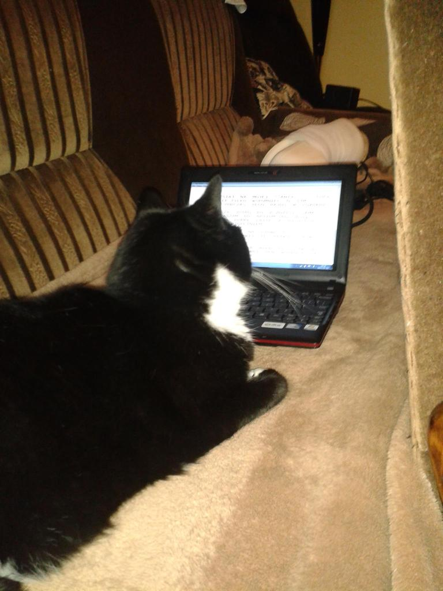

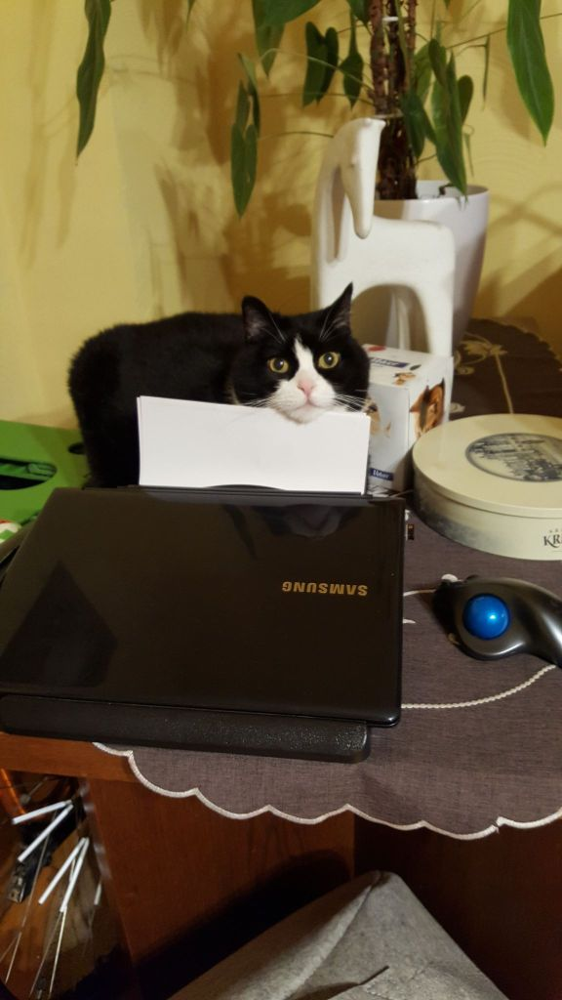

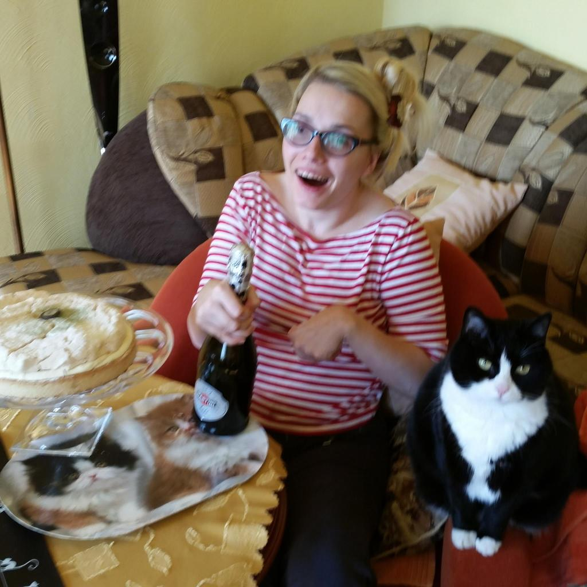

Zawsze grzała mój fotel, łóżko, sprawdzała czy jest odpowiednie dla mnie. Dużo rozmawiała, mruczanda jej  już mi brakuje. Mądra była, wszystko rozumiała, bardzo ostrożna w uczuciach, ja mogłam wszystko, pozostali musieli uważać, myślę, że zwyczajnie chroniła mnie.

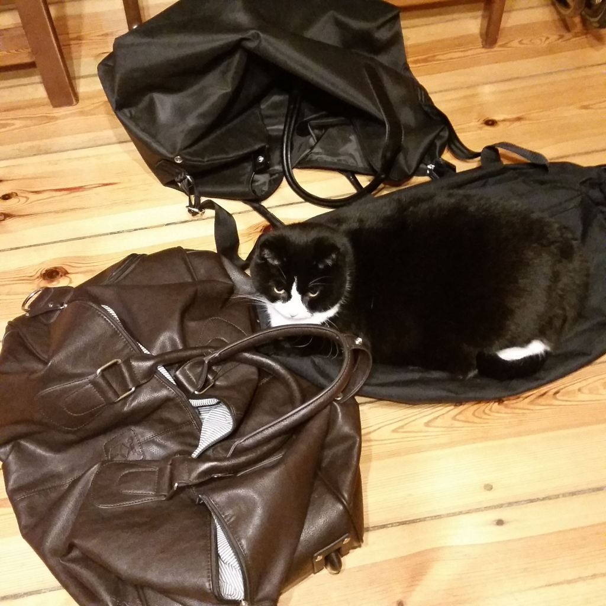

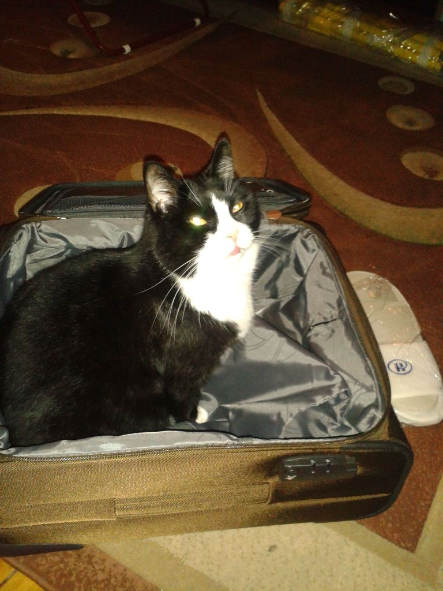

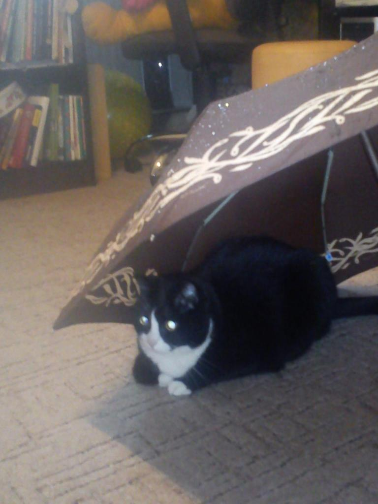

      Pierwsza siedziała w walizce, gdy pakowałam się w podróż, dla niej nie było innej opcji, jechała z nami. Śliczna była, miała najpiękniejszy profil.

 Odeszła w piątek 21 lipca 2023r.o 18.45,malutka z wielkimi oczami,  w których czytałam, że to już ten czas. Ja tak bardzo nie chciałam, tak bardzo! W życiu nie miałam takiej kumpeli, wszystko wiedziała, zawsze była blisko i nikomu nigdy nic nie powiedziała. Przy Megutce wszystko wydawało się do zrobienia, co tam wstać rano dzień w dzień, już siedziała nos w nos patrząc swoimi przepięknymi miodowymi(tak mama je określała)oczami. Śniadanie w sumie wspólne, każda w swoim talerzu, smakołyki różne, ale wspólne. Czekała na mnie wyczekując w oknie jak wracałam z zajęć. Chociaż na chwilę musiałam drapnąć w ucho, uwielbiała bawić się moimi sznurówkami w dopiero co zdjętych zdjętych butach.

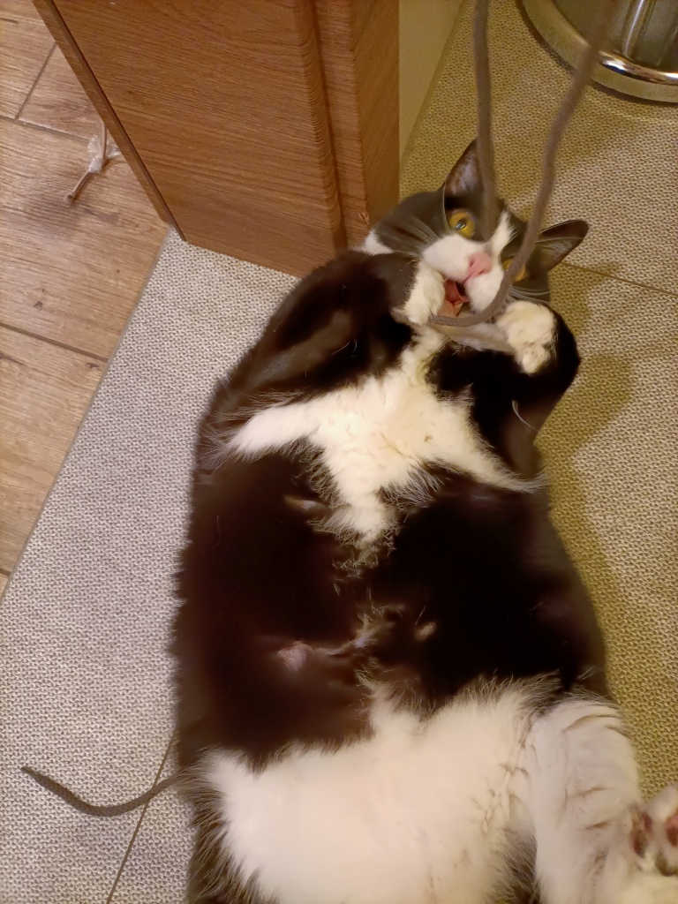

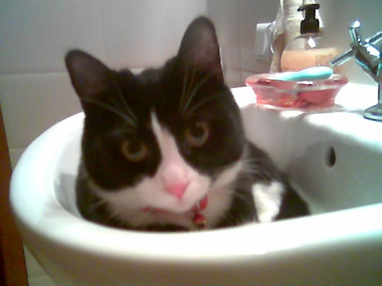

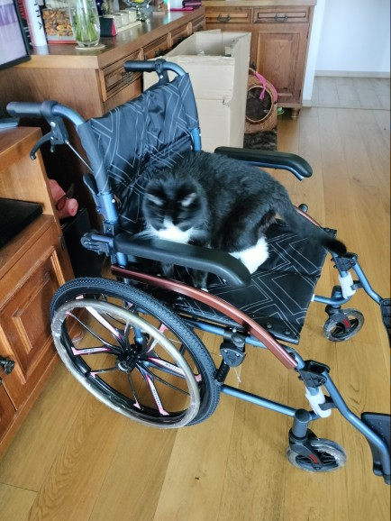

 Zerkam, rozglądam się za Megunią, wierząc, że ujawni się, powyciera w moje nogawki. Niestety, nie wychodzi. Nie czuję ulgi w myślach ,że każdy w swojej kolejce kiedyś odejdzie, jakoś nie czuję!!!!

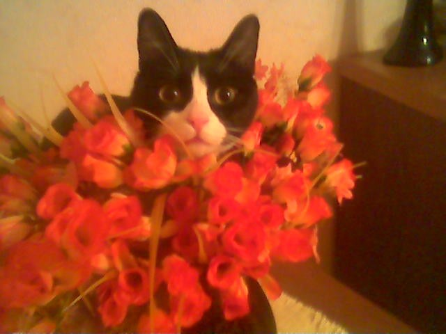

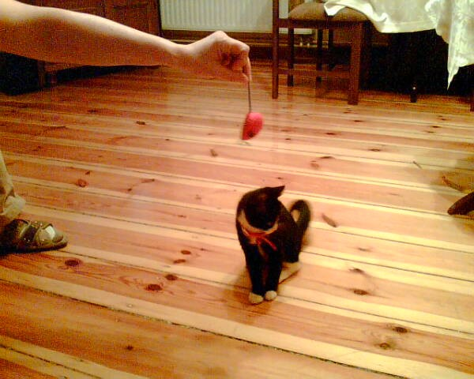

Dziękuję Megusiu za wspólne spędzone chwile z Tobą.  Zastanawiam się teraz, kto właściwie był opiekunem dla kogo?  Ja Twoim, czy Ty Meguto moim?!
