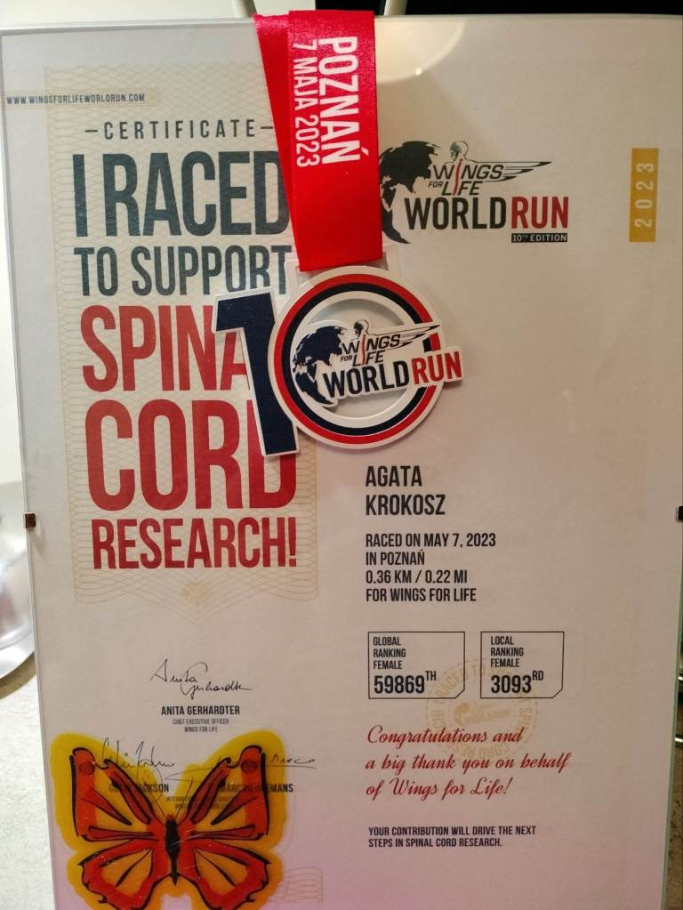
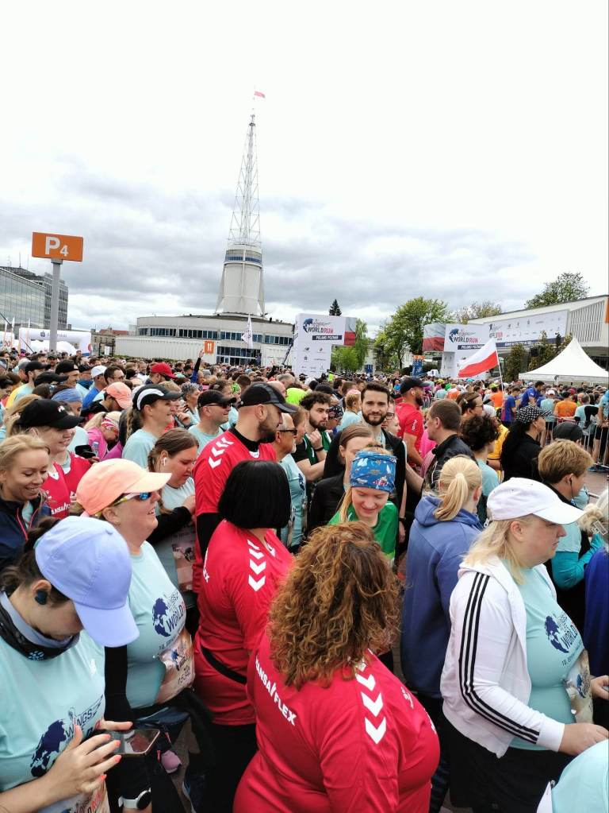
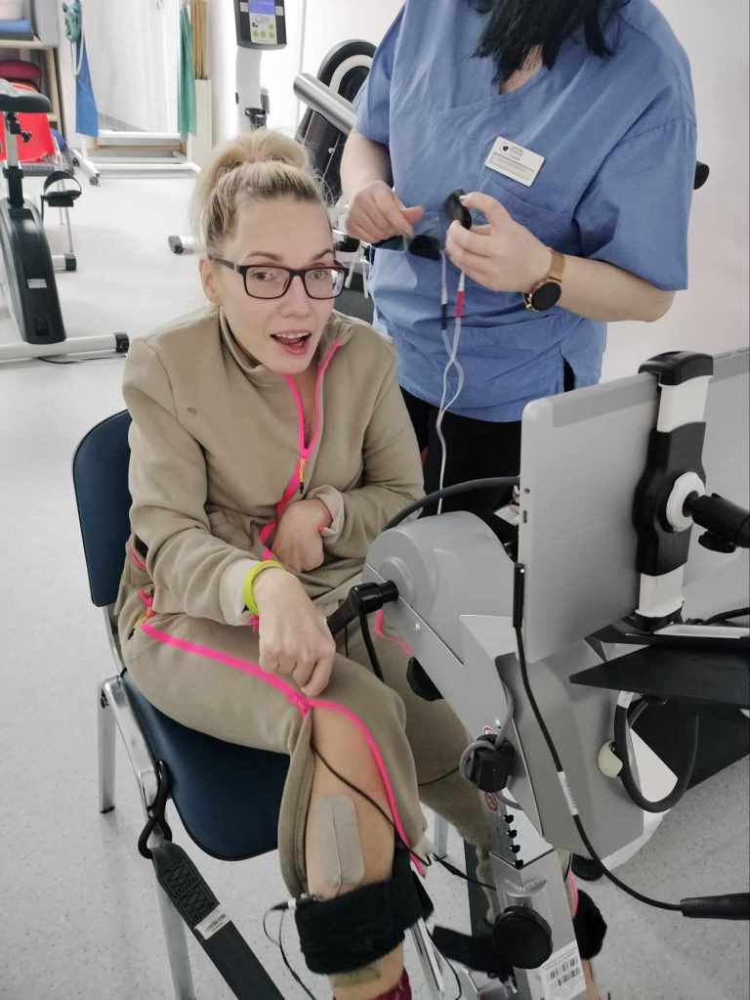
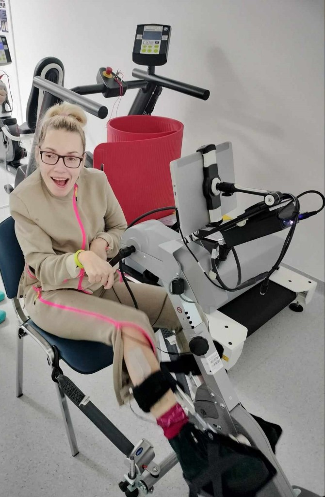
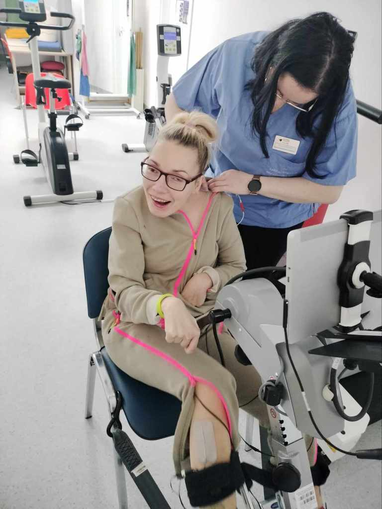
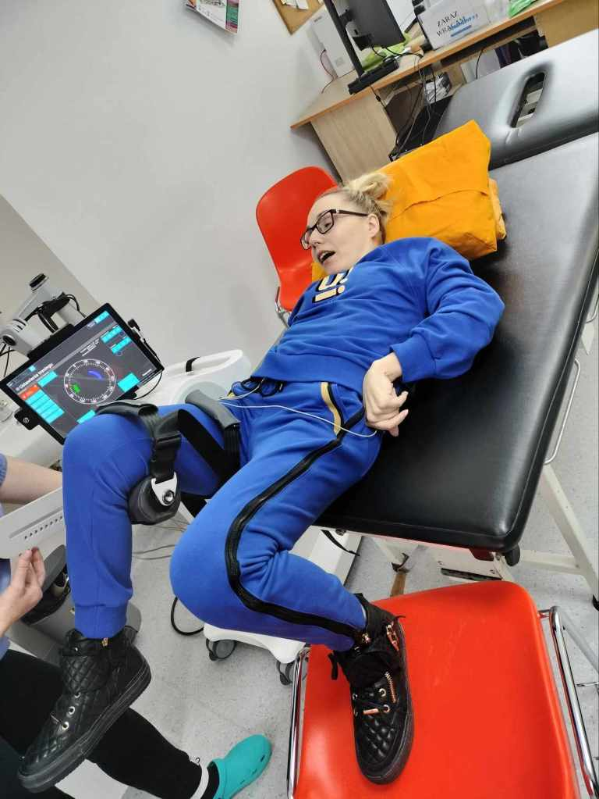
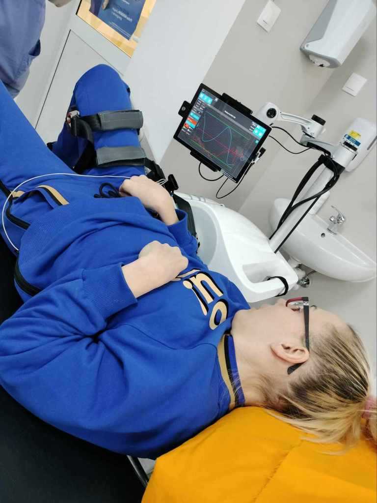
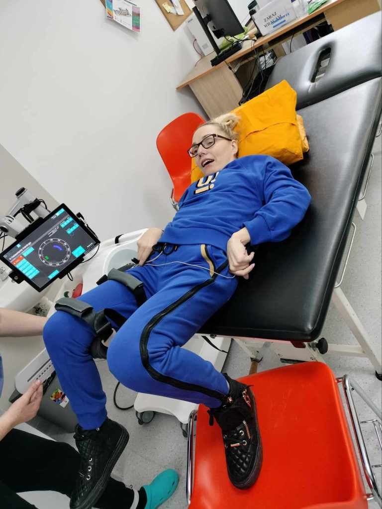
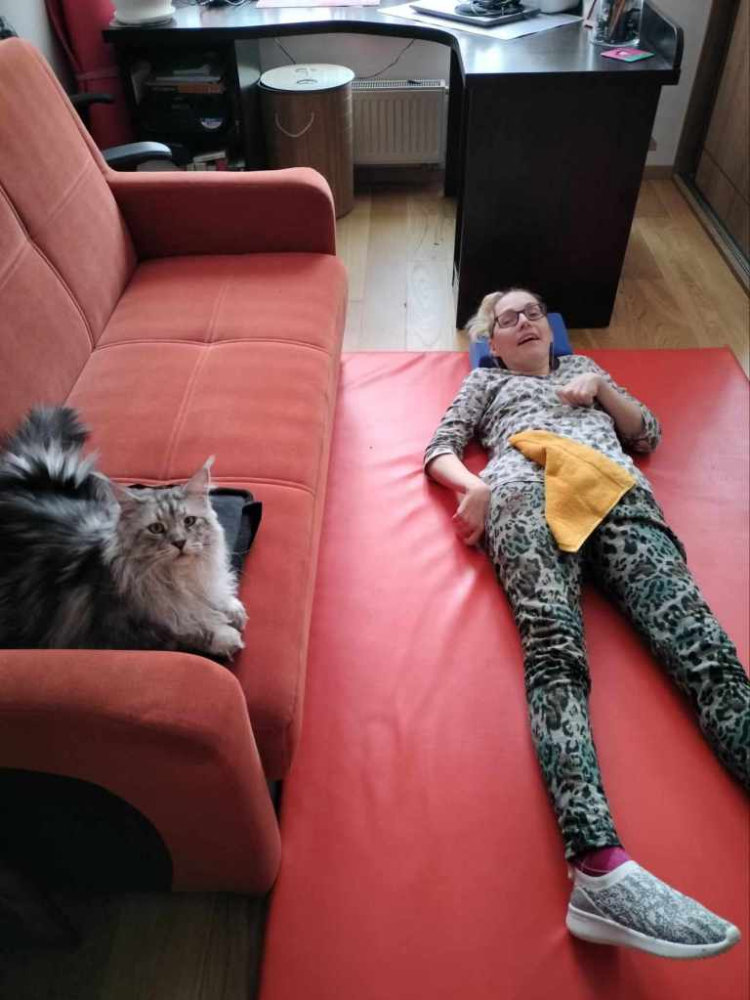

Od kilku lat startuję w biegu WINGS FOR LIVE WORLD RUN.

W tym roku też chciałabym wziąć udział. Cudem wskoczyłam na listę poznańskiej imprezy, mam już rezerwację pobytu. Organizacyjnie wszystko gotowe, pozostało mi poprawić kondycję, koordynację i tempo chodu. Może poprawię swój rekord tj.360m.Bardzo się cieszę, że ponownie wystartuję w Poznaniu, panuje tam niepowtarzalna atmosfera, tworzona przez tysiące fantastycznych ludzi.

Bieg startuje 5 maja, mało czasu pozostało na poprawę wydolności mojego organizmu. Nastał czas intensywnego treningu, na rowerku ręczno-nożnym (zwanym Stefciem)rozciągam i wzmacniam mięśnie wszystkich kończyn.

Pomocna w realizacji teraźniejszych zadań fizycznych stała się Luna. Aktualizacja  programu wymaga ode mnie bardziej sprecyzowanych ruchów(siła,czas,refleks=koordynacja).Bardzo motywujące zajęcia. Dziękuję.

Wsparciem dla mnie jest mój osobisty wyjątkowy asystent-Bulli. Towarzyszy mi podczas wszystkich domowych zajęć, udzielając wskazówek podczas ćwiczeń.

