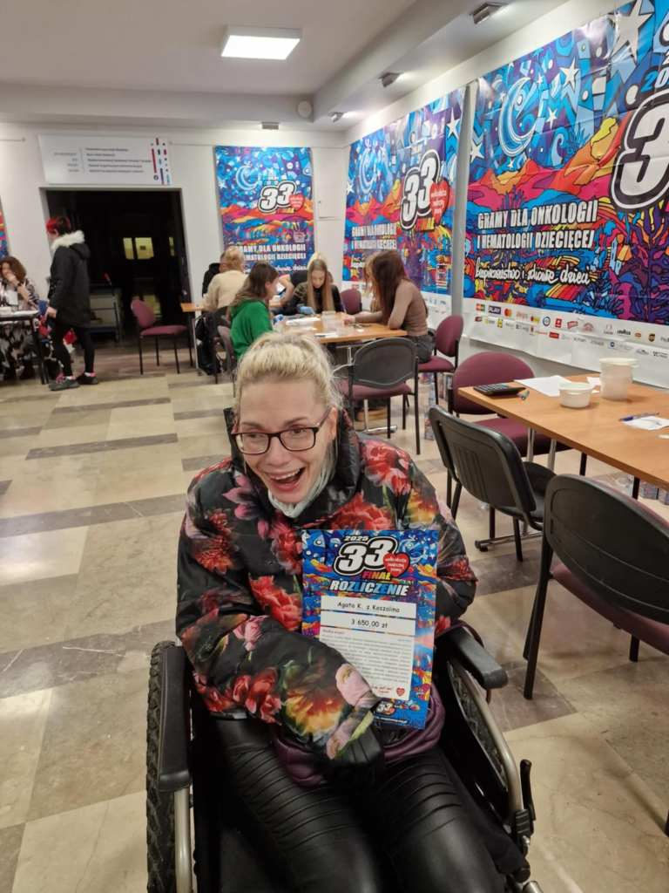

Dzisiaj zrealizowałam  swój pomysł, projekt z  ubiegłego roku.Pomyślałam wtedy ,że od 29 stycznia 2024 r. codziennie do swojej skarbonki będę wrzucała 10 zł.Nie ukrywam,że miałam malutki problem z pozyskiwaniem tych banknotów,ale zo to pamięć mam niezawodną.Udało się. Dzisiaj tj.26 stycznia 2025.przekazałam  do Centrum W.O.Ś.P w Koszalinie całkiem niezłą sumkę.uzbieraną przez 365 dni.(+ 3 dni).Łatwo policzyć i okazuje się ,że łatwo uzbierać,trzeba tylko pamiętać.  

