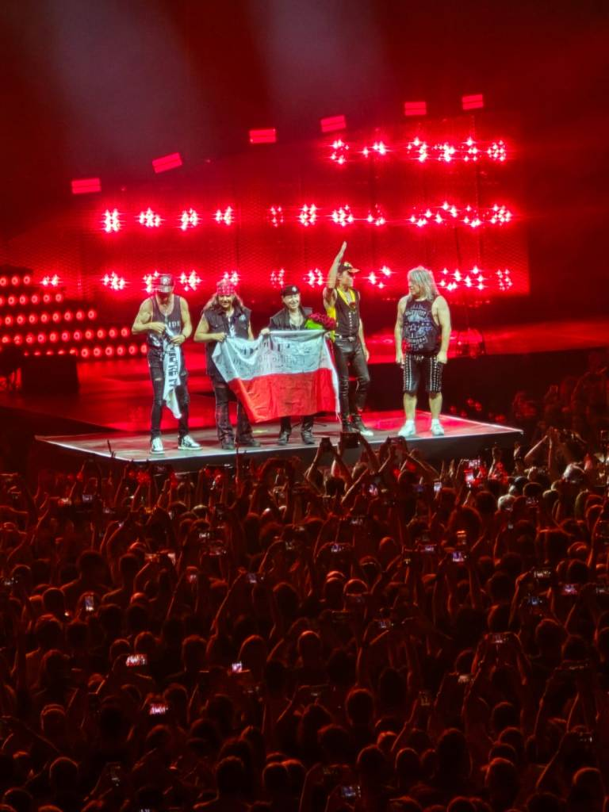
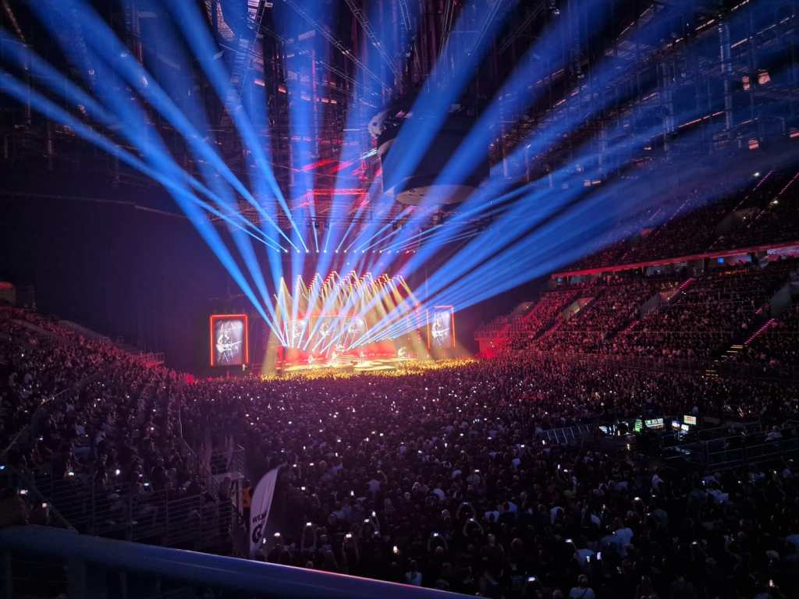
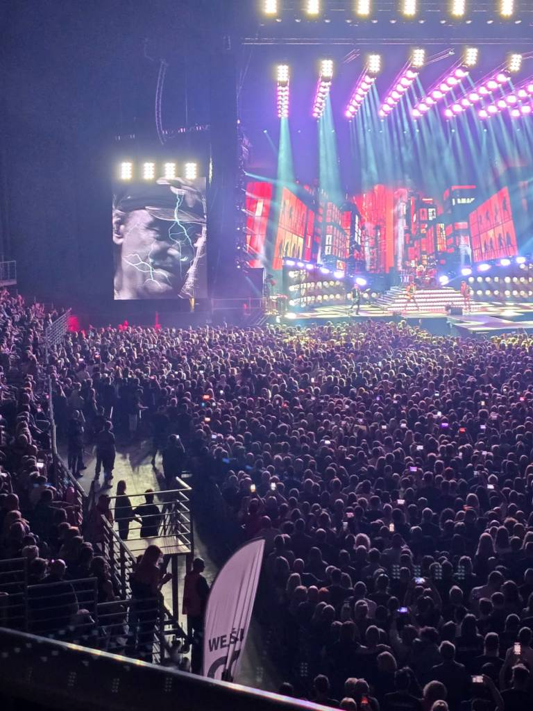
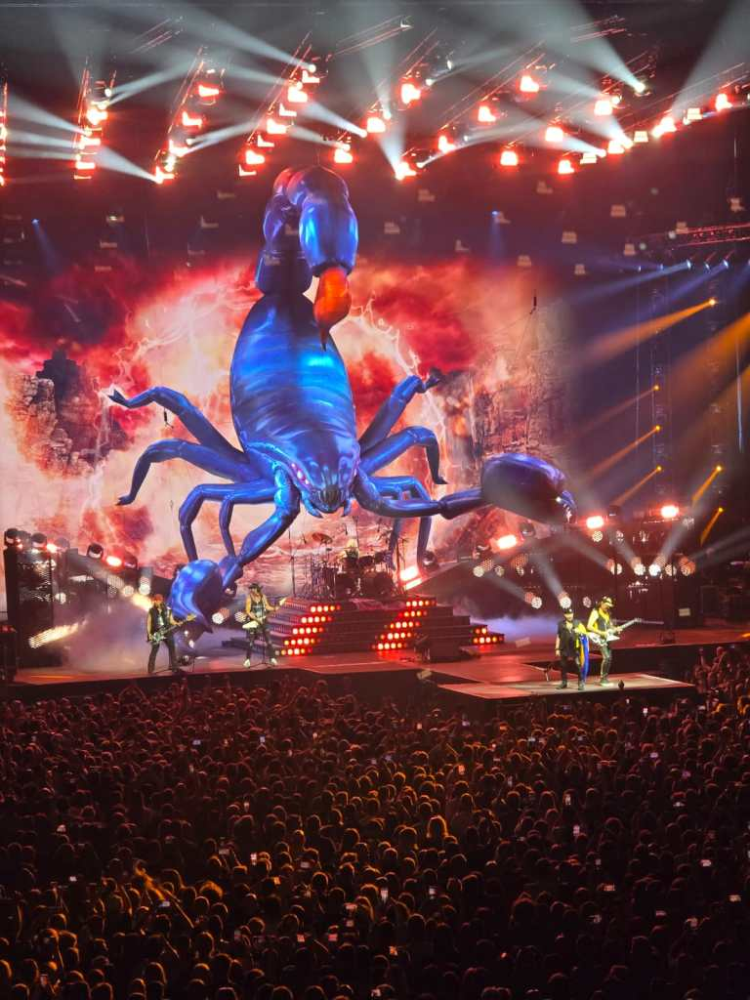
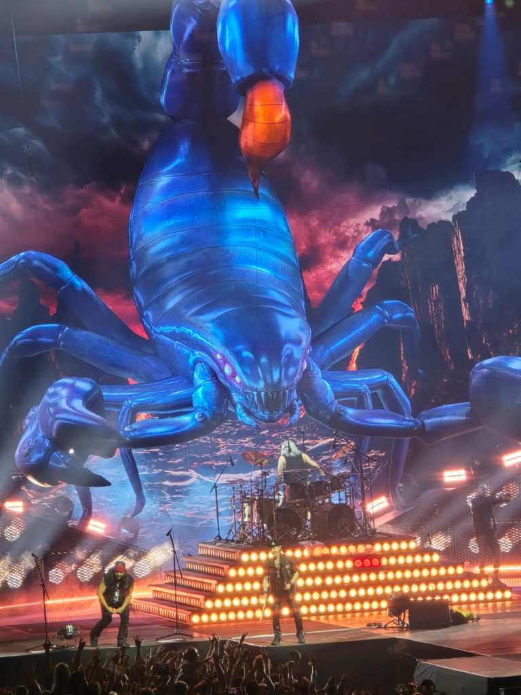

> Moje serce od kilku dni tętni szczęściem, ukochany Kraków udostępnił mi swoje mury na całe cztery tygodnie. Zamierzam wykorzystać ten czas w 100%.

Tu na miejscu dowiadujemy się o występie światowej legendy rocka zespołu Scorpions w krakowskiej Arenie. Bilety dawno wysprzedane,        i tylko wielka naiwność pokierowała mnie i Gosię w stronę imprezy.

Widok tysięcy fanów poraził, ale liczna grupka nieszczęśników biegających z kartką w dłoni ”kupię bilet” rozwiała jakąkolwiek nadzieję na nasz udział w koncercie. Ze smutkiem na twarzach, nie wiedzieć po co zbliżałyśmy się do głównego wejścia. Nasze pytanie o zakup biletów, wywołało dziwne miny na twarzach osób wpuszczających do Areny. Jest czynna kasa, tzn. kręci się w środku, składa sprzęt  młody chłopak. Ostatnim głosem Gosia pyta o bilety. Przystojniak z uśmiechem na twarzy przecząco kiwa głową -niestety  nie ma. Stoimy na środku placu, koniec imprezy czas do domu, gdy nagle słyszymy zza pleców cichutkie: hallo proszę pań …”ciacho” z kasy:.. mogę coś zaradzić,… „Pani   i wskazuje na mnie (bardzo przepraszał za określenie) ma miejsce siedzące, dla pani patrząc na Gosię mam bilet stojący.”… Jeżeli się zgadzamy to, prosi o kierowanie się za nim, do konkretnej bramki wejścia. Uwierzycie?!Obie w ciężkim szoku pędziłyśmy do wnętrza Areny… A jednak! Cuda się zdarzają! Trzeba tylko dać im szansę. 

Mocne rockowe brzmienie, artyzm muzyków, scenografia, oświetlenie i animacja obrazu dało niezapomniane przeżycia.                                                             Piękne widowisko, niesamowity był finał imprezy. Zapadła całkowita ciemność i głucha cisza,…czyli koniec koncertu. Nic z tego!

Z małego światła na scenie, animacji dziury wyłania się skorpion, który urasta na olbrzyma i kroczy w kierunku nas widzów. Obraz, który trudno jest opisać słowami. Zespół wykonał jeszcze dwa utwory. Koncert bardzo mi się podobał.
