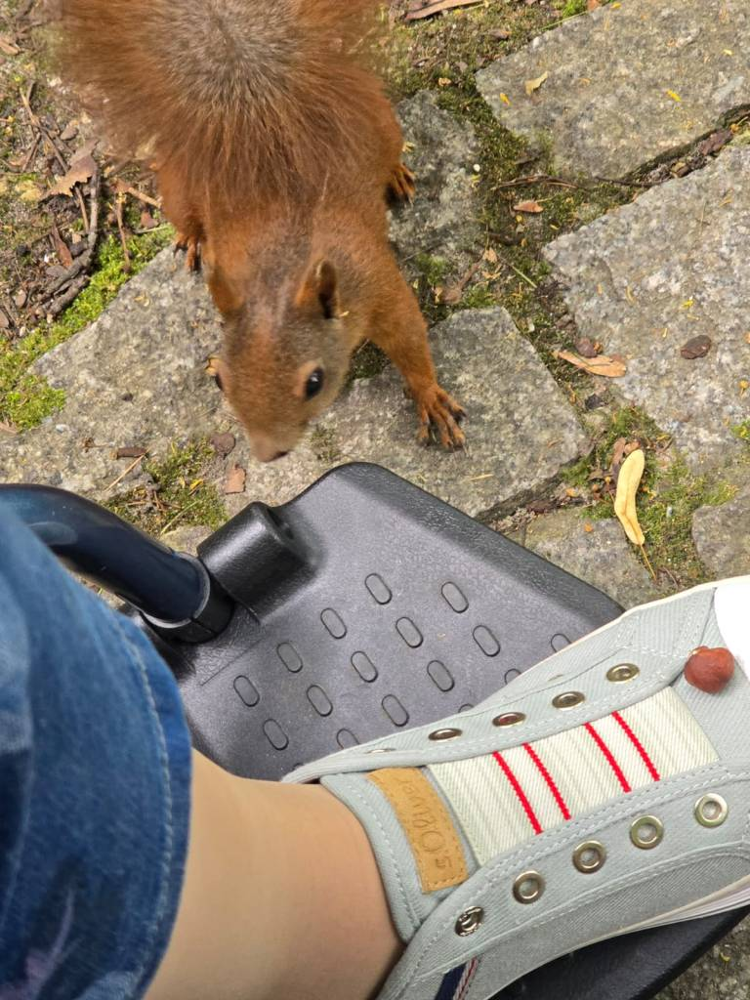
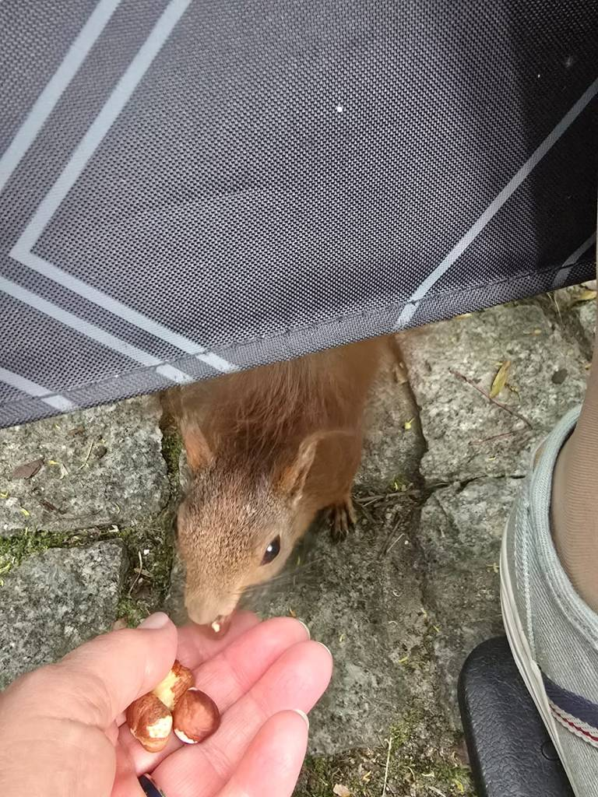
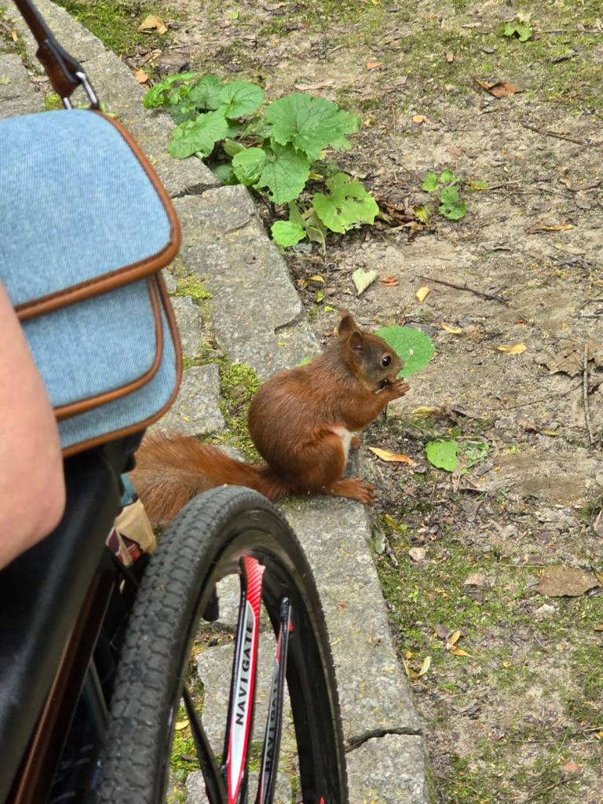
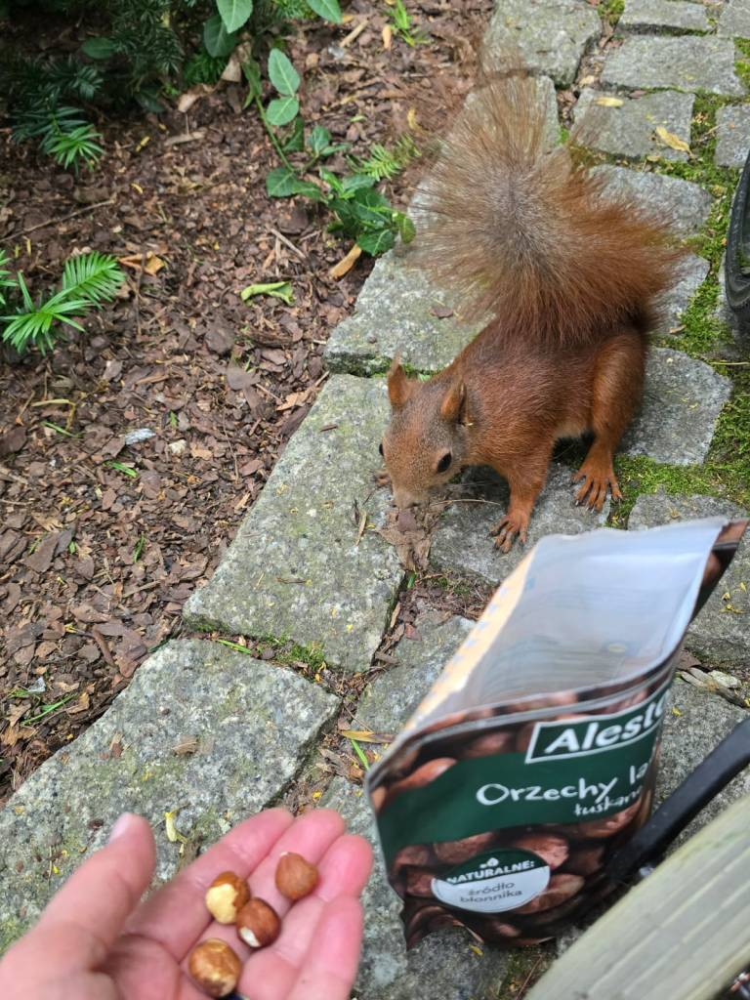
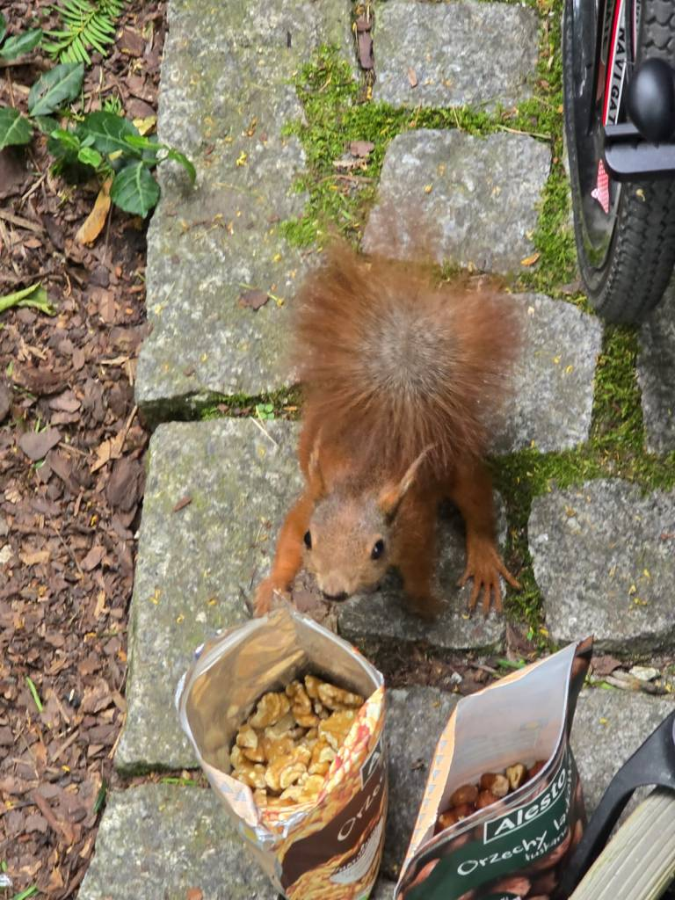
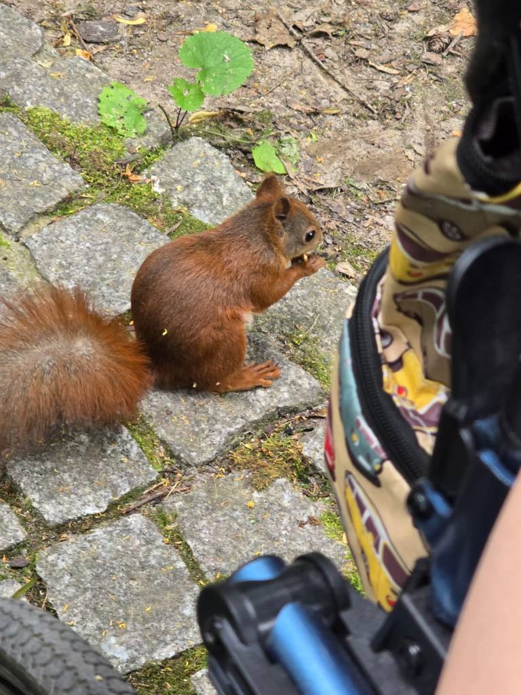

 Od kilku lat regularnie w Parku im.W.Bednarskiego w Podgórzu odwiedzam wiewiórki.

         Stukaniem skorupą orzecha w drzewo próbujemy rude kitki wyciągnąć z kryjówki. Udało się! Pojawiła się jedna okazało się jedyna, ale i tak dała dużo radości i zabawy. Lubię spędzać czas w ich towarzystwie. Mała sugestia, wiewiórkom zdecydowanie bardziej smakują  orzechy włoskie.

