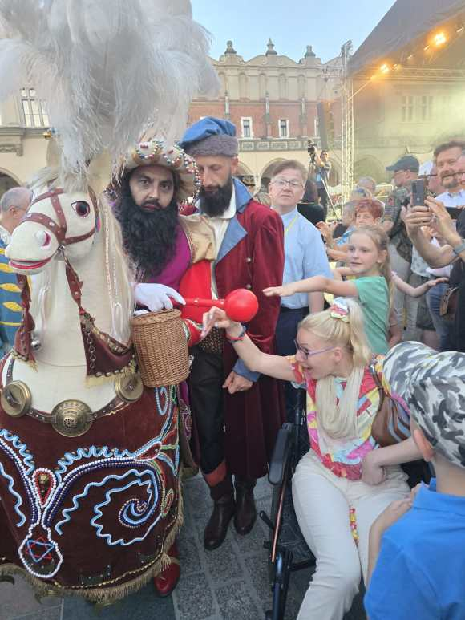
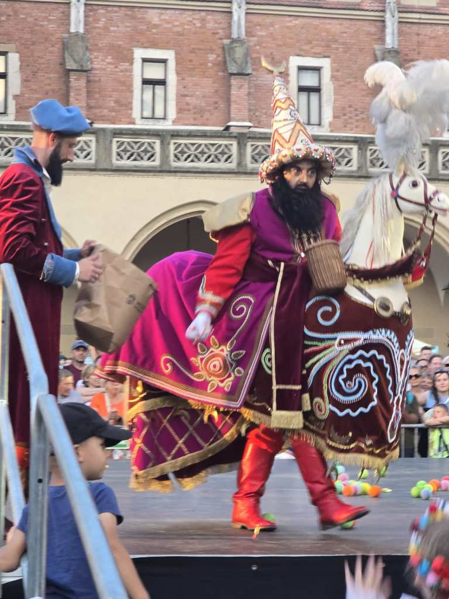
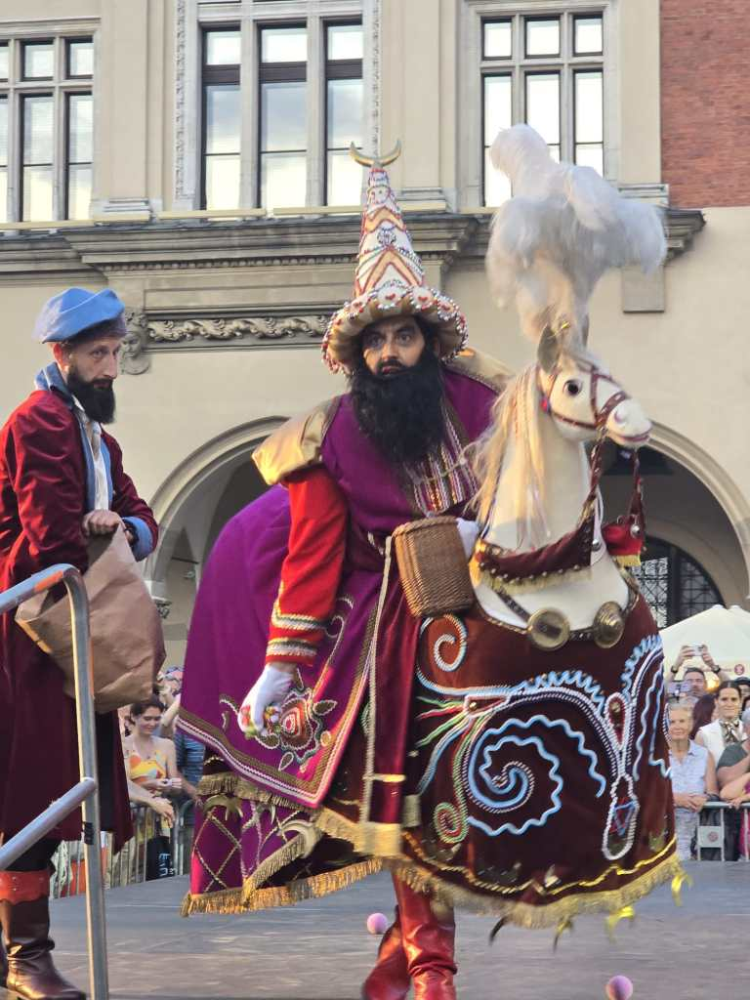
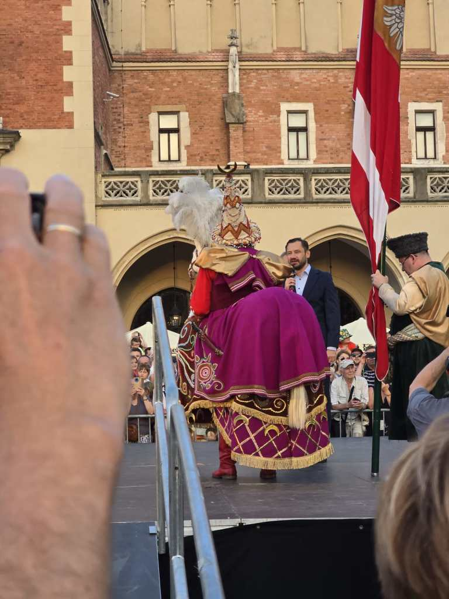
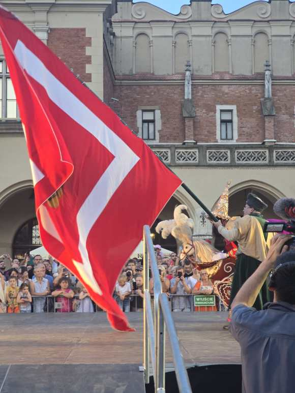

Pobyt w Krakowie umożliwia mi uczestnictwo w niezaplanowanych wcześniej imprezach. Czas na opisanie kolejnej.

         Co roku w oktawę Bożego Ciała, przez ulice miasta(od Zwierzyńca do Rynku Głównego) podąża pochód włóczków i Tatarów prowadzony przez Lajkonika(jeźdźca na sztucznym koniku),któremu przygrywane są krakowskie melodie.

Włóczykowie według legendy uratowali Kraków przed najazdem Tatarów, po czym w przebraniu wroga przemaszerowali ulicami Krakowa           w triumfalnym pochodzie. Najstarsze zapiski w kronikach miasta dotyczące tego wydarzenia sięgają roku 1738.

Projektantem stroju Lajkonika był Stanisław Wyspiański.

          Jest to jedna z najstarszych tradycji Krakowa, w 2014 wpisana na Krajową listę niematerialnego dziedzictwa kulturowego stworzoną przez Ministerstwo Kultury i Dziedzictwa Narodowego, jest na liście  UNESCO,     na której znajdują się zwyczaje, tradycje i obrzędy z całego świata.

Ważne obchody dla krakowian, bo nigdy nie doszło do przerwania przekazu międzypokoleniowego pomiędzy kolejnymi generacjami, które dbały  o przetrwania tej tradycji.

          Korowód kończy się spotkaniem z prezydentem miasta, który wręczył Lajkonikowi należny mu haracz, by następnie wspólnie wznieść toast za pomyślność miasta. **Na sam koniec zabawy Lajkonik wykonał taniec z chorągwią _urbem salutare_ - pokłon miastu,** swój taniec zaprezentowali ponownie także włóczkowie i Tatarzy.

          Mimo ,że od kilkunastu lat regularnie odwiedzam Kraków, nasze drogi z Lajkonikiem nigdy się nie skrzyżowały, bo terminy były odległe. Tym razem, ja również zawalczyłam o szczęście, a nie było to łatwe, musicie uwierzyć mi na słowo.

          Dotknięcie buławą Lajkonika ma, zgodnie z tradycją, zapewnić szczęście na najbliższy rok.

          Udało mi się, zdecydowanie poczułam jej dotyk.
