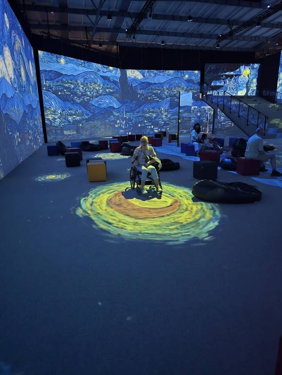
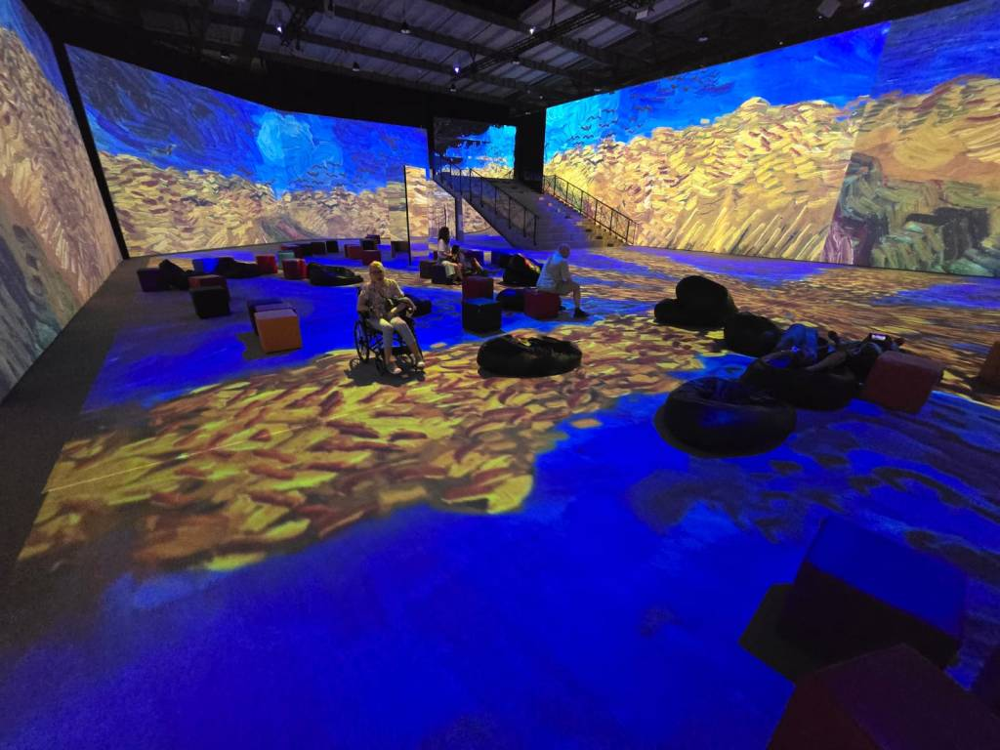
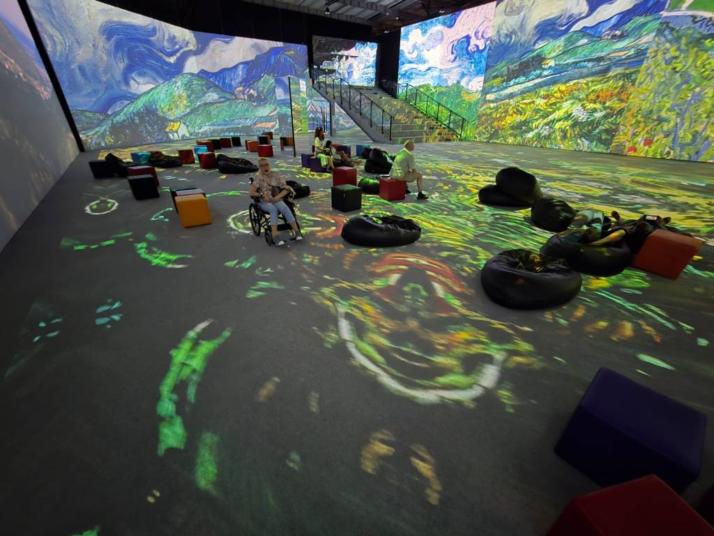
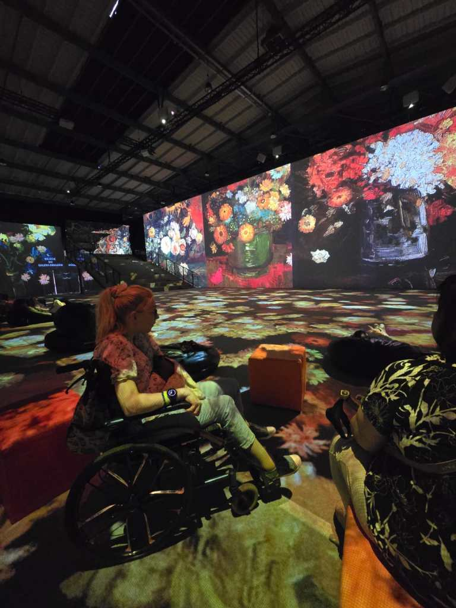
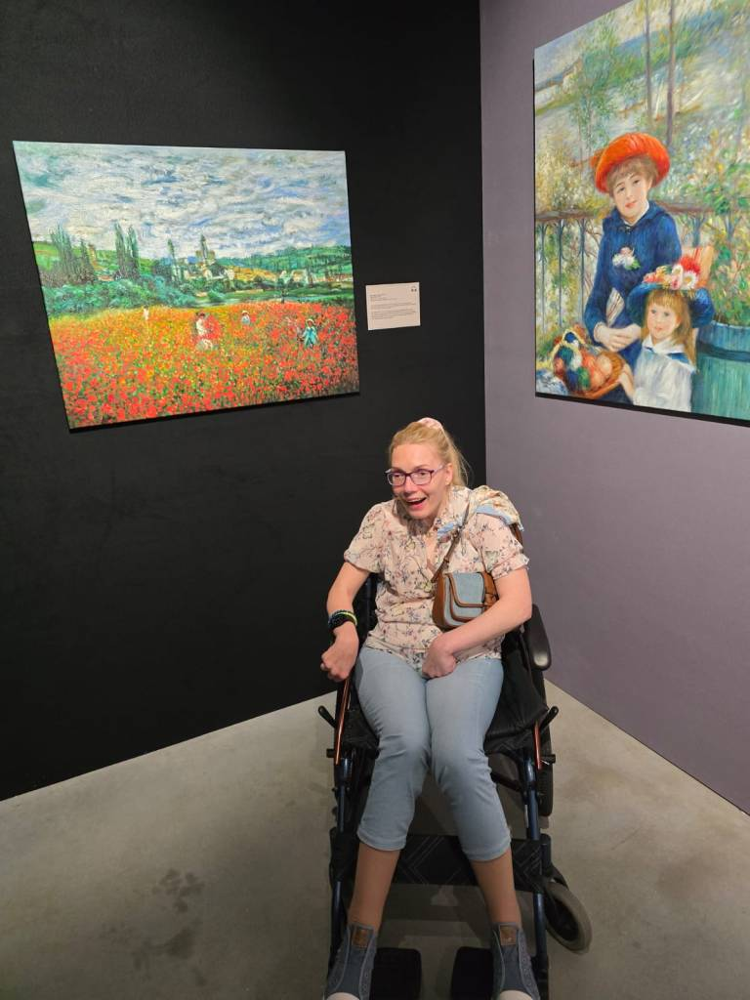
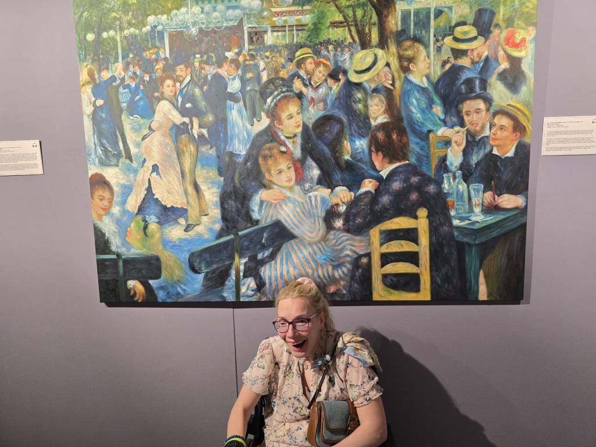
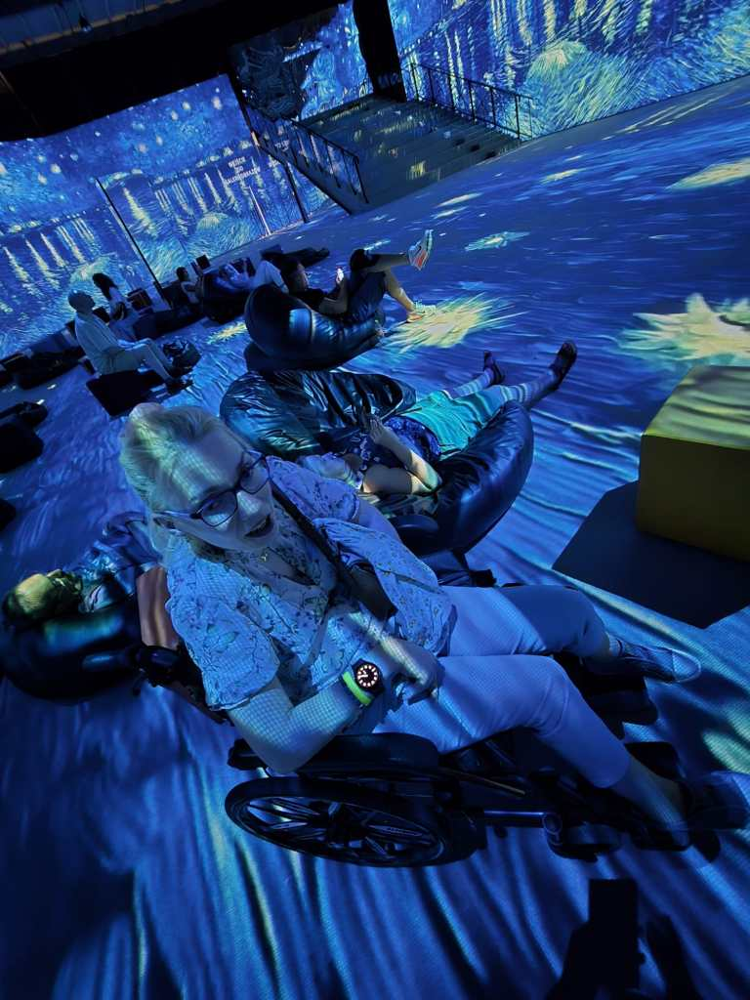

Kraków jest miastem, które  częstuje turystów wieloma kulturalnymi „smakołykami”. Moja kolejna podróż, to bardzo kolorowy świat iluzji animacji w twórczości malarzy impresjonizmu.

         Niby nic, a jednak. Na wejściu zaskoczył mnie widok siedzisk-leżanek. Uważam ,że odbiór inscenizacji w pozycji relaksacyjnej był bardziej widowiskowy. Sama wystawa niczym mnie nie zaskoczyła.

Kilka lat temu miałam okazję odwiedzić podobną, również w Krakowie, ale zdecydowanie w ciekawszym zapisie. Gdybym miała wystawić ocenę, to byłaby mierna, cenę biletów przemilczę. Chwila prawdy, nie polecam tej imprezy.
